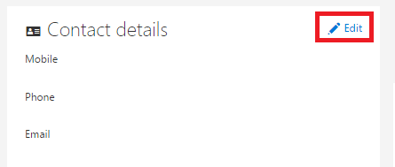

<properties
   pageTitle=""
   description=""
   services="powerbi"
   documentationCenter=""
   authors="guyinacube"
   manager="mblythe"
   backup=""
   editor=""
   tags=""
   qualityFocus="no"
   qualityDate=""/>

<tags
   ms.service="powerbi"
   ms.devlang="NA"
   ms.topic="article"
   ms.tgt_pltfrm="NA"
   ms.workload="powerbi"
   ms.date="09/21/2016"
   ms.author="asaxton"/>

# Dirección de correo electrónico alternativa para Power BI

De forma predeterminada, la dirección de correo electrónico que usó para suscribirse a Power BI con se utiliza para enviar actualizaciones acerca de la actividad en Power BI.  Por ejemplo, cuando alguien le envía una invitación para compartir, vaya a esta dirección.

A veces es conveniente estos correos electrónicos entregados a una dirección de correo electrónico alternativo en lugar de a la que se utilizó originalmente para suscribirse a Power BI con.

Aquí se muestra cómo hacerlo:

1.  Vaya a la [página de información personal de Office 365](https://portal.office.com/account/#personalinfo).  Si se le pide a, inicie sesión con la dirección de correo electrónico y contraseña que utiliza para Power BI.

2.  Haga el vínculo de edición en la sección de detalles de contacto.  

    > [AZURE.NOTE] Si no ve un vínculo de edición, esto significa que la dirección de correo electrónico administrado por el Administrador de Office 365 y deberá ponerse en contacto con ellos para actualizar la dirección de correo electrónico.

    

3.  En el campo de correo electrónico alternativa, escriba la dirección de correo electrónico desea que las actualizaciones de Power BI para enviarse a.

> [AZURE.NOTE] Cambiar esta configuración no afectará a la dirección de correo electrónico se usa para enviar las actualizaciones del servicio, boletines y otras comunicaciones promocionales.  Los que siempre se enviará a la dirección de correo electrónico que utilizó originalmente al registrarse en Power BI.

¿Preguntas más frecuentes? 
            [Pruebe la Comunidad de Power BI](http://community.powerbi.com/)
