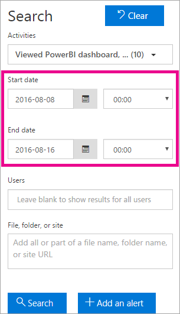

<properties
   pageTitle="Auditing Power BI in your organization"
   description="Learn how you can use auditing with Power BI to monitor and investigate actions taken. You can use the Security and compliance center or use PowerShell."
   services="powerbi"
   documentationCenter=""
   authors="guyinacube"
   manager="mblythe"
   backup=""
   editor=""
   tags=""
   qualityFocus="no"
   qualityDate=""/>

<tags
   ms.service="powerbi"
   ms.devlang="NA"
   ms.topic="article"
   ms.tgt_pltfrm="NA"
   ms.workload="powerbi"
   ms.date="10/11/2016"
   ms.author="asaxton"/>
# Auditing Power BI in your organization

<iframe width="560" height="315" src="https://www.youtube.com/embed/zj4kA39jV_4?showinfo=0" frameborder="0" allowfullscreen></iframe>

Learn how you can use auditing with Power BI to monitor and investigate actions taken. You can use the Security and compliance center or use PowerShell.

Knowing who is taking what action on which item in your Power BI tenant can be critical in helping your organization fulfill its requirements, such as meeting regulatory compliance and records management.

You can filter the audit data by date range, user, dashboard, report, dataset and activity type. You can also download the activities in a csv (comma separated value) file to analyze offline.

> [AZURE.NOTE] The auditing feature in Power BI is in preview and is available in all data regions except those in Austrailia and Europe.

## Enabling auditing functionality in the Power BI admin portal

You will need to enable auditing for your organization in order to work with the reports. You can do this within the tenant settings of the admin portal.

1.  Select the <bpt id="p1">**</bpt>gear icon<ept id="p1">**</ept> in the upper right.

2.  Select <bpt id="p1">**</bpt>Admin Portal<ept id="p1">**</ept>.

    

3.  Select <bpt id="p1">**</bpt>Tenant Settings<ept id="p1">**</ept>.

    

4.  Switch on <bpt id="p1">**</bpt>Create audit logs for internal activity auditing and compliance purposes<ept id="p1">**</ept>.

5.  Select <bpt id="p1">**</bpt>Apply<ept id="p1">**</ept>.

Power BI will start logging various activities that your users perform in Power BI. The logs take up to 48 hours to show up in the O365 Security &amp; Compliance Center. For more information about what activities are logged, see <bpt id="p1">[</bpt>List of activities audited by Power BI<ept id="p1">](#list-of-activities-audited-by-power-bi)</ept>.

## Licensing requirements

Auditing is a Power BI Pro feature and auditing events are only available for Power BI Pro users.  Users with Power BI (free) licenses will be displayed as <bpt id="p1">**</bpt>Free User<ept id="p1">**</ept>.

For more information on how you can acquire and assign Power BI Pro licenses to users in your organization, see <bpt id="p1">[</bpt>Purchasing Power BI Pro<ept id="p1">](powerbi-admin-purchasing-powerb-bi-pro.md)</ept>.

For more information on how to restrict free users from signing up, see <bpt id="p1">[</bpt>Enable, or disable, individual user sign up in Azure Active Directory<ept id="p1">](powerbi-admin-powerbi-free-in-your-organization.md#enable-or-disable-individual-user-sign-up-in-azure-active-directory)</ept>.

> [AZURE.NOTE] To enable auditing for Power BI in your tenant, you need at least one exchange mailbox license in your tenant.

## Accessing your audit logs

To audit your Power BI logs, you must visit the O365 Security &amp; Compliance Center.

1.  Select the <bpt id="p1">**</bpt>gear icon<ept id="p1">**</ept> in the upper right.

2.  Select <bpt id="p1">**</bpt>Admin Portal<ept id="p1">**</ept>.

    

3.  Select <bpt id="p1">**</bpt>Audit Logs<ept id="p1">**</ept>.

4.  Select <bpt id="p1">**</bpt>Go to O365 Admin Center<ept id="p1">**</ept>.

    

Alternatively, you can browse to <bpt id="p1">[</bpt>Office 365 | Security &amp; Compliance<ept id="p1">](https://protection.office.com/#/unifiedauditlog)</ept>.

> [AZURE.NOTE] To provide non-administrator accounts with access to the audit log, you will need to assign permissions within the Exchange Online Admin Center. For example, you could assign a user to an existing role group, such as Organization Management, or you could create a new role group with the Audit Logs role. For more information, see <bpt id="p1">[</bpt>Permissions in Exchange Online<ept id="p1">](https://technet.microsoft.com/library/jj200692\(v=exchg.150\).aspx)</ept>.

## Search only Power BI activities

You can restrict results to only Power BI activities by doing the following.

1.  On the <bpt id="p1">**</bpt>Audit log search<ept id="p1">**</ept> page, select the drop down for <bpt id="p2">**</bpt>Activities<ept id="p2">**</ept> under <bpt id="p3">**</bpt>Search<ept id="p3">**</ept>.

2.  Select <bpt id="p1">**</bpt>PowerBI activities<ept id="p1">**</ept>.

    

3.  Select anywhere outside of the selection box to close it.

Your searches will now be filtered to only Power BI activities.

## Search the audit logs by date

You can search the logs by date range using the “Start date” and “End date” field. The last seven days are selected by default. The date and time are presented in Coordinated Universal Time (UTC) format. The maximum date range that you can specify is 90 days. An error is displayed if the selected date range is greater than 90 days.

> [AZURE.NOTE] If you're using the maximum date range of 90 days, select the current time for the Start date. Otherwise, you'll receive an error saying that the start date is earlier than the end date. If you've turned on auditing within the last 90 days, the maximum date range can't start before the date that auditing was turned on.



## Search the audit logs by users

You can search for audit log entries for activities performed by specific users. To do this, enter one or more user names in the “Users” field.  This would be the username that they sign into Power BI with. It looks like an email address.
Leave this box blank to return entries for all users (and service accounts) in your organization.


## Viewing search results

Once you hit the search button, the search results are loaded and after a few moments they are displayed under Results. When the search is finished, the number of results found is displayed. 

> [AZURE.NOTE] A maximum of 1000 events will be displayed; if more than 1000 events meet the search criteria, the newest 1000 events are displayed.

The results contain the following information about each event returned by the search.

|**Columna**|**Definición**|
|---|---|
|Fecha|The date and time (in UTC format) when the event occurred.|
|Dirección IP|The IP address of the device that was used when the activity was logged. The IP address is displayed in either an IPv4 or IPv6 address format.|
|User|The user (or service account) who performed the action that triggered the event.|
|Actividad|The activity performed by the user. This value corresponds to the activities that you selected in the Activitiesdrop down list. For an event from the Exchange admin audit log, the value in this column is an Exchange cmdlet.|
|Elemento|The object that was created or modified as a result of the corresponding activity. For example, the file that was viewed or modified or the user account that was updated. Not all activities have a value in this column.|
|Detalles|Additional detail about an activity. Again, not all activities will have a value.|

> [AZURE.NOTE] Select a column header under Results to sort the results. You can sort the results from A to Z or Z to A. Click the Date header to sort the results from oldest to newest or newest to oldest.

## View the details for an event

You can view more details about an event by selecting the event record in the list of search results. A details page is displayed that contains the detailed properties from the event record. The properties that are displayed depend on the Office 365 service in which the event occurs. To display additional details, select <bpt id="p1">**</bpt>More information<ept id="p1">**</ept>.

Here are some possible details that are displayed.

|**Parámetro**|**Descripción**|
|---|---|
|Id|Unique identifier of an audit record.|
|RecordType|The type of operation indicated by the record. See the AuditLogRecordType table for details on the types of audit log records.|
|CreationTime|The date and time in Coordinated Universal Time (UTC) when the user performed the activity.|
|Operación|The name of the user or admin activity.|
|OrganizationId|The GUID for your organization's Office 365 service where the event occurred.|
|UserType|The type of user that performed the operation. See the User Type table for details on the types of users.|
|UserKey|The Passport Unique ID of the user who performed the activity.|
|ResultStatus|Indicates whether the action (specified in the Operation property) was successful or not. Possible values are Succeeded, PartiallySucceded, or Failed.|
|ObjectId|For SharePoint and OneDrive for Business activity, the full path name of the file or folder accessed by the user.|
|UserId|The UPN (User Principal Name) of the user who performed the action (specified in the Operation property) that resulted in the record being logged; for example, my_name@my_domain_name. Note that records for activity performed by system accounts (such as SHAREPOINT\system or NT AUTHORITY\SYSTEM) are also included.|
|ClientIp|The IP address of the device that was used when the activity was logged. The IP address is displayed in either an IPv4 or IPv6 address format.|

## Using PowerShell to search

You can use PowerShell to access the audit logs based on your login. This is done by accessing Exchange Online. Here is an example of a command to pull Power BI audit log entries.

```
Set-ExecutionPolicy RemoteSigned
 
$UserCredential = Get-Credential
 
$Session = New-PSSession -ConfigurationName Microsoft.Exchange -ConnectionUri https://outlook.office365.com/powershell-liveid/ -Credential $UserCredential -Authentication Basic -AllowRedirection
 
Import-PSSession $Session
Search-UnifiedAuditLog -StartDate 9/11/2016 -EndDate 9/15/2016 -RecordType PowerBI -ResultSize 1000 | Format-Table | More
```

For more information on connecting to Exchange Online, see <bpt id="p1">[</bpt>Connect to Exchange Online PowerShell<ept id="p1">](https://technet.microsoft.com/library/jj984289\(v=exchg.160\).aspx)</ept>.

For more information about parameters and usage of the Search-UnifiedAuditLog command, see <bpt id="p1">[</bpt>Search-UnifiedAuditLog<ept id="p1">](https://technet.microsoft.com/library/mt238501\(v=exchg.160\).aspx)</ept>.

## Export the Power BI audit log

You can export the Power BI audit log to a csv file.

1.  Select <bpt id="p1">**</bpt>Export results<ept id="p1">**</ept>.

2.  Select either <bpt id="p1">**</bpt>Save loaded results<ept id="p1">**</ept> or <bpt id="p2">**</bpt>Download all results<ept id="p2">**</ept>.

    

## Record and user types

Audit log entries will have a RecordType and UserType as part of the details for the entry. All Power BI entries will have a RecordType of 20.

For a full listing, see <bpt id="p1">[</bpt>Detailed properties in the Office 365 audit log<ept id="p1">](https://support.office.com/article/Detailed-properties-in-the-Office-365-audit-log-ce004100-9e7f-443e-942b-9b04098fcfc3)</ept>

## List of activities audited by Power BI

|Actividad|Descripción|Detalles adicionales|
|---|---|---|
|CreateDashboard|This activity is logged every time a new dashboard is created.|- Dashboard name.|
|EditDashboard|This activity is logged every time a dashboard is renamed.|- Dashboard name.|
|DeleteDashboard|This activity is logged every time a dashboard is deleted.|- Dashboard name.|
|PrintDashboard|This event is logged every time that a dashboard is printed.|- Dashboard name.<br/>- Dataset name|
|ShareDashboard|This activity is logged every time a dashboard is shared.|- Dashboard name.<br/>-Recipient Email.<br/>- Dataset name.<br>- Reshare permissions.|
|ViewDashboard|This activity is logged every time a dashboard is viewed.|- Dashboard name.|
|ExportTile|This event is logged every time data is exported from a dashboard tile.|- Tile name.<br/>- Dataset name.|
|DeleteReport|This activity is logged every time a report is deleted.|- Report name.|
|ExportReport|This event is logged every time data is exported from a report tile.|- Report name.<br/>- Dataset name.|
|PrintReport|This event is logged every time that a report is printed.|- Report name.<br/>- Dataset name.|
|PublishToWebReport|This event is logged every time that a report is Published To Web.|- Report Name.<br/>- Dataset name.|
|ViewReport|This activity is logged every time a report is viewed.|- Report name.|
|ExploreDataset|This event is logged every time you explore a dataset by selected it.|- Dataset name|
|DeleteDataset|This event is logged every time a dataset is deleted.|- Dataset name.|
|CreateOrgApp|This activity is logged every time an organizational content pack is created.|- Organizational Content Pack name.<br/>- Dashbaord names.<br/>- Report names.<br/>- Dataset names.|
|CreateGroup|This activity is fired every time a group is created.|- Group name.|
|AddGroupMembers|This activity is logged every time a member is added to a Power BI group workspace.|- Group name.<br/>- Email addresses.|
|UpdatedAdminFeatureSwitch|This event is logged every time an admin feature switch is changed.|- Switch name.<br/>- New switch state.|

## Consulte también

[Power BI Admin Portal](powerbi-admin-portal.md)  
[Purchasing Power BI Pro](powerbi-admin-purchasing-powerb-bi-pro.md)  
[Permissions in Exchange Online](https://technet.microsoft.com/library/jj200692(v=exchg.150).aspx)  
[Connect to Exchange Online PowerShell](https://technet.microsoft.com/library/jj984289\(v=exchg.160\).aspx)  
[Search-UnifiedAuditLog](https://technet.microsoft.com/library/mt238501\(v=exchg.160\).aspx)  
[Detailed properties in the Office 365 audit log](https://support.office.com/article/Detailed-properties-in-the-Office-365-audit-log-ce004100-9e7f-443e-942b-9b04098fcfc3)  
More questions? [Try the Power BI Community](http://community.powerbi.com/)