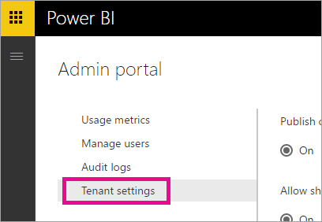
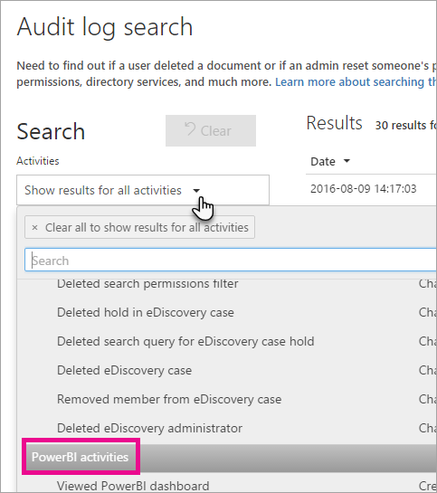

<properties
   pageTitle="Auditoría de Power BI en su organización"
   description="Obtenga información acerca de cómo puede utilizar la auditoría con Power BI para supervisar e investigar las acciones realizadas. Puede utilizar el centro de seguridad y cumplimiento de normas o usar PowerShell."
   services="powerbi"
   documentationCenter=""
   authors="guyinacube"
   manager="mblythe"
   backup=""
   editor=""
   tags=""
   qualityFocus="no"
   qualityDate=""/>

<tags
   ms.service="powerbi"
   ms.devlang="NA"
   ms.topic="article"
   ms.tgt_pltfrm="NA"
   ms.workload="powerbi"
   ms.date="10/11/2016"
   ms.author="asaxton"/>
# Auditoría de Power BI en su organización

<iframe width="560" height="315" src="https://www.youtube.com/embed/zj4kA39jV_4?showinfo=0" frameborder="0" allowfullscreen></iframe>

Obtenga información acerca de cómo puede utilizar la auditoría con Power BI para supervisar e investigar las acciones realizadas. Puede utilizar el centro de seguridad y cumplimiento de normas o usar PowerShell.

Saber quién tiene qué acción en cada elemento de Power BI inquilino puede ser crítico para ayudar a su organización a cumplir sus requisitos, como la administración de registros y cumplimiento de normas de reunión.

Puede filtrar los datos de auditoría por intervalo de fechas, usuario, escritorio, tipo de informe, el conjunto de datos y la actividad. También puede descargar las actividades en un archivo de csv (valores separados por comas) para analizar sin conexión.

> [AZURE.NOTE] La característica de auditoría en Power BI está en vista previa y está disponible en todas las regiones de datos excepto los de Austrailia y Europa.

## Habilitar la funcionalidad de auditoría en el portal de administración de Power BI

Debe habilitar la auditoría de su organización con el fin de trabajar con los informes. Puede hacerlo con el inquilino de configuración del portal de administración.

1.  Seleccione el **icono de engranaje** en la esquina superior derecha.

2.  Seleccione **Portal de administración de**.

    

3.  Seleccione **configuración de inquilinos**.

    

4.  Activar **de registros de auditoría de creación para fines de auditoría y cumplimiento de la actividad interna**.

5.  Seleccione **aplicar**.

Power BI iniciará el registro de diversas actividades que realizan los usuarios en Power BI. Los registros de tardar hasta 48 horas para que aparezcan en el centro de cumplimiento y seguridad de Office 365. Para obtener más información acerca de qué actividades se registran, consulte [lista de actividades controladas por Power BI](#list-of-activities-audited-by-power-bi).

## Requisitos de licencia

La auditoría es una característica de Power BI Pro y eventos de auditoría sólo están disponibles para los usuarios de Power BI Pro.  Los usuarios con licencias de Power BI (gratuitas) se mostrará como **gratuitos de usuario**.

Para obtener más información sobre cómo adquirir y asignar licencias Power BI Pro para los usuarios de su organización, consulte [compras Power BI Pro](powerbi-admin-purchasing-powerb-bi-pro.md).

Para obtener más información acerca de cómo impedir que los usuarios gratuitos suscribirse, consulte [Habilitar o deshabilitar, cada usuario de inicio de sesión de Azure Active Directory](powerbi-admin-powerbi-free-in-your-organization.md#enable-or-disable-individual-user-sign-up-in-azure-active-directory).

> [AZURE.NOTE] Para habilitar la auditoría para Power BI en su inquilino, necesita al menos una licencia de buzón de exchange en el inquilino.

## Obtener acceso a los registros de auditoría

Para auditar los registros de Power BI, visite el centro de cumplimiento y seguridad de Office 365.

1.  Seleccione el **icono de engranaje** en la esquina superior derecha.

2.  Seleccione **Portal de administración de**.

    

3.  Seleccione **registros de auditoría**.

4.  Seleccione **vaya al centro de administración de Office 365**.

    

Como alternativa, puede dirigirse a [Office 365 | Seguridad y cumplimiento](https://protection.office.com/#/unifiedauditlog).

> [AZURE.NOTE] Para las cuentas de administrador no tengan acceso al registro de auditoría, debe asignar permisos en el centro de administración de Exchange en línea. Por ejemplo, podría asignar a un usuario a un grupo existente de la función, como la administración de la organización, o puede crear un nuevo grupo de funciones con la función de los registros de auditoría. Para obtener más información, consulte [permisos en Exchange Online](https://technet.microsoft.com/library/jj200692\(v=exchg.150\).aspx).

## Buscar sólo las actividades de Power BI

Puede restringir los resultados a sólo las actividades de Power BI haciendo lo siguiente.

1.  En el **búsqueda de registros de auditoría** de página, seleccione la lista desplegable para **actividades** en **búsqueda**.

2.  Seleccione **actividades de PowerBI**.

    

3.  Seleccione esta opción en cualquier lugar fuera del cuadro de selección para cerrarlo.

Ahora se filtrarán las búsquedas a sólo las actividades de Power BI.

## Buscar los registros de auditoría por fecha

Puede buscar los registros por intervalo de fechas mediante la "Fecha de inicio" y el campo "Fecha de finalización". De forma predeterminada, se seleccionan los últimos siete días. La fecha y hora se presentan en formato de hora Universal coordinada (UTC). El intervalo de fecha máximo que puede especificar es de 90 días. Si el intervalo de fechas seleccionado es mayor que 90 días, se muestra un error.

> [AZURE.NOTE] Si utiliza el intervalo de fecha máxima de 90 días, seleccione la hora actual de la fecha de inicio. De lo contrario, recibirá un error que indica que la fecha de inicio es anterior a la fecha de finalización. Si ha activado la auditoría en los últimos 90 días, no se puede iniciar el intervalo de fecha máximo antes de la fecha que se ha activado la auditoría.


## Buscar en los registros de auditoría de los usuarios

Puede buscar entradas de registro de auditoría para actividades realizadas por usuarios específicos. Para ello, escriba uno o más nombres de usuario en el campo "Usuarios".  Éste podría ser el nombre de usuario que inician sesión en Power BI con. Se parece a una dirección de correo electrónico.
Deje este cuadro en blanco para devolver las entradas para todos los usuarios (y las cuentas de servicio) de su organización.


## Ver los resultados de búsqueda

Una vez que se presiona el botón de búsqueda, se cargan los resultados de búsqueda y después de unos momentos se mostrarán en resultados. Cuando haya finalizado la búsqueda, se muestra el número de resultados encontrados. 

> [AZURE.NOTE] Se mostrará un máximo de 1000 eventos; Si más de 1000 eventos cumplen los criterios de búsqueda, se muestran los eventos más recientes de 1000.

Los resultados contienen la siguiente información sobre cada evento devuelto por la búsqueda.

|**Columna**|**Definición**|
|---|---|
|Fecha|La fecha y la hora (en formato UTC) cuando se produjo el evento.|
|Dirección IP|La dirección IP del dispositivo que se utilizó cuando se registró la actividad. La dirección IP se muestra en formato de dirección de un IPv4 o IPv6.|
|User|El usuario (o la cuenta de servicio) que realiza la acción que desencadenó el evento.|
|Actividad|La actividad realizada por el usuario. Este valor corresponde a las actividades que seleccionó en el Activitiesdrop hacia abajo de la lista. Para un evento desde el registro de auditoría de administración de Exchange, el valor de esta columna es un cmdlet de Exchange.|
|Elemento|El objeto que se creó o modificó como resultado de la actividad correspondiente. Por ejemplo, el archivo que se ven o se modificó o la cuenta de usuario que se ha actualizado. No todas las actividades tienen un valor en esta columna.|
|Detalles|Detalles adicionales sobre una actividad. Nuevamente, no todas las actividades tendrán un valor.|

> [AZURE.NOTE] Seleccione un encabezado de columna en resultados para ordenar los resultados. Puede ordenar los resultados de la A Z o Z a r. Haga clic en el encabezado de fecha para ordenar los resultados de más antiguo a más reciente o más reciente al más antiguo.

## Ver los detalles de un evento

Puede ver más detalles acerca de un evento seleccionando el registro de eventos en la lista de resultados de búsqueda. Se muestra una página de detalles que contiene las propiedades detalladas del registro de eventos. Las propiedades que se muestran dependen del servicio Office 365 en el que se produce el evento. Para mostrar detalles adicionales, seleccione **obtener más información**.

Aquí encontrará algunos detalles posibles que se muestran.

|**Parámetro**|**Descripción**|
|---|---|
|Id|Identificador único de un registro de auditoría.|
|Tipo de registro|El tipo de operación indicado en el registro. Consulte la tabla AuditLogRecordType para obtener más información sobre los tipos de registros de auditoría.|
|CreationTime|La fecha y hora en hora Universal coordinada (UTC) cuando el usuario ha realizado la actividad.|
|Operación|El nombre de la actividad del usuario o administrador.|
|OrganizationId|El GUID de servicio de Office 365 de su organización donde se produjo el evento.|
|UserType|El tipo de usuario que realizó la operación. Consulte la tabla de tipo de usuario para obtener más información sobre los tipos de usuarios.|
|UserKey|Identificador único de Passport del usuario que realizó la actividad.|
|ResultStatus|Indica si la acción (especificada en la propiedad de operación) se realizó correctamente o no. Los valores posibles son Succeeded, PartiallySucceded o error.|
|ObjectId|Para SharePoint y OneDrive para la actividad de negocio, el nombre de ruta de acceso completa del archivo o carpeta que tiene acceso el usuario.|
|UserId|El UPN (nombre Principal del usuario) del usuario que realizó la acción (especificada en la propiedad de operación) que dan como resultado del registro que se ha iniciado; Por ejemplo, my_name@my_domain_name. Tenga en cuenta que también se incluyen los registros de la actividad de cuentas del sistema (como SHAREPOINT\system o NT AUTHORITY\SYSTEM).|
|IP de cliente|La dirección IP del dispositivo que se utilizó cuando se registró la actividad. La dirección IP se muestra en formato de dirección de un IPv4 o IPv6.|

## Uso de PowerShell para buscar

Puede usar PowerShell para tener acceso a los registros de auditoría basándose en el inicio de sesión. Esto se hace mediante el acceso a Exchange Online. Este es un ejemplo de un comando para extraer las entradas de registro de auditoría de Power BI.

```
Set-ExecutionPolicy RemoteSigned
 
$UserCredential = Get-Credential
 
$Session = New-PSSession -ConfigurationName Microsoft.Exchange -ConnectionUri https://outlook.office365.com/powershell-liveid/ -Credential $UserCredential -Authentication Basic -AllowRedirection
 
Import-PSSession $Session
Search-UnifiedAuditLog -StartDate 9/11/2016 -EndDate 9/15/2016 -RecordType PowerBI -ResultSize 1000 | Format-Table | More
```

Para obtener más información acerca de cómo conectarse a Exchange Online, consulte [conectarse a Exchange Online PowerShell](https://technet.microsoft.com/library/jj984289\(v=exchg.160\).aspx).

Para obtener más información acerca del uso del comando UnifiedAuditLog de búsqueda y parámetros, consulte [UnifiedAuditLog de búsqueda](https://technet.microsoft.com/library/mt238501\(v=exchg.160\).aspx).

## Exportar el registro de auditoría de Power BI

Puede exportar el registro de auditoría de Power BI en un archivo csv.

1.  Seleccione **Exportar resultados**.

2.  Seleccione **Guardar carga resultados** o **Descargar todos los resultados**.

    

## Tipos de registro y de usuario

Las entradas de registro de auditoría tendrá un tipo de registro y UserType como parte de los detalles de la entrada. Todas las entradas de Power BI tendrá un tipo de registro de 20.

Para obtener una lista completa, consulte [registro de auditoría de las propiedades detalladas en Office 365](https://support.office.com/article/Detailed-properties-in-the-Office-365-audit-log-ce004100-9e7f-443e-942b-9b04098fcfc3)

## Lista de actividades controladas por Power BI

|Actividad|Descripción|Detalles adicionales|
|---|---|---|
|CreateDashboard|Esta actividad se registra cada vez que se crea un nuevo panel.|-Nombre del panel.|
|Editar panel|Esta actividad se registra cada vez que se cambia el nombre de un panel.|-Nombre del panel.|
|DeleteDashboard|Esta actividad se registra cada vez que se elimina un panel.|-Nombre del panel.|
|PrintDashboard|Este evento se registra cada vez que se imprime un panel.|-Nombre del panel.<br/>: Nombre del conjunto de datos|
|ShareDashboard|Esta actividad se registra cada vez que se comparte un panel.|-Nombre del panel.<br/>-El correo electrónico destinatario.<br/>: Nombre el conjunto de datos.<br>-Vuelva a compartir permisos.|
|ViewDashboard|Esta actividad se registra cada vez que se visualiza un panel.|-Nombre del panel.|
|ExportTile|Este evento se registra cada vez que los datos se exportan desde un icono de panel.|-Nombre de mosaico.<br/>: Nombre el conjunto de datos.|
|DeleteReport|Esta actividad se registra cada vez que se elimina un informe.|-Nombre del informe.|
|ExportReport|Este evento se registra cada vez que los datos se exportan desde un icono de informe.|-Nombre del informe.<br/>: Nombre el conjunto de datos.|
|PrintReport|Este evento se registra cada vez que se imprime un informe.|-Nombre del informe.<br/>: Nombre el conjunto de datos.|
|PublishToWebReport|Este evento se registra cada vez que es un informe publicado en Web.|-Nombre del informe.<br/>: Nombre el conjunto de datos.|
|ViewReport|Esta actividad se registra cada vez que se ve un informe.|-Nombre del informe.|
|ExploreDataset|Este evento se registra cada vez explorar un conjunto de datos por seleccionado.|: Nombre del conjunto de datos|
|DeleteDataset|Este evento se registra cada vez que se elimina un conjunto de datos.|: Nombre el conjunto de datos.|
|CreateOrgApp|Esta actividad se registra cada vez que se crea un paquete de contenido de organización.|-Organización nombre del paquete de contenido.<br/>-Panel nombres.<br/>-Los nombres de informes.<br/>-El conjunto de datos nombres.|
|CreateGroup|Esta actividad se desencadena cada vez que se crea un grupo.|-Nombre del grupo.|
|AddGroupMembers|Esta actividad se registra cada vez que se agrega un miembro a un área de trabajo del grupo de Power BI.|-Nombre del grupo.<br/>-Direcciones de correo electrónico.|
|UpdatedAdminFeatureSwitch|Este evento se registra cada vez que cambia un conmutador de característica de administración.|-Cambiar nombre.<br/>-Nuevo estado del conmutador.|

## Consulte también

[Portal de administración de Power BI](powerbi-admin-portal.md)  
[Poder adquisitivo BI Pro](powerbi-admin-purchasing-powerb-bi-pro.md)  
[Permisos en Exchange Online](https://technet.microsoft.com/library/jj200692(v=exchg.150).aspx)  
[Conectarse a Exchange Online PowerShell](https://technet.microsoft.com/library/jj984289\(v=exchg.160\).aspx)  
[Búsqueda UnifiedAuditLog](https://technet.microsoft.com/library/mt238501\(v=exchg.160\).aspx)  
[Registro de auditoría de las propiedades detalladas en Office 365](https://support.office.com/article/Detailed-properties-in-the-Office-365-audit-log-ce004100-9e7f-443e-942b-9b04098fcfc3)  
¿Preguntas más frecuentes? [Pruebe la Comunidad de Power BI](http://community.powerbi.com/)