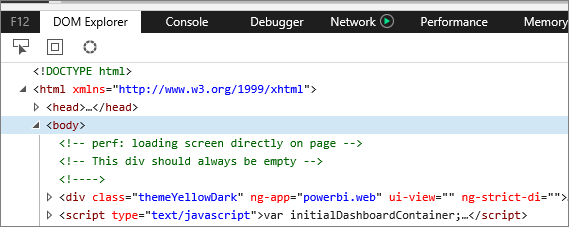
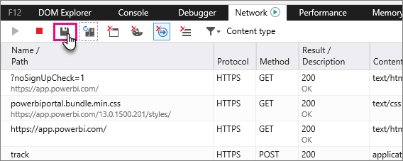

<properties 
   pageTitle="Capturar información de diagnóstico adicional para Power BI"
   description="Capturar información de diagnóstico adicional para Power BI"
   services="powerbi" 
   documentationCenter="" 
   authors="guyinacube" 
   manager="erikre" 
   backup=""
   editor=""
   tags=""
   qualityFocus="no"
   qualityDate=""/>
 
<tags
   ms.service="powerbi"
   ms.devlang="NA"
   ms.topic="article"
   ms.tgt_pltfrm="NA"
   ms.workload="powerbi"
   ms.date="10/10/2016"
   ms.author="asaxton"/>

# Capturar información de diagnóstico adicional para Power BI  

## Capturar información de diagnóstico adicional para Power BI  
Estas instrucciones ofrecen dos opciones posibles para recopilar manualmente la información de diagnóstico adicional desde el cliente web de Power BI.  Solo una de estas opciones debe seguirse.

## Captura de red - Edge e Internet Explorer 
1.  Vaya a [Power BI](https://app.powerbi.com) con borde o Internet Explorer.

2.  Abrir las herramientas de desarrollador de borde presionando F12.

3.  Que se abrirá la ventana Herramientas de desarrollo: 

    

4.  Cambie a la pestaña de la red. Obtendrá una lista de tráfico que ya capturados. 

    

5.  Puede buscar dentro de la ventana y reproducir cualquier problema que encuentre. Puede ocultar y mostrar ventana de herramientas del desarrollador en cualquier momento durante la sesión presionando F12.

6.  Para detener la captura, puede seleccionar el cuadrado rojo en la ficha red del área de herramientas para desarrolladores.

    

7.  Seleccione en el icono de disquete para **Exportar como HAR**

    

8. Proporcione un nombre de archivo y guarde el archivo HAR.

    El archivo HAR contendrá toda la información acerca de las solicitudes de red entre la ventana del explorador y Power BI.  Esto incluye los identificadores de actividad de cada solicitud, la marca de tiempo preciso para cada solicitud y cualquier información de error que se devuelve al cliente.  Esta traza también contendrá los datos utilizados para rellenar los elementos visuales que se muestra en la pantalla.

9. Puede proporcionar el archivo HAR para admitir para su revisión.

¿Preguntas más frecuentes? [Pruebe la Comunidad de Power BI](http://community.powerbi.com/)