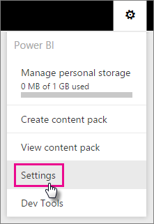
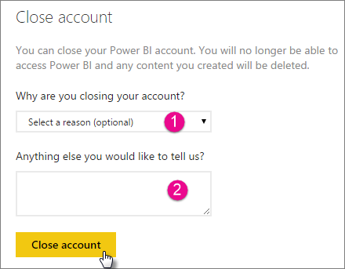

<properties 
   pageTitle="Closing your Power BI Account"
   description="Closing your Power BI Account"
   services="powerbi" 
   documentationCenter="" 
   authors="guyinacube" 
   manager="erikre" 
   backup=""
   editor=""
   tags=""
   qualityFocus="no"
   qualityDate=""/>
 
<tags
   ms.service="powerbi"
   ms.devlang="NA"
   ms.topic="article"
   ms.tgt_pltfrm="NA"
   ms.workload="powerbi"
   ms.date="10/10/2016"
   ms.author="asaxton"/>
# Closing your Power BI Account

If you don't want to use Power BI any longer, you can ask us to close your Power BI account.  After your account is closed, you can no longer sign in to Power BI.  Also, any customer data you uploaded, or created, in Power BI is deleted according to the data retention policy in the Power BI Terms of Service.

## Power BI (free) or individual Power BI Pro users

If you have a free account, or are paying for the individual Power BI Pro subscription, you close your account from the settings screen.

1. Select the gear <ph id="ph1"></ph> in the upper right.

2. Select <bpt id="p1">**</bpt>Settings<ept id="p1">**</ept>.

    

3. <bpt id="p1">**</bpt>General<ept id="p1">**</ept><ph id="ph1"> &gt; </ph><bpt id="p2">**</bpt>Close Account<ept id="p2">**</ept>

    
    
4. Select a reason from the  <bpt id="p1">**</bpt>Why are you closing your account?<ept id="p1">**</ept> (1) dropdown.  You can optionally provide further information (2). Then select <bpt id="p1">**</bpt>Close account<ept id="p1">**</ept>.

    
    
5. Confirm that you want to close your account.

    
    
6. You will see a confirmation that your account is closed. You will also be given a link to reopen your account.

    

## Managed tenant users

You will need to contact your tenant admin and ask them to unassign the license from your account.

More questions? [Try the Power BI Community](http://community.powerbi.com/)