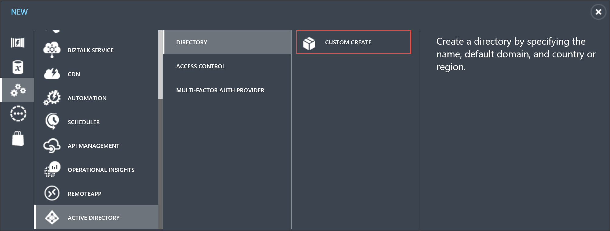

<properties
pageTitle="Sign up with a custom Azure directory"
description="You may be a developer and looking to test your Power BI application that uses the REST API. Creating a custom directory in your Azure subscription can allow you to try an isolated environment. There are a few things you need to do to get Power BI to work with that custom directory."
services="powerbi"
documentationCenter=""
authors="guyinacube"
manager="erikre"
backup=""
editor=""
tags=""
qualityFocus="monitoring"
qualityDate="8/15/2016"/>

<tags
ms.service="powerbi"
ms.devlang="NA"
ms.topic="article"
ms.tgt_pltfrm="na"
ms.workload="powerbi"
ms.date="10/10/2016"
ms.author="asaxton"/>
# Sign up for Power BI (free) with a custom Azure Active Directory tenant

If you are a developer, using Microsoft Azure, and are looking to create a Power BI application using the REST API’s, you will probably want to use Power BI with a custom Azure Active Directory (AAD) tenant for testing purposes.  There are a few things you will need to do to get up and running. This is all about creating an Azure Active Directory tenant for use with testing Power BI. 

There is an extra step you need to perform to actually do the Power BI sign up due to the fact that you won’t have access to an email server for your custom domain with your AAD tenant.

<iframe width="560" height="315" src="https://www.youtube.com/embed/97IfXEWZMfU?showinfo=0" frameborder="0" allowfullscreen></iframe>

## Creating the custom directory and new users

To test with a new tenant, you will need to create an Azure Active Directory Tenant. You can do that through the Azure portal by creating a new directory. After that is done, you will want to create a new user that we can sign up for Power BI with.

### Create an Azure Active Directory tenant

Here's how to setup <bpt id="p1">**</bpt>Azure Active Directory<ept id="p1">**</ept>:

 1. Navigate to https://manage.windowsazure.com and log in with the account that has an Azure subscription.

 2. Select <bpt id="p1">**</bpt>ACTIVE DIRECTORY<ept id="p1">**</ept> management icon in the left pane.

    

 3. Select <bpt id="p1">**</bpt>NEW<ept id="p1">**</ept> button at the bottom of the page.

 4. Select <bpt id="p1">**</bpt>APP SERVICES<ept id="p1">**</ept><ph id="ph1"> &gt; </ph><bpt id="p2">**</bpt>ACTIVE DIRECTORY<ept id="p2">**</ept><ph id="ph2"> &gt; </ph><bpt id="p3">**</bpt>DIRECTORY<ept id="p3">**</ept><ph id="ph3"> &gt; </ph><bpt id="p4">**</bpt>CUSTOM CREATE<ept id="p4">**</ept>

    

 5. In the <bpt id="p1">**</bpt>Add directory<ept id="p1">**</ept> page, enter a name and domain name. For country or region choose United States or the country were Power BI is available.

    

 6. Choose OK icon. An Azure Active Directory is created.

### Add a user to your Azure Active Directory tenant

Now that we have a new tenant, we can create a user within our test organization.

1. Navigate to https://manage.windowsazure.com and log in with the account that has an Azure subscription.

2. Select <bpt id="p1">**</bpt>ACTIVE DIRECTORY<ept id="p1">**</ept> management icon in the left pane.

3. In your <bpt id="p1">**</bpt>Azure Active Directory<ept id="p1">**</ept>, select <bpt id="p2">**</bpt>USERS<ept id="p2">**</ept>.

    

4. At the bottom of the page, select <bpt id="p1">**</bpt>ADD USER<ept id="p1">**</ept>. A user account is used to register a Power BI app.

5. In the <bpt id="p1">**</bpt>Tell us about this user page<ept id="p1">**</ept>:

    1. For <bpt id="p1">**</bpt>TYPE OF USER<ept id="p1">**</ept>, select <bpt id="p2">**</bpt>New user in your organization<ept id="p2">**</ept>.
    2. Enter your <bpt id="p1">**</bpt>USER NAME<ept id="p1">**</ept>.
    3. Select <bpt id="p1">**</bpt>Next<ept id="p1">**</ept>.

        

6. In the <bpt id="p1">**</bpt>user profile<ept id="p1">**</ept> page, enter your <bpt id="p2">**</bpt>DISPLAY NAME<ept id="p2">**</ept>. Display name is a required field.

    

7. Select <bpt id="p1">**</bpt>Next<ept id="p1">**</ept>. For <bpt id="p1">**</bpt>ROLE<ept id="p1">**</ept>, you can use <bpt id="p2">**</bpt>User<ept id="p2">**</ept>.

8. Select <bpt id="p1">**</bpt>Create<ept id="p1">**</ept> to create a temporary password. The new user is assigned a temporary password that must be changed on first sign in.

9. In the <bpt id="p1">**</bpt>Get temporary password<ept id="p1">**</ept> page, copy the temporary password, and click <bpt id="p2">**</bpt>Complete<ept id="p2">**</ept> icon. You use the temporary password when you first login to your AAD.

10. After you select the <bpt id="p1">**</bpt>Complete<ept id="p1">**</ept> icon, a new Azure AD user is created.

 You can learn more about this step at <bpt id="p1">[</bpt>Create an Azure Active Directory tenant<ept id="p1">](powerbi-developer-create-an-azure-active-directory-tenant.md)</ept>.

## Getting free licenses via add subscription within Office 365

If you try to sign up for Power BI (free) with the new user you created in your custom directory, it will give you a message indicating to check your email for the verification step. However, you do not have an email server for this custom directory’s domain. 

To work around this, we will need to add Power BI (free) licenses from the Office 365 admin center.

> [AZURE.IMPORTANT] This step will require that you provide credit card information, but you will not be charged for Power BI (free) licenses.

> [AZURE.NOTE] Make sure you have at least one user marked as a <bpt id="p1">**</bpt>Global Admin<ept id="p1">**</ept> in your custom directory. This is so you can access the Office 365 admin center.

1.  Navigate to the <bpt id="p1">[</bpt>Office 365 admin center<ept id="p1">](https://portal.office.com/admin/default.aspx)</ept>, and sign in with your Global Admin user for your custom directory.

2.  On the left navigation pane, select <bpt id="p1">**</bpt>Billing<ept id="p1">**</ept><ph id="ph1"> &gt; </ph><bpt id="p2">**</bpt>Subscriptions<ept id="p2">**</ept>.

3.  Select <bpt id="p1">**</bpt>Add subscriptions<ept id="p1">**</ept> on the right side. If you do not see <bpt id="p1">**</bpt>Add subscriptions<ept id="p1">**</ept>, you may not have the global admin role.

    

4.  Under Other Plans, hover over the <bpt id="p1">**</bpt>ellipse (…)<ept id="p1">**</ept> for Power BI (free) and select <bpt id="p2">**</bpt>Buy now<ept id="p2">**</ept>.

    

5.  Enter the number of licenses you would like to add and select <bpt id="p1">**</bpt>Check out now<ept id="p1">**</ept> or <bpt id="p2">**</bpt>Add to cart<ept id="p2">**</ept>.

    > [AZURE.NOTE] You can add more at a later date if needed.

6.  Enter the needed information in the check out flow.

There is no purchase when using this approach, although you will need to either enter your credit card information for billing, or choose to be invoiced.

If you decide later that you want to add more licenses, you can go back to <bpt id="p1">**</bpt>Add subscriptions<ept id="p1">**</ept>, and select <bpt id="p2">**</bpt>Change license quantity<ept id="p2">**</ept> for Power BI (free).

You can now assign those licenses to your users. During the check out, it may have assigned the Power BI (free) licenses to all users that didn't have any licenses assigned. [Obtener más información](https://support.office.com/article/Assign-or-unassign-licenses-for-Office-365-for-business-997596b5-4173-4627-b915-36abac6786dc)

You can verify if the user has a license assigned to the account by going to <bpt id="p1">**</bpt>Users<ept id="p1">**</ept><ph id="ph1"> &gt; </ph><bpt id="p2">**</bpt>Active Users<ept id="p2">**</ept> and selecting the user. On the right, you will see <bpt id="p1">**</bpt>Assigned License<ept id="p1">**</ept>.

## Sign into Power BI

You should now be able to sign into <bpt id="p1">[</bpt>Power BI<ept id="p1">](https://app.powerbi.com)</ept> with the user you created in your custom directory.

## Consulte también

[Create an Azure Active Directory tenant](powerbi-developer-create-an-azure-active-directory-tenant.md)  
[Power BI (free) in your organization](powerbi-admin-powerbi-free-in-your-organization.md)  
[¿Qué es un directorio de Azure AD?](https://msdn.microsoft.com/library/azure/jj573650.aspx)  
[How to get an Azure Active Directory tenant](https://azure.microsoft.com/documentation/articles/active-directory-howto-tenant/)  
More questions? [Try the Power BI Community](http://community.powerbi.com/)