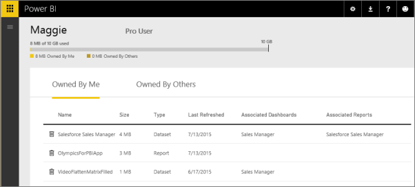
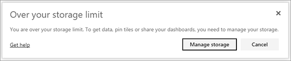

<properties 
   pageTitle="Administrar la capacidad de datos en Power BI"
   description="Administrar la capacidad de datos y almacenamiento en Power BI"
   services="powerbi" 
   documentationCenter="" 
   authors="guyinacube" 
   manager="mblythe" 
   backup=""
   editor=""
   tags=""
   qualityFocus="no"
   qualityDate=""/>
 
<tags
   ms.service="powerbi"
   ms.devlang="NA"
   ms.topic="article"
   ms.tgt_pltfrm="NA"
   ms.workload="powerbi"
   ms.date="08/15/2016"
   ms.author="asaxton"/>
# Administrar la capacidad de datos en Power BI

Power BI ofrece dos licencias, Power BI (gratuito) y Power BI Pro con límites de capacidad de datos diferentes:

-   Los usuarios gratuitos tienen una capacidad máxima de datos de 1 GB.

-   Los usuarios profesionales de Power BI Pro tienen 10 GB de capacidad máxima.

-   Los usuarios profesionales pueden crear grupos, con una capacidad máxima de 10 GB datos cada.

En el nivel del inquilino, uso total no puede superar los 10 GB por usuario Pro en todos los usuarios de Pro y grupos en el inquilino. 

Obtenga información acerca de otras características de la [Power BI, modelo de precios](https://powerbi.microsoft.com/pricing).

Incluido en la capacidad de datos son sus propios conjuntos de datos y los informes de Excel y las que alguien ha compartido con usted. Conjuntos de datos son cualquiera de los orígenes de datos ha cargado o conectado, incluidos los archivos de Power BI Desktop y libros de Excel que esté utilizando. A continuación también se incluye en la capacidad de datos.

-   Rangos de Excel Anclar al panel.

-   Reporting Services local visualizaciones anclados a un panel de Power BI.

-   Imágenes cargadas.

El tamaño de un panel que compartir variará dependiendo de qué está anclado a ella. Por ejemplo, si anclar elementos de dos informes que forman parte de dos conjuntos de datos diferentes, el tamaño incluirá dos conjuntos de datos.

<a name="manage"/>
## Administrar elementos de su propiedad

Ver cuánta capacidad de datos se está usando en su cuenta de Power BI y administrar su cuenta.

1.  Para administrar su propio almacenamiento, vaya a **Mi área de trabajo** en la parte superior del panel de navegación izquierdo. 

    

2.  Seleccione el icono de engranaje  en la esquina superior derecha \> **Administrar almacenamiento Personal**. 

    La barra superior muestra cuánto ha usado el límite de almacenamiento.

    

    Los informes y conjuntos de datos se separan en dos pestañas:

    
                **Propiedad por mí:** son informes y conjuntos de datos que se haya cargado en la cuenta de Power BI, incluidos los conjuntos de datos de servicio como Salesforce y Dynamics CRM.

            **Propiedad de otros usuarios:** estos informes y conjuntos de datos de otras personas hayan compartido con usted.

3.  Para eliminar un conjunto de datos o un informe, seleccione el icono de la Papelera .

Tenga en cuenta que usted u otra persona puede tener informes y paneles basados en un conjunto de datos. Si elimina el conjunto de datos, los informes y paneles no funcionarán ya.

## Administrar el grupo

1.  Seleccione la flecha situada junto a **Mi área de trabajo** \> Seleccione el nombre del grupo.

    

2.  Seleccione el icono de engranaje  en la esquina superior derecha \> **Administrar almacenamiento de información de grupo**.

    La barra superior muestra la cantidad de límite de almacenamiento del grupo se utiliza.

    

    Los informes y conjuntos de datos se separan en dos pestañas:

    
                **Propiedad nos:** son informes y conjuntos de datos que usted u otra persona ha cargado en la cuenta del grupo Power BI, incluidos los conjuntos de datos de servicio como Salesforce y Dynamics CRM.

            **Propiedad de otros usuarios:** otras personas hayan compartido estos informes y conjuntos de datos con el grupo.

3.  Para eliminar un conjunto de datos o un informe, seleccione el icono de la Papelera .
    >
            **Nota:** cualquier miembro del grupo tiene permisos para eliminar informes y conjuntos de datos desde el almacenamiento de información de grupo.

Tenga en cuenta que usted u otra persona del grupo puede tener informes y paneles basados en un conjunto de datos. Si elimina el conjunto de datos, los informes y paneles no funcionarán ya.

## Límites de conjunto de datos

Hay un límite de 1 GB por cada conjunto de datos que se importa en Power BI. Si ha elegido mantener la experiencia de Excel, en lugar de importar los datos, estará limitado a 250 MB para el conjunto de datos.

## ¿Qué ocurre cuando se alcanza un límite

Cuando se alcanza el límite de capacidad de datos de lo que puede hacer, verá mensajes en el servicio. 

Al seleccionar el icono de engranaje , verá una barra que indica superó su límite de capacidad de datos de color rojo.

También verá esto indica dentro de **Administrar almacenamiento personal**.

 
 
 Cuando intenta realizar una acción que se alcance uno de los límites, verá un mensaje que indica que está por encima del límite. De forma gratuita los usuarios, tendrá una oportunidad de probar Pro. Usuarios gratuitas y profesionales podrán [administrar](#manage) su almacenamiento.
 
 **Cuadro de diálogo libre**
 
 
 
 **Cuadro de diálogo Pro** 
 
 

 ¿Preguntas más frecuentes? [Pruebe la Comunidad de Power BI](http://community.powerbi.com/)