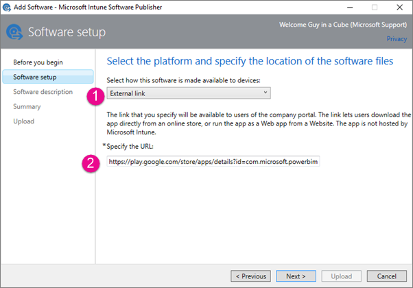
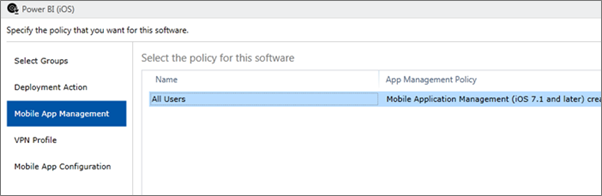
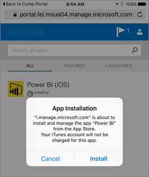

<properties
pageTitle="Configure mobile apps with Intune"
description="How to configure the Power BI Mobile apps with Microsoft Intune. This includes how to add, and deploy, the application. And, how to create the mobile application policy to control security."
services="powerbi"
documentationCenter=""
authors="guyinacube"
manager="mblythe"
backup=""
editor=""
tags=""
qualityFocus="no"
qualityDate=""/>

<tags
ms.service="powerbi"
ms.devlang="NA"
ms.topic="article"
ms.tgt_pltfrm="na"
ms.workload="powerbi"
ms.date="08/15/2016"
ms.author="asaxton"/>
# Configure Power BI mobile apps with Microsoft Intune

Microsoft Intune enables organizations to manage devices and applications. The Power BI mobile applications, for iOS and Android, integrate with Intune to allow you to manage the application on your devices, and to control security. Through configuration policies, you can control items like requiring an access pin, controlling how data is handled by the application and even encrypting application data when the app is not in use.

## General mobile device management configuration

This article is not meant as full configuration guide for Microsoft Intune. If you are just now integrating with Intune, there are a few things you will want to make sure you have setup. [Obtener más información](https://technet.microsoft.com/library/jj676587.aspx)

Microsoft Intune can co-exist with Mobile Device Management (MDM) within Office 365. [Obtener más información](https://blogs.technet.microsoft.com/configmgrdogs/2016/01/04/microsoft-intune-co-existence-with-mdm-for-office-365/)

This article assumes that Intune is configured properly and you have devices enrolled with Intune. If you are co-existing with MDM, the device will show enrolled within MDM, but is available to manage within Intune.

## Step 1: Get the url for the application

Before we create the application within Intune, we need to get the urls for the apps. For iOS, we will get this from iTunes. For Android, you can get it from the Power BI mobile page.

Save the url, as you will need it when we create the application.

### iOS

To get the app url for iOS, we will need to get it from iTunes.

1. Open iTunes.

2. Search for <bpt id="p1">*</bpt>Power BI<ept id="p1">*</ept>.

3. You should see <bpt id="p1">**</bpt>Microsoft Power BI<ept id="p1">**</ept> listed under <bpt id="p2">**</bpt>iPhone Apps<ept id="p2">**</ept> and <bpt id="p3">**</bpt>iPad Apps<ept id="p3">**</ept>. You can use either, as you will get the same url.

4. Select the <bpt id="p1">**</bpt>Get<ept id="p1">**</ept> drop down and select <bpt id="p2">**</bpt>Copy Link<ept id="p2">**</ept>.

    

It should look similar to the following.

    https://itunes.apple.com/us/app/microsoft-power-bi/id929738808?mt=8
    
### Android

You can get the url to Google Play from the <bpt id="p1">[</bpt>Power BI mobile page<ept id="p1">](https://powerbi.microsoft.com/mobile/)</ept>. Clicking on the <bpt id="p1">**</bpt>Download from Google Play<ept id="p1">**</ept> icon will take you to the app page. You can copy the URL from the browser address bar. It should look similar to the following.

    https://play.google.com/store/apps/details?id=com.microsoft.powerbim

## Step 2: Create a mobile application management policy

The mobile application management policy allows you to enforce items like an access pin. You can create one within the Intune portal. 

You can create the application, or the policy first. The order in which they are added doesn't matter. They will just need to both exist for the deploy step.

1. Select <bpt id="p1">**</bpt>Policy<ept id="p1">**</ept><ph id="ph1"> &gt; </ph><bpt id="p2">**</bpt>Configuration Policies<ept id="p2">**</ept>.

    

2. Select <bpt id="p1">**</bpt>Add...<ept id="p1">**</ept>.

3. Under <bpt id="p1">**</bpt>Software<ept id="p1">**</ept> you can select Mobile Application Management for either Android or iOS. To get started quickly, you can select <bpt id="p1">**</bpt>Create a policy with the recommended settings<ept id="p1">**</ept>, or you can create a custom policy.
    
4. Edit the policy to configure the restrictions you want on the application.

## Step 3: Create the application

The application is a reference, or package, that is saved into Intune for deployment. We will need to create an application and reference the app url that we got from either Google Play or iTunes.

You can create the application, or the policy first. The order in which they are added doesn't matter. They will just need to both exist for the deploy step.

1. Go to the Intune portal and select <bpt id="p1">**</bpt>Apps<ept id="p1">**</ept> from the left menu.

2. Select <bpt id="p1">**</bpt>Add App<ept id="p1">**</ept>. This will launch the <bpt id="p1">**</bpt>Add Software<ept id="p1">**</ept> application.

### iOS

1. Select <bpt id="p1">**</bpt>Managed iOS App from the App Store<ept id="p1">**</ept> from the drop down.

2. Enter the app url, that we got from <bpt id="p1">[</bpt>Step 1<ept id="p1">](#step-1-get-the-url-for-the-application)</ept>, and select <bpt id="p2">**</bpt>Next<ept id="p2">**</ept>.

    
    
3. Provide a <bpt id="p1">**</bpt>Publisher<ept id="p1">**</ept>, <bpt id="p2">**</bpt>Name<ept id="p2">**</ept> and <bpt id="p3">**</bpt>Description<ept id="p3">**</ept>. You can optionally provide an <bpt id="p1">**</bpt>Icon<ept id="p1">**</ept>. The <bpt id="p1">**</bpt>Category<ept id="p1">**</ept> is for the Company Portal app. Once you are done, select <bpt id="p1">**</bpt>Next<ept id="p1">**</ept>.

4. You can decide if you want the publish the app as <bpt id="p1">**</bpt>Any<ept id="p1">**</ept> (default), <bpt id="p2">**</bpt>iPad<ept id="p2">**</ept> or <bpt id="p3">**</bpt>iPhone<ept id="p3">**</ept>. By default it will show <bpt id="p1">**</bpt>Any<ept id="p1">**</ept> and will work for both device types. The Power BI app is the same url for both iPhone and iPad. Select <bpt id="p1">**</bpt>Next<ept id="p1">**</ept>.

5. Select <bpt id="p1">**</bpt>Upload<ept id="p1">**</ept>.

> NOTE: You may not see it show up in the app list until you refresh the page. You can click on <bpt id="p1">**</bpt>Overview<ept id="p1">**</ept> and back to <bpt id="p2">**</bpt>Apps<ept id="p2">**</ept> to get the page to reload.

### Android

1. Select <bpt id="p1">**</bpt>External Link<ept id="p1">**</ept> from the drop down.

2. Enter the app url, that we got from <bpt id="p1">[</bpt>Step 1<ept id="p1">](#step-1-get-the-url-for-the-application)</ept>, and select <bpt id="p2">**</bpt>Next<ept id="p2">**</ept>.

    
    
3. Provide a <bpt id="p1">**</bpt>Publisher<ept id="p1">**</ept>, <bpt id="p2">**</bpt>Name<ept id="p2">**</ept> and <bpt id="p3">**</bpt>Description<ept id="p3">**</ept>. You can optionally provide an <bpt id="p1">**</bpt>Icon<ept id="p1">**</ept>. The <bpt id="p1">**</bpt>Category<ept id="p1">**</ept> is for the Company Portal app. Once you are done, select <bpt id="p1">**</bpt>Next<ept id="p1">**</ept>.

5. Select <bpt id="p1">**</bpt>Upload<ept id="p1">**</ept>.

> NOTE: You may not see it show up in the app list until you refresh the page. You can click on <bpt id="p1">**</bpt>Overview<ept id="p1">**</ept> and back to <bpt id="p2">**</bpt>Apps<ept id="p2">**</ept> to get the page to reload.

## Step 4: Deploy the application

After you have added the application, you will need to deploy it so that it is available to your end users. This is the step where you will bind the policy you created with the app.

### iOS

1. On the apps screen, select the app you created. Then select the <bpt id="p1">**</bpt>Manage Deployment...<ept id="p1">**</ept> link.

    

2. In the <bpt id="p1">**</bpt>Select Groups<ept id="p1">**</ept> screen, you can choose which groups you want to deploy this app to. Select <bpt id="p1">**</bpt>Next<ept id="p1">**</ept>.

3. In the <bpt id="p1">**</bpt>Deployment Action<ept id="p1">**</ept> screen, you can choose how you want to deploy this app. Selecting <bpt id="p1">**</bpt>Available Install<ept id="p1">**</ept>, or <bpt id="p2">**</bpt>Required Install<ept id="p2">**</ept>, will make the app available in the Company Portal for users to install on-demand. After you are done making your selection, select <bpt id="p1">**</bpt>Next<ept id="p1">**</ept>.

    

4. In the <bpt id="p1">**</bpt>Mobile App Management<ept id="p1">**</ept> screen, you can select the Mobile App Management policy that we created in <bpt id="p2">[</bpt>Step 2<ept id="p2">](#step-2-create-a-mobile-application-management-policy)</ept>. It will default to the policy you made, if that is the only iOS policy available. Select <bpt id="p1">**</bpt>Next<ept id="p1">**</ept>.

    

5. In the <bpt id="p1">**</bpt>VPN Profile<ept id="p1">**</ept> screen, you can select a policy if you have one for your organization. It defaults to <bpt id="p1">**</bpt>None<ept id="p1">**</ept>. Select <bpt id="p1">**</bpt>Next<ept id="p1">**</ept>.

6. In the <bpt id="p1">**</bpt>Mobile App Configuration<ept id="p1">**</ept> screen, you can select an <bpt id="p2">**</bpt>App Configuration Policy<ept id="p2">**</ept> if you created one. It defaults to <bpt id="p1">**</bpt>None<ept id="p1">**</ept>. This is not required. Select <bpt id="p1">**</bpt>Finish<ept id="p1">**</ept>.

After you have deployed the app, it should show <bpt id="p1">**</bpt>Yes<ept id="p1">**</ept> for deployed, in the apps page.

### Android

1. On the apps screen, select the app you created. Then select the <bpt id="p1">**</bpt>Manage Deployment...<ept id="p1">**</ept> link.

    

2. In the <bpt id="p1">**</bpt>Select Groups<ept id="p1">**</ept> screen, you can choose which groups you want to deploy this app to. Select <bpt id="p1">**</bpt>Next<ept id="p1">**</ept>.

3. In the <bpt id="p1">**</bpt>Deployment Action<ept id="p1">**</ept> screen, you can choose how you want to deploy this app. Selecting <bpt id="p1">**</bpt>Available Install<ept id="p1">**</ept>, or <bpt id="p2">**</bpt>Required Install<ept id="p2">**</ept>, will make the app available in the Company Portal for users to install on-demand. After you are done making your selection, select <bpt id="p1">**</bpt>Next<ept id="p1">**</ept>.

    

4. In the <bpt id="p1">**</bpt>Mobile App Management<ept id="p1">**</ept> screen, you can select the Mobile App Management policy that we created in <bpt id="p2">[</bpt>Step 2<ept id="p2">](#step-2-create-a-mobile-application-management-policy)</ept>. It will default to the policy you made, if that is the only Android policy available. Select <bpt id="p1">**</bpt>Finish<ept id="p1">**</ept>.

    

After you have deployed the app, it should show <bpt id="p1">**</bpt>Yes<ept id="p1">**</ept> for deployed, in the apps page.

## Step 5: Install the application on a device

You will install the application through the Company Portal app. If you haven't installed the Company Portal, you can get it through the app store on either iOS or Android platforms. You will sign into the Company Portal with your organizational login.

1. Abra la aplicación del portal de empresa.

2. If you don't see the Power BI app listed as a featured app, select <bpt id="p1">**</bpt>Company Apps<ept id="p1">**</ept>.

    

3. Select the Power BI app that you deployed.

    

4. Seleccione **Instalar**.

    

5. If you are on iOS, it will push the app to you. Select <bpt id="p1">**</bpt>Install<ept id="p1">**</ept> on the push dialog.

    
    
After it is installed, you will see that it is <bpt id="p1">**</bpt>Managed by your company<ept id="p1">**</ept>. If you enabled access with a pin, in the policy, you will see the following.

## Vídeo

<iframe width="560" height="315" src="https://www.youtube.com/embed/9HF-qsdQvHw?list=PLv2BtOtLblH1nPVPU2etFzTNmpz49dwXm" frameborder="0" allowfullscreen></iframe>

## Consulte también

[Configure and deploy mobile application management policies in the Microsoft Intune console](https://technet.microsoft.com/library/dn878026.aspx)  
[Power BI apps for mobile devices](powerbi-power-bi-apps-for-mobile-devices.md)  
More questions? [Try the Power BI Community](http://community.powerbi.com/)