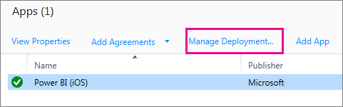
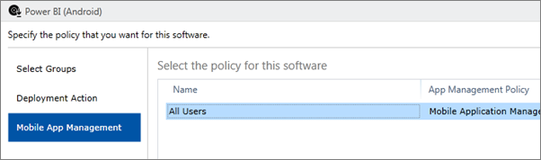
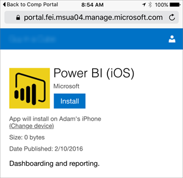

<properties
pageTitle="Configurar aplicaciones móviles con Intune"
description="Cómo configurar las aplicaciones móviles de Power BI con Microsoft Intune. Esto incluye cómo agregar e implementar la aplicación. Y cómo crear la directiva de aplicación móvil para controlar la seguridad."
services="powerbi"
documentationCenter=""
authors="guyinacube"
manager="mblythe"
backup=""
editor=""
tags=""
qualityFocus="no"
qualityDate=""/>

<tags
ms.service="powerbi"
ms.devlang="NA"
ms.topic="article"
ms.tgt_pltfrm="na"
ms.workload="powerbi"
ms.date="08/15/2016"
ms.author="asaxton"/>
# Configurar aplicaciones móviles de Power BI con Microsoft Intune

Microsoft Intune permite a las organizaciones administrar dispositivos y aplicaciones. Las aplicaciones móviles de Power BI, iOS y Android, integran con Intune que le permiten administrar la aplicación en los dispositivos y controlar la seguridad. A través de directivas de configuración, puede controlar elementos como requerir un pin de acceso, controlar cómo se controlan los datos por la aplicación o incluso cifrar los datos de la aplicación cuando la aplicación no está en uso.

## Configuración de administración de dispositivos móviles general

Este artículo no está pensado como guía de configuración completa de Microsoft Intune. Si ahora está integrando con Intune, hay algunas cosas que desea asegurarse de que ha configurado. [Obtener más información](https://technet.microsoft.com/library/jj676587.aspx)

Microsoft Intune puede coexistir con Mobile Device Management (MDM) dentro de Office 365. [Obtener más información](https://blogs.technet.microsoft.com/configmgrdogs/2016/01/04/microsoft-intune-co-existence-with-mdm-for-office-365/)

Este artículo se supone que Intune está configurado correctamente y que tiene los dispositivos inscritos con Intune. Si estás coexiste con MDM, el dispositivo mostrará inscrito en MDM, pero está disponible para administrar en Intune.

## Paso 1: Obtener la dirección url de la aplicación

Antes de crear la aplicación en Intune, necesitamos obtener las direcciones URL para las aplicaciones. Para iOS, se incluye de iTunes. Para Android, puede obtener desde la página móvil de Power BI.

Guarde la dirección url, ya que lo necesitará al crear la aplicación.

### iOS

Para obtener la dirección url de la aplicación para iOS, necesitamos obtener de iTunes.

1. Abra iTunes.

2. Buscar *Power BI*.

3. Debería ver **Microsoft Power BI** aparece bajo **iPhone aplicaciones** y **iPad aplicaciones**. Puede utilizar cualquiera, como, obtendrá la misma dirección url.

4. Seleccione el **obtener** de lista desplegable y seleccione **Copiar vínculo**.

    

Debería ser similar al siguiente.

    https://itunes.apple.com/us/app/microsoft-power-bi/id929738808?mt=8
    
### Android

Puede obtener la dirección url a Google Play desde la [página móvil de Power BI](https://powerbi.microsoft.com/mobile/). Al hacer clic en el **descargar de Google Play** icono le llevará a la página de aplicación. Puede copiar la dirección URL de la barra de direcciones del explorador. Debería ser similar al siguiente.

    https://play.google.com/store/apps/details?id=com.microsoft.powerbim

## Paso 2: Crear una directiva de administración de aplicaciones móviles

La directiva de administración de aplicaciones móviles le permite exigir los elementos como un NIP de acceso. Puede crear uno en el portal de Intune. 

Puede crear primero la aplicación o la directiva. No importa el orden en que se agregan. Se simplemente necesita tanto existen para el paso de implementación.

1. Seleccione **directiva** > **las directivas de configuración**.

    

2. Seleccione **Agregar...**.

3. En **Software** seleccione Administración de aplicaciones móviles para Android o iOS. Para empezar a trabajar rápidamente, puede seleccionar **crear una directiva con la configuración recomendada**, o puede crear una directiva personalizada.
    
4. Modificar la directiva para configurar las restricciones que desee en la aplicación.

## Paso 3: Crear la aplicación

La aplicación es una referencia o paquete, que se guarda en Intune para implementación. Necesitamos crear una aplicación y hacer referencia a la dirección url de la aplicación que recibimos de Google Play o iTunes.

Puede crear primero la aplicación o la directiva. No importa el orden en que se agregan. Se simplemente necesita tanto existen para el paso de implementación.

1. Vaya al portal y seleccione Intune **aplicaciones** en el menú izquierdo.

2. Seleccione **Agregar aplicación**. Esto iniciará el **Agregar Software** aplicación.

### iOS

1. Seleccione **aplicación iOS administrada de la tienda de aplicaciones** en la lista desplegable.

2. Escriba la dirección url de la aplicación, que recibimos de [paso 1](#step-1-get-the-url-for-the-application), y seleccione **siguiente**.

    
    
3. Proporcionar un **Publisher**, **nombre** y **descripción**. También puede proporcionar una **icono**. El **categoría** es para la aplicación de Portal de empresa. Una vez que haya terminado, seleccione **siguiente**.

4. Puede decidir si desea publicar la aplicación como **cualquier** (valor predeterminado), **iPad** o **iPhone**. De forma predeterminada se muestran **cualquier** y funcionará para ambos tipos de dispositivo. La aplicación Power BI es la misma dirección url para el iPhone y iPad. Seleccione **siguiente**.

5. Seleccione **cargar**.

> NOTA: No verá aparecen en la lista de aplicaciones hasta que actualice la página. Puede hacer clic en **Introducción** y a **aplicaciones** para obtener la página para volver a cargar.

### Android

1. Seleccione **vínculo externo** en la lista desplegable.

2. Escriba la dirección url de la aplicación, que recibimos de [paso 1](#step-1-get-the-url-for-the-application), y seleccione **siguiente**.

    
    
3. Proporcionar un **Publisher**, **nombre** y **descripción**. También puede proporcionar una **icono**. El **categoría** es para la aplicación de Portal de empresa. Una vez que haya terminado, seleccione **siguiente**.

5. Seleccione **cargar**.

> NOTA: No verá aparecen en la lista de aplicaciones hasta que actualice la página. Puede hacer clic en **Introducción** y a **aplicaciones** para obtener la página para volver a cargar.

## Paso 4: Implementación de la aplicación

Después de haber agregado la aplicación, debe implementarlo para que esté disponible para los usuarios finales. Este es el paso donde se enlazará la directiva creada con la aplicación.

### iOS

1. En la pantalla de aplicaciones, seleccione la aplicación que creó. A continuación, seleccione la **Administrar implementación** vínculo.

    

2. En la **Seleccionar grupos** pantalla, puede elegir qué grupos desea implementar esta aplicación. Seleccione **siguiente**.

3. En el **la acción de implementación** pantalla, puede elegir cómo desea implementar esta aplicación. Seleccionar **instalación disponible**, o **instalación requerida**, hará que la aplicación disponible en el Portal de empresa para los usuarios a instalar a petición. Cuando termine de realizar su selección, seleccione **siguiente**.

    

4. En el **administración de aplicaciones móviles** pantalla, puede seleccionar la directiva de administración de aplicaciones móviles que hemos creado en [paso 2](#step-2-create-a-mobile-application-management-policy). Usará la directiva que ha realizado, si es la única directiva de iOS disponible. Seleccione **siguiente**.

    

5. En el **el perfil de VPN** pantalla, puede seleccionar una directiva si dispone de uno para su organización. El valor predeterminado es **Ninguno**. Seleccione **siguiente**.

6. En el **configuración de la aplicación móvil** pantalla, puede seleccionar una **Directiva de configuración de aplicación** Si ha creado uno. El valor predeterminado es **Ninguno**. Esto no es necesario. Seleccione **Finalizar**.

Después de haber implementado la aplicación, debe mostrar **Sí** implementa en la página de aplicaciones.

### Android

1. En la pantalla de aplicaciones, seleccione la aplicación que creó. A continuación, seleccione la **Administrar implementación** vínculo.

    

2. En la **Seleccionar grupos** pantalla, puede elegir qué grupos desea implementar esta aplicación. Seleccione **siguiente**.

3. En el **la acción de implementación** pantalla, puede elegir cómo desea implementar esta aplicación. Seleccionar **instalación disponible**, o **instalación requerida**, hará que la aplicación disponible en el Portal de empresa para los usuarios a instalar a petición. Cuando termine de realizar su selección, seleccione **siguiente**.

    

4. En el **administración de aplicaciones móviles** pantalla, puede seleccionar la directiva de administración de aplicaciones móviles que hemos creado en [paso 2](#step-2-create-a-mobile-application-management-policy). Tomará predeterminado a la directiva que ha realizado, si es la directiva sólo Android disponible. Seleccione **Finalizar**.

    

Después de haber implementado la aplicación, debe mostrar **Sí** implementa en la página de aplicaciones.

## Paso 5: Instalar la aplicación en un dispositivo

Se instalará la aplicación a través de la aplicación de Portal de empresa. Si no ha instalado el Portal de empresa, puede obtener a través de la tienda de aplicaciones en plataformas Android o iOS. Iniciará sesión en el Portal de empresa con su inicio de sesión organizativa.

1. Abra la aplicación del portal de empresa.

2. Si no ve la aplicación de Power BI aparece como aplicación destacada, seleccione **aplicaciones de empresa**.

    

3. Seleccione la aplicación de Power BI que ha implementado.

    

4. Seleccione **Instalar**.

    

5. Si se encuentra en iOS, insertará la aplicación para usted. Seleccione **instalar** en el cuadro de diálogo de inserción.

    
    
Una vez instalado, verá que es **administra su empresa**. Si ha habilitado el acceso con un pin en la directiva, verá lo siguiente.

## Vídeo

<iframe width="560" height="315" src="https://www.youtube.com/embed/9HF-qsdQvHw?list=PLv2BtOtLblH1nPVPU2etFzTNmpz49dwXm" frameborder="0" allowfullscreen></iframe>

## Consulte también

[Configure and deploy mobile application management policies in the Microsoft Intune console](https://technet.microsoft.com/library/dn878026.aspx)  
[Aplicaciones para dispositivos móviles de Power BI](powerbi-power-bi-apps-for-mobile-devices.md)  
¿Preguntas más frecuentes? [Pruebe la Comunidad de Power BI](http://community.powerbi.com/)