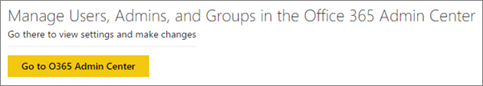
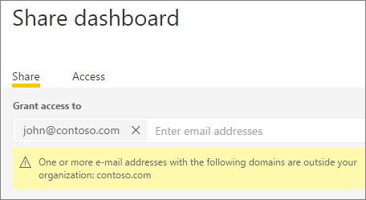

<properties
   pageTitle="Portal de administración"
   description="El portal de administración permite la administración de inquilinos de Power BI en su organización. Incluye elementos como las métricas de uso, acceso a la configuración y el centro de administración de Office 365."
   services="powerbi"
   documentationCenter=""
   authors="guyinacube"
   manager="mblythe"
   backup=""
   editor=""
   tags=""
   qualityFocus="no"
   qualityDate=""/>
<tags
   ms.service="powerbi"
   ms.devlang="NA"
   ms.topic="article"
   ms.tgt_pltfrm="NA"
   ms.workload="powerbi"
   ms.date="08/15/2016"
   ms.author="asaxton"/>
# Portal de administración de Power BI

Administración de inquilinos de Power BI para su empresa se realiza mediante el portal de administración de Power BI. El portal de administración es accesible para todos los usuarios que son administradores globales de Office 365. 

## Cómo abrir el portal de administración

Para abrir el portal de administración de Power BI, haga lo siguiente.

1. Seleccione el engranaje de la configuración en la parte superior derecha del servicio Power BI.

2. Seleccione **Portal de administración de**.

> [AZURE.NOTE] La cuenta debe estar marcada como un **Administrador Global**, dentro de Office 365 o Azure Active Directory, para obtener acceso al portal de administración de Power BI.

En el portal, hay 3 pestañas. Estos métodos se describen a continuación.
-   [Métricas de uso](#usage-metrics)
-   [Administrar usuarios](#manage-users)
-   [Registros de auditoría](#audit-logs)
-   [Configuración de inquilinos](#tenant-settings)

## Métricas de uso

La primera ficha, en el portal de administración es **métricas de uso**. El informe de métricas de uso le ofrece la capacidad de supervisar el uso de Power BI para su organización. También proporciona la capacidad para ver qué usuarios y grupos, son los más activos en Power BI para su organización.

> [AZURE.NOTE] La primera vez tener acceso al panel, o después de visitar nuevo tras un largo período de no ve el panel, probablemente verá una pantalla de carga mientras se carga en el panel.

Una vez las cargas del panel, verá dos secciones de mosaicos. La primera sección incluye datos de uso para usuarios individuales y la segunda sección muestra información similar para los grupos de su organización.

Éste es un desglose de lo que verá en cada mosaico:

- Recuento distinto de todos los paneles, informes y conjuntos de datos en el área de trabajo de usuario

    

- Panel más utilizado por el número de usuarios que pueden tener acceso a él. Por ejemplo, si tiene un panel que comparte con 3 usuarios y también se agrega a dos usuarios distintos conectados a un paquete de contenido, su recuento sería 6 (1 + 3 + 2)

    

- Los usuarios de contenido más populares conectan a. Esto sería todo lo que los usuarios llegara a través del proceso de obtención de datos, por lo que los paquetes, paquetes de contenido organizativo, archivos o bases de datos de contenido SaaS.

    

- Una vista de los usuarios principales según el número de paneles tienen, ambos paneles que han creado ellos mismos y paneles compartidos a ellos.

    

- Una vista de los usuarios principales según cuántos informes tienen

    

La segunda sección muestra el mismo tipo de información, pero se basa en grupos. Esto le permitirá ver qué grupos de la organización son más activos y qué tipo de información están utilizando.

Con esta información, se podrá obtener la información real en cómo las personas están usando Power BI en toda la organización y poder reconocer dichos usuarios y grupos, que son muy activos en su organización.

## Administrar usuarios

La segunda pestaña, en el portal de administración es **Administrar usuarios**. Administración de usuarios, para Power BI, se realiza en el centro de administración de Office 365, por lo que esta sección le permite alcanzar rápidamente el área para administrar usuarios, administradores y grupos dentro de Office 365.

Al hacer clic en **vaya al centro de administración de Office 365**, vaya directamente al centro de administración de Office 365 página para administrar los usuarios de su inquilino de inicio.

## Registros de auditoría

Es la tercera ficha en el portal de administración de **registros de auditoría**. Los registros se encuentran en el centro de seguridad de Office 365 y cumplimiento. Esta sección permite obtener acceso rápidamente a esa área dentro de Office 365. 

Para obtener más información acerca de los registros de auditoría, consulte [auditoría Power BI en su organización](powerbi-admin-auditing.md)

## Configuración de inquilinos

La tercera pestaña en el portal de administración es **configuración de inquilinos**. Configuración del inquilino ofrecen un mayor control sobre qué características estarán disponibles para su organización. Si le preocupa en torno a los datos confidenciales, algunas de nuestras características pueden no ser adecuado para su organización. Si es así, se puede desactivar en el inquilino.

> [AZURE.IMPORTANT] Estos parámetros son globales. Apagarlos afectará a todos los usuarios, el uso de Power BI, en su organización!

Cuando se activa la configuración y desactiva, aparecerá una notificación que sabrá que se realizó correctamente. Pueden tardar hasta 10 minutos para la configuración surta efecto para todos los usuarios en el inquilino.

### Publicar paquetes de contenido en toda la organización

Esta configuración controla si los usuarios del inquilino de pueden publicar paquetes de contenido en toda la organización.

### Permitir uso compartido de contenido a los usuarios externos

Esta configuración determina si puede compartir un panel con usuarios fuera de su organización.

### Publicar en web

Esta configuración determina si se puede usar el **publicar en web** la característica de informes. [Obtener más información](powerbi-service-publish-to-web.md)

### Exportar datos

Esta configuración determina si puede exportar datos desde un icono o una visualización. [Obtener más información](powerbi-service-export-data.md)

## Consulte también

[Auditoría de Power BI en su organización](powerbi-admin-auditing.md)  
[Administración de Power BI en su organización](powerbi-admin-administering-power-bi-in-your-organization.md)  
¿Preguntas más frecuentes? [Pruebe la Comunidad de Power BI](http://community.powerbi.com/)