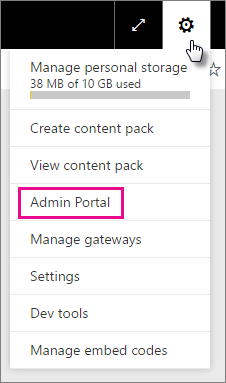
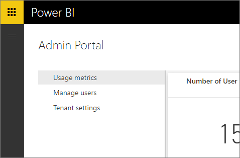
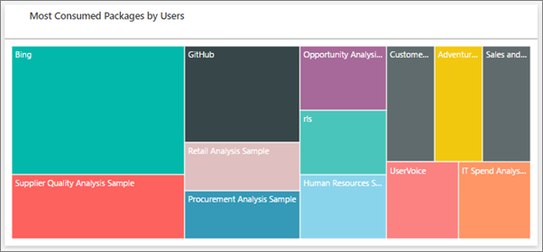
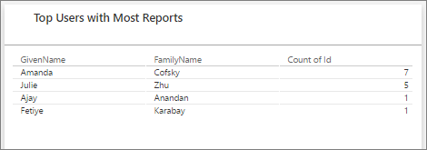
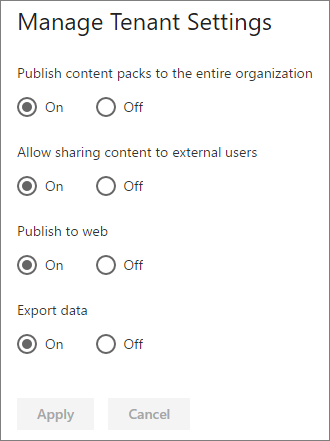

<properties
   pageTitle="Portal de administración"
   description="The admin portal allows for tenant management of Power BI in your organization. It includes items such as usage metrics, access to the Office 365 admin center, and settings."
   services="powerbi"
   documentationCenter=""
   authors="guyinacube"
   manager="mblythe"
   backup=""
   editor=""
   tags=""
   qualityFocus="no"
   qualityDate=""/>
<tags
   ms.service="powerbi"
   ms.devlang="NA"
   ms.topic="article"
   ms.tgt_pltfrm="NA"
   ms.workload="powerbi"
   ms.date="08/15/2016"
   ms.author="asaxton"/>
# Power BI admin portal

Tenant management of Power BI for your company is done through the Power BI admin portal. The admin portal is accessible to all users who are Global Admins in Office 365. 

## How to get to the admin portal

To get to the Power BI admin portal, do the following.

1. Select the settings gear in the top right of the Power BI service.

2. Select <bpt id="p1">**</bpt>Admin Portal<ept id="p1">**</ept>.

> [AZURE.NOTE] Your account needs to be marked as a <bpt id="p1">**</bpt>Global Admin<ept id="p1">**</ept>, within Office 365 or Azure Active Directory, to get access to the Power BI admin portal.

Within the portal, there are 3 tabs. These are described below.
-   [Usage metrics](#usage-metrics)
-   [Administrar usuarios](#manage-users)
-   [Audit logs](#audit-logs)
-   [Tenant settings](#tenant-settings)

## Usage metrics

The first tab, in the admin portal, is <bpt id="p1">**</bpt>Usage metrics<ept id="p1">**</ept>. The usage metrics report gives you the ability to monitor usage within Power BI for your organization. It also provides the ability to see which users, and groups, are the most active within Power BI for your organization.

> [AZURE.NOTE] The first time you access the dashboard, or after you visit again after a long period of not viewing the dashboard, you'll likely see a loading screen while we load the dashboard.

Once the dashboard loads, you will see two sections of tiles. The first section includes usage data for individual users and the second section has similar information for groups in your organization.

Here’s a breakdown of what you will see in each tile:

- Distinct count of all dashboards, reports, and datasets in the user workspace

    

- Most consumed dashboard by number of users who can access it. For example, if you have a dashboard that you shared with 3 users, and you also added it to a content pack two different users connected to, its count would be 6 (1 + 3 + 2)

    

- The most popular content users connected to. This would be anything the users could reach through the Get Data process, so SaaS content packs, Organizational content packs, files or databases.

    

- A view of your top users based on how many dashboards they have, both dashboards they created themselves and dashboards shared to them.

    

- A view of your top users based on how many reports they have

    

The second section shows the same type of information, but based on groups. This will let you see which groups in your organization are most active and what kind of information they are using.

With this information, you will be able to get real insights into how people are using Power BI across your organization, and be able to recognize those users, and groups, who are very active in your organization.

## Administrar usuarios

The second tab, in the admin portal, is <bpt id="p1">**</bpt>Manage Users<ept id="p1">**</ept>. User management, for Power BI, is done in the Office 365 admin center, so this section allows you to quickly reach the area to manage users, admins, and groups within Office 365.

When you click <bpt id="p1">**</bpt>Go to O365 Admin Center<ept id="p1">**</ept>, you go directly to the Office 365 admin center landing page, to manage the users of your tenant.

## Audit logs

The third tab, in the admin portal, is <bpt id="p1">**</bpt>Audit logs<ept id="p1">**</ept>. The logs are located within the Office 365 Security &amp; Compliance center. This section allows you to quickly access that area within Office 365. 

For more information about audit logs, see <bpt id="p1">[</bpt>Auditing Power BI in your organization<ept id="p1">](powerbi-admin-auditing.md)</ept>

## Tenant settings

The third tab, in the admin portal, is <bpt id="p1">**</bpt>Tenant settings<ept id="p1">**</ept>. Tenant settings give you more control over what features are made available to your organization. If you have concerns around sensitive data, some of our features may not be right for your organization. If this is the case, you can switch it off in your tenant.

> [AZURE.IMPORTANT] These are global settings. Turning them off will affect all users, using Power BI, in your organization!

When you turning settings on and off, you will see a notification letting you know it was successful. It can take up to 10 minutes for the setting to take effect for everyone in your tenant.

### Publish content packs to the entire organization

This setting controls whether users of your tenant can publish content packs to the entire organization.

### Allow sharing content to external users

This setting determines whether you can share a dashboard with users outside of your oganization.

### Publish to web

This setting determines whether you can use the <bpt id="p1">**</bpt>Publish to web<ept id="p1">**</ept> feature for reports. [Obtener más información](powerbi-service-publish-to-web.md)

### Export data

This setting determines whether you can export data from a tile or visualization. [Obtener más información](powerbi-service-export-data.md)

## Consulte también

[Auditing Power BI in your organization](powerbi-admin-auditing.md)  
[Administering Power BI in your Organization](powerbi-admin-administering-power-bi-in-your-organization.md)  
More questions? [Try the Power BI Community](http://community.powerbi.com/)