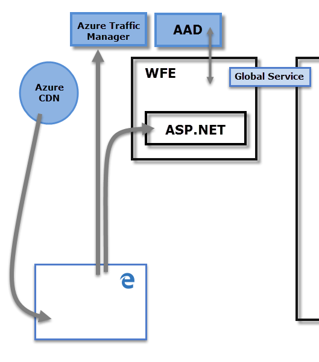

<properties
   pageTitle="Seguridad de Power BI"
   description="Seguridad de Power BI. Cómo Power BI se relaciona con Azure Active Directory y otros servicios de Azure. Este tema también incluye un vínculo a un documento que va a obtener información más detallado."
   services="powerbi"
   documentationCenter=""
   authors="guyinacube"
   manager="mblythe"
   backup=""
   editor=""
   tags=""
   qualityFocus="no"
   qualityDate=""/>

<tags
   ms.service="powerbi"
   ms.devlang="NA"
   ms.topic="article"
   ms.tgt_pltfrm="NA"
   ms.workload="powerbi"
   ms.date="09/28/2016"
   ms.author="asaxton"/>

# Seguridad de Power BI

Obtener una explicación detallada de la seguridad de Power BI, [descargar las notas del producto Power BI seguridad](http://go.microsoft.com/fwlink/?LinkId=829185).

El servicio Power BI se basa en **Azure**, que es la infraestructura informática y plataforma de nube de Microsoft. La arquitectura del servicio Power BI se basa en dos clústeres: el Front-End Web (**WFE**) clúster y **Back-End** clúster. El clúster WFE es responsable de la conexión inicial y la autenticación en el servicio Power BI y, una vez autenticado, el Back-End se encarga de todas las interacciones de usuario siguientes. Power BI usa Azure Active Directory (AAD) para almacenar y administrar identidades de usuario y administra el almacenamiento de datos y metadatos con BLOBS de Azure y base de datos de SQL Azure, respectivamente.

## Arquitectura de Power BI

Cada implementación de Power BI consta de dos clústeres – un Front-End Web (**WFE**) clúster y un **Back-End** clúster.

El **WFE** clúster administra el proceso de conexión y autenticación inicial para Power BI, con AAD para autenticar clientes y proporcionar tokens de cliente posteriores conexiones al servicio Power BI. Power BI también usa el **Azure Traffic Manager** (ATM) para dirigir el tráfico de usuarios hacia el centro de datos más cercano, determinado por el registro DNS del cliente intenta conectarse, el proceso de autenticación y para descargar archivos y contenido estático. Power BI usa el **red de entrega de contenido de Azure** (CDN) para distribuir eficazmente los archivos a los usuarios y el contenido estático necesario basándose en la región geográfica.

El **Back-End** clúster es los clientes autenticados cómo interactuar con el servicio Power BI. El **Back-End** clúster administra visualizaciones, paneles de usuario, conjuntos de datos, informes, almacenamiento de datos, conexiones de datos, la actualización de datos y otros aspectos de la interacción con el servicio Power BI. El **función puerta de enlace** actúa como una puerta de enlace entre las solicitudes de usuario y el servicio Power BI. Los usuarios no interactúan directamente con los roles distinto de los **rol de puerta de enlace**. 
            **Administración de API de Azure** finalmente controlará la **función puerta de enlace**.

> [AZURE.IMPORTANT] Es imprescindible tener en cuenta que solo **administración de API de Azure** (APIM) y **puerta de enlace** roles (GW) son accesibles a través de la red Internet pública. Proporcionan autenticación, autorización, DDoS protección, limitación, equilibrio de carga, enrutamiento y otras capacidades.

## Seguridad de almacenamiento de datos
Power BI usa dos repositorios principales para almacenar y administrar datos: los datos que se cargan desde los usuarios normalmente se envían a **Azure BLOB** almacenamiento y todos los metadatos así como artefactos para el propio sistema se almacenan en **base de datos de SQL Azure**.

La línea de puntos en el **Back-End** imagen de clúster anterior, clarifica el límite entre el sólo dos componentes que son accesibles para los usuarios (a la izquierda de la línea de puntos) y los roles que sólo son accesibles para el sistema. Cuando un usuario autenticado se conecta al servicio Power BI, la conexión y acepta cualquier solicitud del cliente y administra los **rol de puerta de enlace** (finalmente a ser manipulados por **administración de API de Azure**), que luego interactúa en nombre del usuario con el resto del servicio de Power BI. Por ejemplo, cuando un cliente intenta ver un panel, el **función puerta de enlace** acepta la solicitud, a continuación, envía una solicitud de forma independiente el **presentación rol** para recuperar los datos necesarios mediante el explorador para representar el panel.

## Autenticación de usuario

Power BI usa Azure Active Directory ([AAD](http://azure.microsoft.com/services/active-directory/)) para autenticar a los usuarios que el inicio de sesión para el servicio Power BI y, a su vez, usa las credenciales de inicio de sesión de Power BI siempre que un usuario intenten recursos que requieren autenticación. Inicio de sesión de los usuarios al servicio Power BI con la dirección de correo electrónico que se utiliza para establecer su cuenta de Power BI; Power BI usa el correo electrónico de inicio de sesión como el *nombre de usuario efectivo*, que se pasa a los recursos de cada vez que un usuario intenta conectarse a los datos. El *nombre de usuario efectivo* a continuación, se asigna a un *nombre Principal de usuario* ([UPN](https://msdn.microsoft.com/library/windows/desktop/aa380525\(v=vs.85\).aspx) y resolver en la cuenta de dominio de Windows asociada, en la que se aplica la autenticación.

Para las organizaciones que utilizan mensajes de correo electrónico de trabajo para el inicio de sesión de Power BI (como *david@contoso.com*), el *nombre de usuario efectivo* a UPN asignación es sencilla. Para las organizaciones que no utiliza mensajes de correo electrónico de trabajo para el inicio de sesión de Power BI (como *david@contoso.onmicrosoft.com*), la asignación entre AAD y local se requieren credenciales [la sincronización de directorios](https://technet.microsoft.com/library/jj573653.aspx) funcione correctamente.

Seguridad de la plataforma para Power BI también incluye la capacidad para agregar medidas de seguridad adicionales basados en AAD, seguridad de redes y seguridad del entorno de varios inquilinos.

## Seguridad de datos y servicio

Para obtener más información, visite la [Microsoft Trust Center](https://www.microsoft.com/trustcenter).

Como se describió anteriormente en este artículo, se utiliza el inicio de sesión de un usuario Power BI por servidores de Active Directory local para asignar a un UPN para las credenciales. Sin embargo, es **importante** a tener en cuenta que los usuarios son responsables de los datos que comparten: si un usuario se conecta a orígenes de datos utilizando sus credenciales y, a continuación, comparte un informe (o panel o conjunto de datos) basándose en los datos, los usuarios con los que se comparte el panel no está autenticados con el origen de datos original y se le concederá acceso al informe.

Una excepción es que las conexiones a **SQL Server Analysis Services** utilizando el **puerta de enlace de datos local**; se almacenan en caché de los paneles en Power BI, pero el acceso a informes subyacentes o conjuntos de datos inician la autenticación para el usuario que intenta tener acceso al informe (o conjunto de datos) y sólo se concede acceso si el usuario tiene suficientes credenciales para tener acceso a los datos. Para obtener más información, consulte [profundización de puerta de enlace de datos local](powerbi-gateway-onprem-indepth.md).
