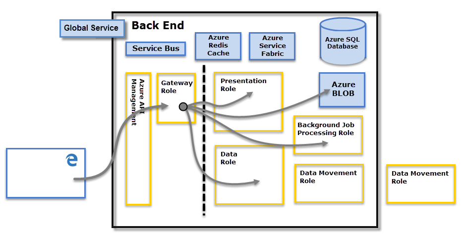

<properties
   pageTitle="Power BI Security"
   description="Power BI Security. How Power BI relates to Azure Active Directory and other Azure services. This topic also includes a link to a white paper which goes more in-depth."
   services="powerbi"
   documentationCenter=""
   authors="guyinacube"
   manager="mblythe"
   backup=""
   editor=""
   tags=""
   qualityFocus="no"
   qualityDate=""/>

<tags
   ms.service="powerbi"
   ms.devlang="NA"
   ms.topic="article"
   ms.tgt_pltfrm="NA"
   ms.workload="powerbi"
   ms.date="09/28/2016"
   ms.author="asaxton"/>

# Power BI Security

For a detailed explanation of Power BI security, please <bpt id="p1">[</bpt>download the Power BI Security whitepaper<ept id="p1">](http://go.microsoft.com/fwlink/?LinkId=829185)</ept>.

The Power BI service is built on <bpt id="p1">**</bpt>Azure<ept id="p1">**</ept>, which is Microsoft’s cloud computing infrastructure and platform. The Power BI service architecture is based on two clusters – the Web Front End (<bpt id="p1">**</bpt>WFE<ept id="p1">**</ept>) cluster and the <bpt id="p2">**</bpt>Back End<ept id="p2">**</ept> cluster. The WFE cluster is responsible for initial connection and authentication to the Power BI service, and once authenticated, the Back End handles all subsequent user interactions. Power BI uses Azure Active Directory (AAD) to store and manage user identities, and manages the storage of data and metadata using Azure BLOB and Azure SQL Database, respectively.

## Power BI Architecture

Each Power BI deployment consists of two clusters – a Web Front End (<bpt id="p1">**</bpt>WFE<ept id="p1">**</ept>) cluster, and a <bpt id="p2">**</bpt>Back End<ept id="p2">**</ept> cluster.

The <bpt id="p1">**</bpt>WFE<ept id="p1">**</ept> cluster manages the initial connection and authentication process for Power BI, using AAD to authenticate clients and provide tokens for subsequent client connections to the Power BI service. Power BI also uses the <bpt id="p1">**</bpt>Azure Traffic Manager<ept id="p1">**</ept> (ATM) to direct user traffic to the nearest datacenter, determined by the DNS record of the client attempting to connect, for the authentication process and to download static content and files. Power BI uses the <bpt id="p1">**</bpt>Azure Content Delivery Network<ept id="p1">**</ept> (CDN) to efficiently distribute the necessary static content and files to users based on geographical locale.

The <bpt id="p1">**</bpt>Back End<ept id="p1">**</ept> cluster is how authenticated clients interact with the Power BI service. The <bpt id="p1">**</bpt>Back End<ept id="p1">**</ept> cluster manages visualizations, user dashboards, datasets, reports, data storage, data connections, data refresh, and other aspects of interacting with the Power BI service. The <bpt id="p1">**</bpt>Gateway Role<ept id="p1">**</ept> acts as a gateway between user requests and the Power BI service. Users do not interact directly with any roles other than the <bpt id="p1">**</bpt>Gateway Role<ept id="p1">**</ept>. <bpt id="p1">**</bpt>Azure API Management<ept id="p1">**</ept> will eventually handle the <bpt id="p2">**</bpt>Gateway Role<ept id="p2">**</ept>.

> [AZURE.IMPORTANT] It is imperative to note that only <bpt id="p1">**</bpt>Azure API Management<ept id="p1">**</ept> (APIM) and <bpt id="p2">**</bpt>Gateway<ept id="p2">**</ept> (GW) roles are accessible through the public Internet. They provide authentication, authorization, DDoS protection, Throttling, Load Balancing, Routing, and other capabilities.

## Data Storage Security
Power BI uses two primary repositories for storing and managing data: data that is uploaded from users is typically sent to <bpt id="p1">**</bpt>Azure BLOB<ept id="p1">**</ept> storage, and all metadata as well as artifacts for the system itself are stored in <bpt id="p2">**</bpt>Azure SQL Database<ept id="p2">**</ept>.

The dotted line in the <bpt id="p1">**</bpt>Back End<ept id="p1">**</ept> cluster image, above, clarifies the boundary between the only two components that are accessible by users (left of the dotted line), and roles that are only accessible by the system. When an authenticated user connects to the Power BI Service, the connection and any request by the client is accepted and managed by the <bpt id="p1">**</bpt>Gateway Role<ept id="p1">**</ept> (eventually to be handled by <bpt id="p2">**</bpt>Azure API Management<ept id="p2">**</ept>), which then interacts on the user’s behalf with the rest of the Power BI Service. For example, when a client attempts to view a dashboard, the <bpt id="p1">**</bpt>Gateway Role<ept id="p1">**</ept> accepts that request then separately sends a request to the <bpt id="p2">**</bpt>Presentation Role<ept id="p2">**</ept> to retrieve the data needed by the browser to render the dashboard.

## Autenticación de usuario

Power BI uses Azure Active Directory (<bpt id="p1">[</bpt>AAD<ept id="p1">](http://azure.microsoft.com/services/active-directory/)</ept>) to authenticate users who login to the Power BI service, and in turn, uses the Power BI login credentials whenever a user attempt to resources that require authentication. Users login to the Power BI service using the email address used to establish their Power BI account; Power BI uses the that login email as the <bpt id="p1">*</bpt>effective username<ept id="p1">*</ept>, which is passed to resources whenever a user attempts to connect to data. The <bpt id="p1">*</bpt>effective username<ept id="p1">*</ept> is then mapped to a <bpt id="p2">*</bpt>User Principal Name<ept id="p2">*</ept> (<bpt id="p3">[</bpt>UPN<ept id="p3">](https://msdn.microsoft.com/library/windows/desktop/aa380525\(v=vs.85\).aspx)</ept> and resolved to the associated Windows domain account, against which authentication is applied.

For organizations that used work emails for Power BI login (such as <bpt id="p1">*</bpt>david@contoso.com<ept id="p1">*</ept>), the <bpt id="p2">*</bpt>effective username<ept id="p2">*</ept> to UPN mapping is straightforward. For organizations that did not use work emails for Power BI login (such as <bpt id="p1">*</bpt>david@contoso.onmicrosoft.com<ept id="p1">*</ept>), mapping between AAD and on-premises credentials will require <bpt id="p2">[</bpt>directory synchronization<ept id="p2">](https://technet.microsoft.com/library/jj573653.aspx)</ept> to work properly.

Platform security for Power BI also includes multi-tenant environment security, networking security, and the ability to add additional AAD-based security measures.

## Data and Service Security

For more information, please visit the <bpt id="p1">[</bpt>Microsoft Trust Center<ept id="p1">](https://www.microsoft.com/trustcenter)</ept>.

As described earlier in this article, a user’s Power BI login is used by on-premises Active Directory servers to map to a UPN for credentials. However, it’s <bpt id="p1">**</bpt>important<ept id="p1">**</ept> to note that users are responsible for the data they share: if a user connects to data sources using her credentials, then shares a report (or dashboard, or dataset) based on that data, users with whom the dashboard is shared are not authenticated against the original data source, and will be granted access to the report.

An exception is connections to <bpt id="p1">**</bpt>SQL Server Analysis Services<ept id="p1">**</ept> using the <bpt id="p2">**</bpt>On-premises Data Gateway<ept id="p2">**</ept>; dashboards are cached in Power BI, but access to underlying reports or datasets initiate authentication for the user attempting to access the report (or dataset), and access will only be granted if the user has sufficient credentials to access the data. For more information, see <bpt id="p1">[</bpt>On-premises Data Gateway deep dive<ept id="p1">](powerbi-gateway-onprem-indepth.md)</ept>.
