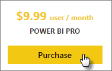

<properties 
   pageTitle="Poder adquisitivo BI Pro"
   description="Poder adquisitivo BI Pro"
   services="powerbi" 
   documentationCenter="" 
   authors="guyinacube" 
   manager="erikre" 
   backup=""
   editor=""
   tags=""
   qualityFocus="monitoring"
   qualityDate="08/15/2016"/>
 
<tags
   ms.service="powerbi"
   ms.devlang="NA"
   ms.topic="article"
   ms.tgt_pltfrm="NA"
   ms.workload="powerbi"
   ms.date="08/15/2016"
   ms.author="asaxton"/>
   
# Poder adquisitivo BI Pro

Power BI Pro proporciona acceso a características que no tiene un usuario gratuitas. Esto incluye el uso de la puerta de enlace de datos local para la actualización de datos local a orígenes de datos como SQL Server, grupos y otras características. Para obtener más información, consulte [contenido de Power BI Pro - ¿qué es?](powerbi-power-bi-pro-content-what-is-it.md).

Puede adquirir Power BI Pro directamente a través del sitio Web de Power BI, el centro de administración de Office 365 o su representante de Microsoft o su asociado. En este artículo examinaremos las dos opciones de evaluación disponibles para Power BI Pro y, a continuación, cómo comprar Power BI Pro como individuo o como una organización.

## Precios

Para obtener la información de precio más reciente de Power BI Pro y un listado de la tabla de características incluidas, consulte [precios de Power BI](https://powerbi.microsoft.com/pricing/).

## Versión de prueba de Power BI Pro 60 días

Después de registrarse para su cuenta gratuita, puede optar por probar Pro de forma gratuita. Tendrá acceso a todas las funciones de Pro para la duración de la versión de prueba. Power BI Pro incluye todas las características de la versión gratuita de Power BI y características de actualización de datos y la colaboración adicional. También tiene mayor capacidad de datos y límites de transmisión de datos. Para obtener más información, consulte [contenido de Power BI Pro - ¿qué es?](powerbi-power-bi-pro-content-what-is-it.md). Para probar una versión de prueba gratuita de 60 días de Power BI Pro, inicie sesión en Power BI y pruebe una de estas características de Power BI Pro:

-   Creación y publicación personalizada [paquetes de contenido](powerbi-service-organizational-content-packs-introduction.md)
-   Recurso compartido [actualizables](powerbi-refresh-data.md) paneles e informes de uso del equipo [grupos](powerbi-service-create-a-group-in-power-bi.md)
-   Conectarse a datos de local mediante [Personal Gateway](powerbi-personal-gateway.md)
-   Habilitar la conectividad interactivo directo a los orígenes siguientes:
    -   [SQL Server Analysis Services](powerbi-sql-server-analysis-services-tabular-data.md)
    -   [Spark en HDInsight de Azure](powerbi-spark-on-hdinsight-with-direct-connect.md)
    -   [Almacenamiento de datos SQL Azure](powerbi-azure-sql-data-warehouse-with-direct-connect.md)
    -   [Azure SQL Database](powerbi-azure-sql-database-with-direct-connect.md)

Cuando realice una de las características anteriores, se le pedirá para iniciar la prueba gratuita. También puede hacer uso de ella en el icono de engranaje y seleccione **Administrar almacenamiento personal**. A continuación, seleccione **prueba gratuita de Pro para** a la derecha.

 
Puede seleccionar **Inicio prueba**.

> **Notas**
>
>-   Si necesita más tiempo para evaluar Power BI, puede solicitar para ampliar el período de prueba de 60 días más.
>-   Aprovechándose de esta versión de evaluación del producto Power BI Pro no aparece en el portal de administración de Office 365 como usuarios de Power BI Pro prueba (aparecen como usuarios gratuitos de Power BI). Sin embargo, aparecerán como usuarios de la versión de prueba de Power BI Pro en el **Administrar almacenamiento** página en Power BI.
>-   Si es un administrador de TI que deseen adquirir e implementar licencias de prueba de Power BI a varios usuarios de su organización sin necesidad de aceptar los términos de prueba individualmente usuarios individuales, puede registrarse para una [Power BI Pro suscripción de prueba](https://portal.office.com/Signup/MainSignup15.aspx?OfferId=d59682f3-3e3b-4686-9c00-7c7c1c736085&dl=POWER_BI_PRO).  Debe ser un administrador de facturación o Office 365 Global o crear un nuevo inquilino para suscribirse a un administrador de prueba. [Obtener más información](powerbi-admin-purchasing-power-bi-pro.md)

### Aspecto dentro del servicio

Cuando esté en el servicio, puede comprobar que tiene una cuenta de prueba Pro yendo a la **engranaje* icono y seleccione **Administrar almacenamiento personal**.

## Poder adquisitivo BI Pro como usuario individual

Puede adquirir Power BI Pro desde el principio, o puede elegir actualizar a Pro después de finaliza la prueba gratuita. Si la cuenta forma parte de una organización, puede comprar Power BI Pro como usuario individual si su organización ha deshabilitado compras individuales.

Para adquirir Power BI Pro como usuario individual, puede hacer lo siguiente.

1.  Vaya a [powerbi.com](https://www.powerbi.com).

2.  Seleccione **productos** > **precios**.

3.  Seleccione **compra**.

    

4.  Responda las preguntas que se presentan para guiar la compra. Como usuario individual, habrá una opción para seleccionar **yo mismo**. 

    

    > [AZURE.NOTE] Si está interesado en la opción de comprar para su equipo u organización, puede leer sobre la adquisición de Power BI Pro para su organización. [Obtener más información]()

5.  Si aún no ha iniciado en Power BI, debe iniciar sesión con su cuenta de Power BI (gratis).

6.  Debe proporcionar información para realizar la compra.

### Aspecto dentro del servicio

Cuando esté en el servicio, puede comprobar que tiene una cuenta de Pro, vaya a la **engranaje** icono y seleccione **Administrar almacenamiento personal**.

## Suscripción de prueba de Office 365

Puede obtener Power BI Pro como una prueba para su organización. Una vez que la suscripción, puede asignar licencias Power BI Pro para los usuarios. [Obtener más información](https://support.office.com/article/Assign-or-unassign-licenses-for-Office-365-for-business-997596b5-4173-4627-b915-36abac6786dc)

> [AZURE.NOTE] Hay un límite de una evaluación organizativa por inquilino. Esto significa que si alguien ya aplicado la versión de prueba de Power BI Pro para el inquilino, no se vuelva a hacerlo. Si necesita ayuda con esto, puede ponerse en contacto [soporte de facturación de Office 365](https://support.office.microsoft.com/article/Contact-Office-365-for-business-support-Admin-Help-32a17ca7-6fa0-4870-8a8d-e25ba4ccfd4b?CorrelationId=552bbf37-214f-4202-80cb-b94240dcd671&ui=en-US&rs=en-US&ad=US#BKMK_call_support).
 
1.  Desplácese hasta el [Centro de administración de Office 365](https://portal.office.com/admin/default.aspx).
2.  En el panel de navegación izquierdo, seleccione facturación > suscripciones.
3.  Seleccione Agregar suscripciones + en el lado derecho.
4.  En otros planes, mantenga el mouse sobre los puntos suspensivos (...) para Power BI Pro y seleccione la versión de prueba gratuita de inicio.

    

5.  En la confirmación la pantalla de orden, seleccione Probar ahora.
6.  Seleccione Continuar en la recepción del pedido.

Bajo **facturación** > **suscripciones**, verá **versión de prueba de Power BI Pro** aparece con 25 licencias disponibles. Se trata de un prueba de un mes.

### Aspecto dentro del servicio

Cuando esté en el servicio, puede comprobar que tiene una cuenta de Pro, vaya a la **engranaje** icono y seleccione **Administrar almacenamiento personal**. No habrá ninguna indicación de que se trata de un usuario de prueba.

## Compra de suscripción de Office 365

Puede adquirir Power BI Pro para su organización a través del centro de administración de Office 365. Una vez que la suscripción, puede asignar licencias Power BI Pro para los usuarios. [Obtener más información](https://support.office.com/article/Assign-or-unassign-licenses-for-Office-365-for-business-997596b5-4173-4627-b915-36abac6786dc)
 
1.  Desplácese hasta el [Centro de administración de Office 365](https://portal.office.com/admin/default.aspx).
2.  En el panel de navegación izquierdo, seleccione facturación > suscripciones.
3.  Seleccione Agregar suscripciones + en el lado derecho.
4.  En otros planes, mantenga el mouse sobre los puntos suspensivos (...) para Power BI Pro y seleccione Comprar ahora.

    

5.  Escriba el número de licencias que desea agregar y seleccione Extraer ahora o agregar al carro.

    > [AZURE.NOTE] Puede agregar más adelante si es necesario.

6.  Escriba la información necesaria en la comprobación de flujo de cierre.

> [AZURE.NOTE] Si ya tenía la versión de prueba de Power BI Pro, pasará directamente a la pantalla de retirada para el número de licencias que desee de la entrada.

Bajo **facturación** > **suscripciones**, verá **Power BI Pro** enumerados. Si más adelante decide que desea agregar más licencias, puede volver a **Agregar suscripciones**, y seleccione **cambiar la cantidad de licencias**.

### Aspecto dentro del servicio

Cuando esté en el servicio, puede comprobar que tiene una cuenta de Pro, vaya a la **engranaje** icono y seleccione **Administrar almacenamiento personal**.
 

## Consulte también

[Suscripción de autoservicio para Power BI](powerbi-service-self-service-signup-for-power-bi.md)  
[Power BI (gratuito) de su organización](powerbi-admin-powerbi-free-in-your-organization.md)  
¿Preguntas más frecuentes? [Pruebe la Comunidad de Power BI](http://community.powerbi.com/)