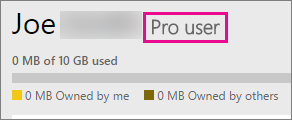
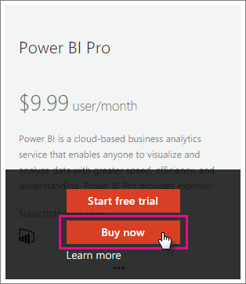

<properties 
   pageTitle="Purchasing Power BI Pro"
   description="Purchasing Power BI Pro"
   services="powerbi" 
   documentationCenter="" 
   authors="guyinacube" 
   manager="erikre" 
   backup=""
   editor=""
   tags=""
   qualityFocus="monitoring"
   qualityDate="08/15/2016"/>
 
<tags
   ms.service="powerbi"
   ms.devlang="NA"
   ms.topic="article"
   ms.tgt_pltfrm="NA"
   ms.workload="powerbi"
   ms.date="08/15/2016"
   ms.author="asaxton"/>
   
# Purchasing Power BI Pro

Power BI Pro provides access to features that a free user does not have. This includes use of the On-Premises Data Gateway for on-premises data refresh to data sources such as SQL Server, Groups and other features. For more information, see <bpt id="p1">[</bpt>Power BI Pro content - what is it?<ept id="p1">](powerbi-power-bi-pro-content-what-is-it.md)</ept>.

You can purchase Power BI Pro directly through the Power BI website, the Office 365 admin center or through your Microsoft representative or partner. This article will look at the two trial options available for Power BI Pro, and then how to purchase Power BI Pro as an individual, or as an organization.

## Precios

For the latest pricing information of Power BI Pro and a table listing of included features, see <bpt id="p1">[</bpt>Power BI Pricing<ept id="p1">](https://powerbi.microsoft.com/pricing/)</ept>.

## Power BI Pro 60 day trial

After you have signed up for your free account, you can optionally choose to try Pro for free. You will have access to all of the Pro features for the duration of the trial. Power BI Pro has all the features of the free version of Power BI, and additional collaboration and data refresh features. It also has higher data capacity and data streaming limits. For more information, see <bpt id="p1">[</bpt>Power BI Pro content - what is it?<ept id="p1">](powerbi-power-bi-pro-content-what-is-it.md)</ept>. To try a 60-day free trial of Power BI Pro, sign into Power BI, and try one of these Power BI Pro features:

-   Create and publish customized <bpt id="p1">[</bpt>content packs<ept id="p1">](powerbi-service-organizational-content-packs-introduction.md)</ept>
-   Share <bpt id="p1">[</bpt>refreshable<ept id="p1">](powerbi-refresh-data.md)</ept> team dashboards and reports using <bpt id="p2">[</bpt>groups<ept id="p2">](powerbi-service-create-a-group-in-power-bi.md)</ept>
-   Connect to on-premises data using <bpt id="p1">[</bpt>Personal Gateway<ept id="p1">](powerbi-personal-gateway.md)</ept>
-   Enable live interactive connectivity to the following sources:
    -   [SQL Server Analysis Services](powerbi-sql-server-analysis-services-tabular-data.md)
    -   [Spark on Azure HDInsight](powerbi-spark-on-hdinsight-with-direct-connect.md)
    -   [Azure SQL Data Warehouse](powerbi-azure-sql-data-warehouse-with-direct-connect.md)
    -   [Azure SQL Database](powerbi-azure-sql-database-with-direct-connect.md)

When you try any of the above features, you will be prompted to start your free trial. You can also choose to make use of it by going to the gear icon and selecting <bpt id="p1">**</bpt>Manage personal storage<ept id="p1">**</ept>. Then select <bpt id="p1">**</bpt>Try Pro for free<ept id="p1">**</ept> on the right.

 
Then you can select <bpt id="p1">**</bpt>Start trial<ept id="p1">**</ept>.

> **Notas**
>
>-   If you need more time to evaluate Power BI, you can request to extend your trial period for 60 more days.
>-   Users taking advantage of this in-product Power BI Pro trial do not appear in the Office 365 admin portal as Power BI Pro Trial users (they appear as Power BI free users). They will, however, show up as Power BI Pro Trial users in the <bpt id="p1">**</bpt>manage storage<ept id="p1">**</ept> page in Power BI.
>-   If you are an IT Administrator wishing to acquire and deploy Power BI trial licenses to multiple users in your organization without having individual users accept trial terms individually, you can sign up for a <bpt id="p1">[</bpt>Power BI Pro subscription trial<ept id="p1">](https://portal.office.com/Signup/MainSignup15.aspx?OfferId=d59682f3-3e3b-4686-9c00-7c7c1c736085&amp;dl=POWER_BI_PRO)</ept>.  You will need to be an Office 365 Global or Billing Admin or create a new tenant to sign up for an admin trial. [Obtener más información](powerbi-admin-purchasing-power-bi-pro.md)

### What this looks like within the service

When you are in the service, you can verify that you have a Pro trial account by going to the <bpt id="p1">*</bpt><bpt id="p2">*</bpt>gear<ept id="p2">*</ept> icon and selecting <ept id="p1">*</ept><bpt id="p3">*</bpt>Manage personal storage<ept id="p3">*</ept>*.

## Purchasing Power BI Pro as an individual

You can purchase Power BI Pro from the start, or can choose to upgrade to Pro after your free trial has ended. If your account is part of an organization, you can purchase Power BI Pro as an individual if your organization has not disabled individual purchases.

To purchase Power BI Pro as an individual, you can do the following.

1.  Browse to <bpt id="p1">[</bpt>powerbi.com<ept id="p1">](https://www.powerbi.com)</ept>.

2.  Select <bpt id="p1">**</bpt>Products<ept id="p1">**</ept><ph id="ph1"> &gt; </ph><bpt id="p2">**</bpt>Pricing<ept id="p2">**</ept>.

3.  Select <bpt id="p1">**</bpt>Purchase<ept id="p1">**</ept>.

    

4.  Answer the questions that are presented to guide the purchase. As an individual, there will be an option to select <bpt id="p1">**</bpt>Myself<ept id="p1">**</ept>. 

    

    > [AZURE.NOTE] If you are interested in the option to purchase for your team or organization, you can read about purchasing Power BI Pro for your organization. [Obtener más información]()

5.  If you aren’t already signed into Power BI, you will need to sign in with your Power BI (free) account.

6.  You will need to provide information to make the purchase.

### What this looks like within the service

When you are in the service, you can verify that you have a Pro account by going to the <bpt id="p1">**</bpt>gear<ept id="p1">**</ept> icon and selecting <bpt id="p2">**</bpt>Manage personal storage<ept id="p2">**</ept>.

## Subscription trial in Office 365

You can get Power BI Pro as a trial for your organization. Once you have the subscription, you can assign Power BI Pro licenses to your users. [Obtener más información](https://support.office.com/article/Assign-or-unassign-licenses-for-Office-365-for-business-997596b5-4173-4627-b915-36abac6786dc)

> [AZURE.NOTE] There is a limit of one organizational trial per tenant. This means that if someone has already applied the Power BI Pro Trial to your tenant, you cannot do it again. If you need assistance with this, you can contact <bpt id="p1">[</bpt>Office 365 Billing support<ept id="p1">](https://support.office.microsoft.com/article/Contact-Office-365-for-business-support-Admin-Help-32a17ca7-6fa0-4870-8a8d-e25ba4ccfd4b?CorrelationId=552bbf37-214f-4202-80cb-b94240dcd671&amp;ui=en-US&amp;rs=en-US&amp;ad=US#BKMK_call_support)</ept>.
 
1.  Navigate to the <bpt id="p1">[</bpt>Office 365 admin center<ept id="p1">](https://portal.office.com/admin/default.aspx)</ept>.
2.  On the left navigation pane, select Billing &gt; Subscriptions.
3.  Select Add subscriptions + on the right side.
4.  Under Other Plans, hover over the ellipse (…) for Power BI Pro and select Start free trial.

    

5.  On the confirm your order screen, select Try now.
6.  Select Continue on the order receipt.

Under <bpt id="p1">**</bpt>Billing<ept id="p1">**</ept><ph id="ph1"> &gt; </ph><bpt id="p2">**</bpt>Subscriptions<ept id="p2">**</ept>, you will see <bpt id="p3">**</bpt>Power BI Pro Trial<ept id="p3">**</ept> listed with 25 licenses available. This is a one month trial.

### What this looks like within the service

When you are in the service, you can verify that you have a Pro account by going to the <bpt id="p1">**</bpt>gear<ept id="p1">**</ept> icon and selecting <bpt id="p2">**</bpt>Manage personal storage<ept id="p2">**</ept>. There will be no indication that this is a trial user.

## Purchase subscription in Office 365

You can purchase Power BI Pro for your organization through the Office 365 admin center. Once you have the subscription, you can assign Power BI Pro licenses to your users. [Obtener más información](https://support.office.com/article/Assign-or-unassign-licenses-for-Office-365-for-business-997596b5-4173-4627-b915-36abac6786dc)
 
1.  Navigate to the <bpt id="p1">[</bpt>Office 365 admin center<ept id="p1">](https://portal.office.com/admin/default.aspx)</ept>.
2.  On the left navigation pane, select Billing &gt; Subscriptions.
3.  Select Add subscriptions + on the right side.
4.  Under Other Plans, hover over the ellipse (…) for Power BI Pro and select Buy now.

    

5.  Enter the number of licenses you would like to add and select Check out now or Add to cart.

    > [AZURE.NOTE] You can add more at a later date if needed.

6.  Enter the needed information in the check out flow.

> [AZURE.NOTE] If you already had the Power BI Pro Trial, it will go directly to the checkout screen asking to input the number of licenses you want.

Under <bpt id="p1">**</bpt>Billing<ept id="p1">**</ept><ph id="ph1"> &gt; </ph><bpt id="p2">**</bpt>Subscriptions<ept id="p2">**</ept>, you will see <bpt id="p3">**</bpt>Power BI Pro<ept id="p3">**</ept> listed. If you decide later that you want to add more licenses, you can go back to <bpt id="p1">**</bpt>Add subscriptions<ept id="p1">**</ept>, and select <bpt id="p2">**</bpt>Change license quantity<ept id="p2">**</ept>.

### What this looks like within the service

When you are in the service, you can verify that you have a Pro account by going to the <bpt id="p1">**</bpt>gear<ept id="p1">**</ept> icon and selecting <bpt id="p2">**</bpt>Manage personal storage<ept id="p2">**</ept>.
 

## Consulte también

[Self-service sign up for Power BI](powerbi-service-self-service-signup-for-power-bi.md)  
[Power BI (free) in your organization](powerbi-admin-powerbi-free-in-your-organization.md)  
More questions? [Try the Power BI Community](http://community.powerbi.com/)