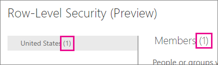
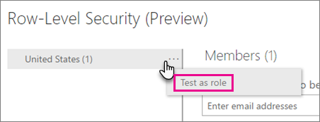
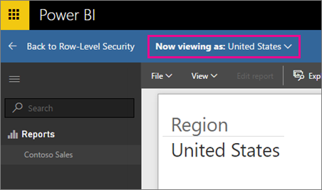
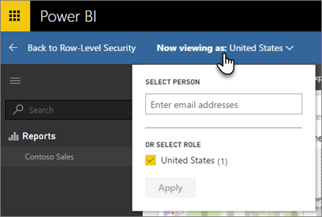
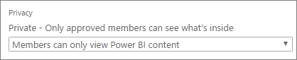

<properties
pageTitle="Seguridad de nivel de fila (RLS) con Power BI"
description="Cómo configurar la seguridad de nivel de fila de los conjuntos de datos importados y DirectQuery, dentro del servicio Power BI."
services="powerbi"
documentationCenter=""
authors="guyinacube"
manager="mblythe"
backup=""
editor=""
tags=""
qualityFocus="no"
qualityDate=""/>

<tags
ms.service="powerbi"
ms.devlang="NA"
ms.topic="article"
ms.tgt_pltfrm="na"
ms.workload="powerbi"
ms.date="10/18/2016"
ms.author="asaxton"/>
# Seguridad de nivel de fila (RLS) con Power BI

<iframe width="560" height="315" src="https://www.youtube.com/embed/67fK0GoVQ80?showinfo=0" frameborder="0" allowfullscreen></iframe>

Seguridad de nivel de fila (RLS) con Power BI puede utilizarse para restringir el acceso a datos para los usuarios. Los filtros restringen los datos en el nivel de fila. Puede definir filtros en roles.

> [AZURE.NOTE] RLS no es una característica de Pro. Puede leer más sobre qué [contenido Pro](powerbi-power-bi-pro-content-what-is-it.md) es.

Ahora puede configurar RLS para modelos de datos importados en Power BI con Power BI Desktop. También puede configurar RLS en conjuntos de datos que utilizan DirectQuery, como SQL Server. Anteriormente, podía sólo implementar RLS dentro de modelos de Analysis Services local fuera de Power BI. Para las conexiones en directo de Analysis Services, configurar la seguridad de nivel de fila en el modelo en local. La opción de seguridad no mostrará los conjuntos de datos de la conexión activa.

[AZURE.INCLUDE [include-short-name](../includes/rls-desktop-define-roles.md)]

[AZURE.INCLUDE [include-short-name](../includes/rls-desktop-view-as-roles.md)]

## Administrar la seguridad en el modelo

Para administrar la seguridad en el modelo de datos, deberá hacer lo siguiente.

1.  Seleccione el **puntos suspensivos (...)** para un conjunto de datos.
2.  Seleccione **seguridad**.

    
 
Esto le llevará a la página RLS para agregar miembros a un rol creado en Power BI Desktop. Sólo los propietarios del conjunto de datos verán seguridad disponible. Si el conjunto de datos está en un grupo, sólo los administradores del grupo verán la opción de seguridad. 

Sólo puede crear o modificar roles de Power BI Desktop.

## Trabajar con miembros

### Agregar miembros

Puede agregar un miembro a la función escribiendo la dirección de correo electrónico o el nombre del usuario, seguridad de grupo o lista de distribución que desee agregar. Este miembro debe estar dentro de su organización. No se puede agregar que grupos se crean en Power BI.

 
También puede ver cuántos miembros forman parte de la función por el número entre paréntesis junto al nombre del rol o junto a los miembros.

 
### Quitar miembros

Puede quitar a los miembros seleccionando la X junto a su nombre. 
 

## Validar el rol en el servicio Power BI

Puede validar que la función definida por el que funciona correctamente mediante la comprobación de la función. 

1. Seleccione el **puntos suspensivos (...)** junto a la función.
2. Seleccione **datos como función de prueba**

A continuación, verá los informes que están disponibles para este rol. Los paneles no se presentan en esta vista. En la barra azul anterior, verá lo que se aplica.

Puede probar otras funciones o combinación de funciones, seleccionando **Ver ahora como**.

Puede elegir ver los datos como una persona específica o puede seleccionar una combinación de roles disponibles para validar que están trabajando. 

Para volver a la vista normal, seleccione **a la seguridad de nivel de fila**.

[AZURE.INCLUDE [include-short-name](../includes/rls-usernames.md)]

## Uso de RLS con grupos de Power BI

Si publica un informe de Power BI Desktop a un grupo en el servicio Power BI, los roles se aplica a los miembros de sólo lectura. Debe indicar que los miembros solo pueden ver contenido de Power BI dentro de la configuración del grupo.

> [AZURE.WARNING] Si ha configurado el grupo para que los miembros tienen permisos de edición, los roles RLS no se aplicará a ellos. Los usuarios podrán ver todos los datos.

[AZURE.INCLUDE [include-short-name](../includes/rls-limitations.md)]

[AZURE.INCLUDE [include-short-name](../includes/rls-faq.md)]

## Consulte también

            [Seguridad de nivel de fila (RLS) con Power BI Desktop](powerbi-desktop-rls.md)  
¿Preguntas más frecuentes? 
            [Pruebe la Comunidad de Power BI](http://community.powerbi.com/)