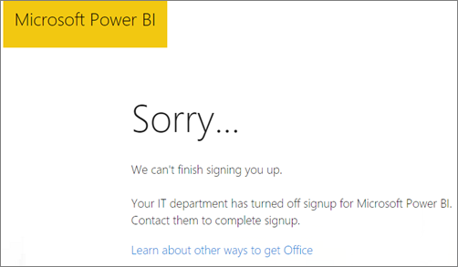

<properties
pageTitle="No se puede agregar Power BI para Office 365 asociado"
description="No se puede agregar Power BI con un asociado de distribución de Office 365. El modelo distribuido es un modelo de compra utilizado Office 365."
services="powerbi"
documentationCenter=""
authors="guyinacube"
manager="mblythe"
backup=""
editor=""
tags=""
qualityFocus="no"
qualityDate=""/>

<tags
ms.service="powerbi"
ms.devlang="NA"
ms.topic="article"
ms.tgt_pltfrm="na"
ms.workload="powerbi"
ms.date="08/15/2016"
ms.author="asaxton"/>
# No se puede agregar suscripción a Office 365 socio Power BI

Office 365 permite a las empresas revenden Office 365 empaquetan y se integran con sus propias soluciones, proporcionando a los clientes finales con un solo punto de contacto para compras, facturación y soporte técnico.

Si está interesado en adquirir Power BI, junto con su suscripción de Office 365, se recomienda ponerse en contacto con su socio para hacerlo. Si el socio no ofrece Power BI, tendrá diferentes opciones que puede considerar.

1. Es posible comprar el servicio de otro canal, ya sea directamente desde Microsoft u otro socio comercial. Esta opción no está disponible para todos los clientes según su relación con el socio comercial. Puede comprobarlo si va a la **Portal de administración de Office 365** > **facturación** > **suscripciones**. Si ve **suscripciones**, puede adquirir el servicio de Microsoft directamente, o también puede ponerse en contacto con un socio que ofrece Power BI.

    

2.  Si no ve **suscripciones** aparece bajo **facturación**, no se puede comprar de Microsoft directamente o de otro socio. 

    

Si no es posible comprar Power BI directamente y, dependiendo del tipo de suscripción de Power BI le interesa, todavía tiene algunas opciones.

[Power BI (gratis)](#power-bi-free)

[Power BI Pro](#power-bi-pro)

## Power BI (gratis)

Si está satisfecho con la oferta gratuita para Power BI, puede registrarse para el servicio gratuito. De forma predeterminada, se deshabilitan individuales suscripciones, también conocido como las suscripciones de ad hoc. Cuando intenta iniciar sesión en Power BI, verá un mensaje que indica que el departamento de TI ha desactivado inicio de sesión para Microsoft Power BI.

    Your IT department has turned off signup for Microsoft Power BI.

Para habilitar las suscripciones de ad hoc, puede ponerse en contacto con un socio y la solicitud que activen. Si es un administrador del inquilino de y saber cómo aprovechar los comandos de PowerShell de Azure Active Directory, puede habilitar las suscripciones de ad hoc. [Obtener más información](https://technet.microsoft.com/library/jj151815.aspx)

1. Debe iniciar sesión primero en Azure Active Directory mediante las credenciales de Office 365. La primera línea le solicitará las credenciales. La segunda línea se conecta a Azure Active Directory.

        $msolcred = get-credential
        connect-msolservice -credential $msolcred

    

2. Una vez que ha iniciado sesión, puede emitir el comando siguiente para habilitar el inicio de sesión gratuita SAI (UPS).

        Set-MsolCompanySettings -AllowAdHocSubscriptions $true

## Power BI Pro

Si desea comprar una suscripción a Power BI Pro, tendrá que trabajar con su socio comercial para tener en cuenta qué opciones tiene.

- El socio acuerda agregar Power BI a su cartera de modo que puede adquirir de ellos.
- Su socio es capaz de realizar la transición a un modelo donde puede comprar Power BI directamente desde Microsoft o de otro socio que ofrece Power BI.

Este vídeo examina la distribución de Office 365 y poder adquisitivo BI:

<iframe width="560" height="315" src="https://www.youtube.com/embed/C357phT94A8" frameborder="0" allowfullscreen></iframe>

## Consulte también

[Administrar Azure AD mediante Windows PowerShell](https://technet.microsoft.com/library/jj151815.aspx)  
¿Preguntas más frecuentes? [Pruebe la Comunidad de Power BI](http://community.powerbi.com/)
