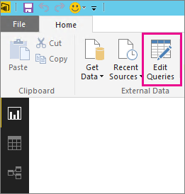

<properties
   pageTitle="Solucionar problemas de origen de datos no admitidos para la actualización"
   description="Solucionar problemas de origen de datos no admitidos para la actualización"
   services="powerbi"
   documentationCenter=""
   authors="guyinacube"
   manager="mblythe"
   backup=""
   editor=""
   tags=""
   qualityFocus="no"
   qualityDate=""/>

<tags
   ms.service="powerbi"
   ms.devlang="NA"
   ms.topic="article"
   ms.tgt_pltfrm="NA"
   ms.workload="powerbi"
   ms.date="08/15/2016"
   ms.author="asaxton"/>

# Solucionar problemas de origen de datos no admitidos para la actualización  

Puede ver un error al intentar configurar un conjunto de datos para la actualización programada.

        You cannot schedule refresh for this dataset because it gets data from sources that currently don’t support refresh.

Esto sucede cuando el origen de datos que usó en Power BI Desktop, no se admite para la actualización. Debe buscar el origen de datos que está utilizando y compare eso con la lista de admite orígenes de datos en [Actualizar datos en Power BI](powerbi-refresh-data.md). 

## Buscar el origen de datos  
Si no está seguro de qué origen de datos se utilizó, encontrará mediante los siguientes pasos en Power BI Desktop.  

1.  En Power BI Desktop, asegúrese de que se encuentra en el **informe** panel.  
    

2.  Seleccione **Editar consultas** desde la barra de la cinta de opciones.  
    

3.  Seleccione **Editor avanzadas**.  
    

4.  Tome nota del proveedor para el origen.  En este ejemplo, el proveedor es Active Directory.  
    

5.  Comparar con la lista de orígenes de datos admitidos se encuentran en el proveedor de [Actualizar datos en Power BI](powerbi-refresh-data.md).  Encontrará que Active Directory no es un origen de datos admitidos para la actualización.  

## Véase también

[Actualización de datos](powerbi-refresh-data.md)  
[Puerta de enlace de Power BI - Personal](powerbi-personal-gateway.md)  
[Puerta de enlace de datos local](powerbi-gateway-onprem.md)  
[Solución de problemas de la puerta de enlace de datos local](powerbi-gateway-onprem-tshoot.md)  
[Solución de problemas de la puerta de enlace de Power BI - Personal](powerbi-admin-troubleshooting-power-bi-personal-gateway.md)  
¿Preguntas más frecuentes? [Pruebe la Comunidad de Power BI](http://community.powerbi.com/)