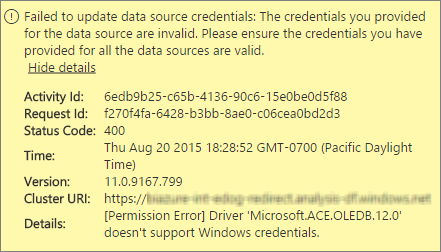
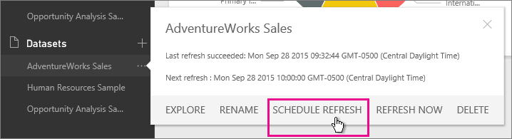
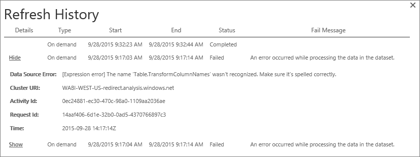
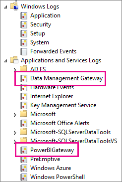
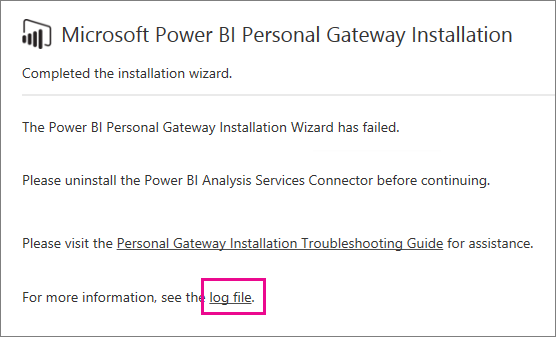

<properties 
   pageTitle="Solución de problemas de puerta de enlace de Power BI - Personal"
   description="Solución de problemas de puerta de enlace de Power BI - Personal"
   services="powerbi" 
   documentationCenter="" 
   authors="guyinacube" 
   manager="mblythe" 
   backup=""
   editor=""
   tags=""
   qualityFocus="monitoring"
   qualityDate="07/25/2016"/>
 
<tags
   ms.service="powerbi"
   ms.devlang="NA"
   ms.topic="article"
   ms.tgt_pltfrm="NA"
   ms.workload="powerbi"
   ms.date="09/06/2016"
   ms.author="asaxton"/>
# Solución de problemas de puerta de enlace de Power BI - Personal

A continuación se pasa por algunos problemas comunes que puede producirse al usar la puerta de enlace de Power BI - Personal. 

> [AZURE.NOTE] Si detecta un problema que no se enumera a continuación, puede pedir ayuda adicional en el [sitio de la Comunidad](http://community.powerbi.com/), o puede crear un [admite vale](https://powerbi.microsoft.com/support/).

## Actualice a la versión más reciente 
 
Muchos problemas pueden surgir cuando la versión de la puerta de enlace no está actualizada.  Es una buena práctica general para asegurarse de que se encuentra en la versión más reciente.  Si no ha actualizado la puerta de enlace durante un mes o más, puede considerar la instalación de la versión más reciente de la puerta de enlace y vea si puede reproducir el problema.

## Instalación

            **Puerta de enlace personal es de 64 bits** -Si su equipo es de 32 bits, no podrá instalar la puerta de enlace personal. El sistema operativo debe ser de 64 bits. Debe instalar una versión de 64 bits de Windows, o la puerta de enlace personal en un equipo de 64 bits.

            **No se puede instalar como un servicio aunque sea un administrador local para el equipo de puerta de enlace personal** -instalación puede fallar si el usuario está en el grupo de administradores locales del equipo, pero la directiva de grupo no permite ese nombre de usuario iniciar sesión como un servicio.  En este momento, asegúrese de que la directiva de grupo permite a un usuario iniciar sesión como un servicio. Estamos trabajando en una solución para este problema. [Obtener más información](https://technet.microsoft.com/library/cc739424.aspx)

            **Operación agotó el tiempo de espera** -Esto es frecuente si el equipo (equipo físico o máquina Virtual) en el que va a instalar la puerta de enlace personal tiene un procesador de núcleo único. Cierre las aplicaciones y desactivar los procesos que no sean necesarios e intente instalar de nuevo.

            **Data Management Gateway o el conector de Analysis Services no puede instalarse en el mismo equipo que la puerta de enlace personal** : si ya tiene un conector de Analysis Services o puerta de enlace de datos de administración instalado, debe desinstalar el conector o la puerta de enlace y, a continuación, intente instalar la puerta de enlace personal.

 > [AZURE.NOTE] Si detecta un problema durante la instalación, los registros de instalación podrían proporcionar información para ayudarle a resolver el problema. Consulte [registros de instalación](#SetupLogs) para obtener más información.
 
 
            **Configuración de proxy**
 se pueden producir problemas con la configuración de la puerta de enlace personal si su entorno necesita el uso de un servidor proxy. Para obtener más información acerca de cómo configurar la información de proxy, consulte [configuración de proxy para las puertas de enlace de Power BI](powerbi-gateway-proxy.md)

## Programación de actualización

**Error: La credencial almacenada en la nube es que faltan.**

Puede obtener este error en la configuración de \<conjunto de datos\> Si una actualización programada y, a continuación, desinstalar y volver a instalar la puerta de enlace personal. Cuando se desinstala una puerta de enlace personal, se quitan las credenciales de origen de datos para un conjunto de datos que se ha configurado para la actualización desde el servicio Power BI.

            **Solución:** en Power BI, vaya a la configuración de actualización de un conjunto de datos. En Administrar orígenes de datos de cualquier origen de datos con un error, haga clic en Editar credenciales y vuelva a iniciar la sesión en el origen de datos.

**Error: Las credenciales proporcionadas para el conjunto de datos no son válidas. Actualice las credenciales a través de una actualización o en el cuadro de diálogo de configuración de origen de datos para continuar.**

            **Solución**: Si recibe un mensaje de credenciales, esto podría significar que:

-   Asegúrese de que los nombres de usuario y contraseñas que utiliza para iniciar sesión en orígenes de datos están actualizadas. En Power BI, vaya a actualizar la configuración del conjunto de datos. En Administrar orígenes de datos, haga clic en Editar credenciales para actualizar las credenciales del origen de datos.

-   Mashups entre un origen de la nube y un origen local, en una sola consulta, se producirá un error al actualizar en la puerta de enlace personal si uno de los orígenes utiliza OAuth para la autenticación. Un ejemplo de esto es un mashup entre CRM Online y un servidor SQL Server local. Esto generará un error porque CRM Online requiere OAuth.

    Se trata de un problema conocido y que se buscaba. Para solucionar el problema, tiene una consulta independiente para el origen de la nube y el origen local y use una combinación o anexar consulta para combinarlos.

**Error: El origen de datos no admitidos.**

            **Solución:** Si recibe un mensaje de origen de datos no admitidos en la configuración de la programación de actualización, esto podría significar que: 

-   El origen de datos no se admite actualmente para la actualización en Power BI. 

-   El libro de Excel no contiene un modelo de datos, sólo los datos de hoja de cálculo. Power BI actualmente sólo admite la actualización si el libro de Excel cargado contiene un modelo de datos. Al importar datos mediante Power Query en Excel, asegúrese de elegir la opción para cargar el modelo de datos para datos. Esto garantiza que se importan datos en un modelo de datos. 

**Error: [No se puede combinar datos] &lt;parte de la consulta&gt;/&lt;...&gt;/&lt;…&gt; tiene acceso a orígenes de datos que tienen niveles de privacidad que no pueden utilizarse juntos. Vuelva a generar esta combinación de datos.**

            **Solución**: este error es debido a las restricciones de nivel de privacidad y los tipos de orígenes de datos que está utilizando. [Obtener más información](powerbi-refresh-enable-fast-combine.md)

**Error: Error de origen de datos: no se puede convertir el valor "\[tabla\]" al tipo de tabla.**

            **Solución**: este error es debido a las restricciones de nivel de privacidad y los tipos de orígenes de datos que está utilizando. [Obtener más información](powerbi-refresh-enable-fast-combine.md)

**Error: No hay espacio suficiente para esta fila.**

Esto ocurrirá si tiene una sola fila mayor que 4 MB de tamaño. Debe determinar cuál es la fila del origen de datos e intentar filtrar o reducir el tamaño de la fila.

## Orígenes de datos

            **Proveedor de datos que faltan** : la puerta de enlace personal es 64 bits sólo. Requiere una versión de 64 bits de los proveedores de datos esté instalado en el mismo equipo donde se instaló la puerta de enlace personal. Por ejemplo, si el origen de datos del conjunto de datos es Microsoft Access, debe instalar al proveedor ACE de 64 bits en el mismo equipo donde instaló la puerta de enlace personal.  
            **Nota:** Si tiene Excel de 32 bits, no puede instalar un proveedor ACE de 64 bits en el mismo equipo.

            **No se admite la autenticación de Windows para la base de datos de Access** -Power BI solo admite actualmente anónimo para la base de datos de Access. Estamos trabajando en habilitar la autenticación de Windows para la base de datos de Access.

            **Error de identificación al especificar credenciales para un origen de datos** -Si obtiene un error similar al siguiente al escribir las credenciales de Windows para un origen de datos, es posible que en una versión anterior de la puerta de enlace personal. 
            [Instale la versión más reciente de Power BI Gateway - Personal](https://powerbi.microsoft.com/gateway/).

  

            **Error: Error de identificación cuando se selecciona la autenticación de Windows para un origen de datos mediante OLE DB de ACE** : si se produce el siguiente error al introducir credenciales de origen de datos de un origen de datos mediante el proveedor OLE DB de ACE:

Power BI no admite la autenticación de Windows para un origen de datos mediante el proveedor OLE DB de ACE.

            **Solución:** para solucionar este error, puede seleccionar la autenticación anónima. Proveedor OLEDB de ACE heredada, credenciales anónimas son equivalentes a las credenciales de Windows.

## Actualización de mosaico

Si recibe un error con los iconos de panel de actualización, consulte el siguiente artículo.

[Solución de problemas de errores de mosaico](powerbi-refresh-troubleshooting-tile-errors.md)

## Herramientas para la solución de problemas

### Historial de actualización  

            **Historial de actualización** puede ayudarle a ver qué errores se han producido, así como proporcionar datos útiles si necesita crear una solicitud de soporte técnico. Puede ver ambos programada, así como a petición, las actualizaciones. A continuación mostramos cómo puede tener acceso a la **historial de actualización**.

1.  En el panel de navegación de Power BI en **conjuntos de datos**, seleccione un conjunto de datos &gt; menú Abrir &gt; **Programar actualización**.
    

2.  En **configuración...** &gt; **Programar actualización**, seleccione **historial de actualización**.  
    
  
    

### Registros de eventos  
Hay varios registros de eventos que pueden proporcionar información. Las dos primeras, **Data Management Gateway** y **PowerBIGateway**, están presentes si es administrador en el equipo.  Si no es un administrador y utiliza la puerta de enlace Personal, verá las entradas del registro dentro de la **aplicación** registro.

El **Data Management Gateway** y **PowerBIGateway** están presentes en registros **registros de aplicaciones y servicios**.

### Seguimiento de Fiddler  

            [Fiddler](http://www.telerik.com/fiddler) es una herramienta gratuita de Telerik que supervisa el tráfico HTTP.  Puede ver la parte posterior y hacia delante con Power BI de servicio desde el equipo cliente. Esto puede mostrar errores y otra información relacionada.

<a name="SetupLogs">
### Registros de instalación
Si el **Personal Gateway**, no se puede instalar, verá un vínculo para mostrar el registro de instalación. Puede mostrar detalles del error. Estos registros son registros de instalación de Windows, o también se conoce como registros MSI. Pueden ser bastante compleja y difícil de leer. Normalmente será el error resultante en la parte inferior, pero no es fácil determinar la causa del error. Podría ser el resultado de errores en un registro diferente, o ser el resultado de un error más arriba en el registro. 

Como alternativa, puede ir a su **carpeta Temp** (% temp %) y busque los archivos que comienzan con **Power\_BI\_**.

> [AZURE.NOTE] Ir a % temp % puede tardar en una subcarpeta de temp.  El **Power\_BI\_** archivos estarán en la raíz del directorio temporal.  Debe subir un nivel o dos.

## Véase también

[Configuración de proxy para las puertas de enlace de Power BI](powerbi-gateway-proxy.md)  
[Actualización de datos](powerbi-refresh-data.md)  
[Puerta de enlace de Power BI - Personal](powerbi-personal-gateway.md)  
[Solución de problemas de errores de mosaico](powerbi-refresh-troubleshooting-tile-errors.md)  
[Solución de problemas de la puerta de enlace de datos local](powerbi-gateway-onprem-tshoot.md)  
¿Preguntas más frecuentes? [Pruebe la Comunidad de Power BI](http://community.powerbi.com/)