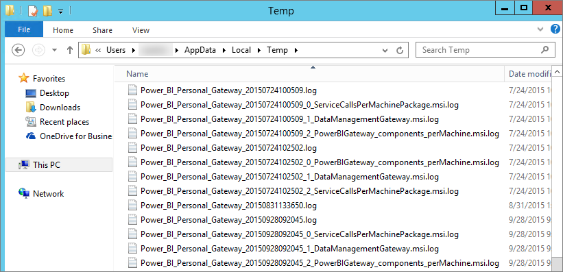

<properties 
   pageTitle="Troubleshooting Power BI Gateway - Personal"
   description="Troubleshooting Power BI Gateway - Personal"
   services="powerbi" 
   documentationCenter="" 
   authors="guyinacube" 
   manager="mblythe" 
   backup=""
   editor=""
   tags=""
   qualityFocus="monitoring"
   qualityDate="07/25/2016"/>
 
<tags
   ms.service="powerbi"
   ms.devlang="NA"
   ms.topic="article"
   ms.tgt_pltfrm="NA"
   ms.workload="powerbi"
   ms.date="09/06/2016"
   ms.author="asaxton"/>
# Troubleshooting Power BI Gateway - Personal

The following goes through some common issues you may encounter when using the Power BI Gateway - Personal. 

> [AZURE.NOTE] If you encounter an issue that is not listed below, you can ask for further assistance on the <bpt id="p1">[</bpt>community site<ept id="p1">](http://community.powerbi.com/)</ept>, or you can create a <bpt id="p2">[</bpt>support ticket<ept id="p2">](https://powerbi.microsoft.com/support/)</ept>.

## Update to the latest version 
 
A lot of issues can surface when the gateway version is out of date.  It is a good general practice to make sure you are on the latest version.  If you haven't updated the gateway for a month, or longer, you may want to consider installing the latest version of the gateway and see if you can reproduce the issue.

## Instalación

<bpt id="p1">**</bpt>Personal gateway is 64bit<ept id="p1">**</ept> - If your machine is 32bit, you will not be able to install the personal gateway. Your operating system needs to be 64bit. You will need to install a 64bit version of Windows, or install the personal gateway on a 64bit machine.

<bpt id="p1">**</bpt>Personal gateway fails to install as a service even though you are a local administrator for the computer<ept id="p1">**</ept> - Installation can fail if the user is in the computer’s local Administrator group, but group policy does not allow that username to log on as a service.  At the moment, ensure the group policy allows a user to log on as a service. We’re working on a fix for this issue. [Obtener más información](https://technet.microsoft.com/library/cc739424.aspx)

<bpt id="p1">**</bpt>Operation timed out<ept id="p1">**</ept> - This is common if the computer (physical machine or VM) on which you’re installing the personal gateway has a single core processor. Close any applications and turn off any non-essential processes and try installing again.

<bpt id="p1">**</bpt>Data Management Gateway or Analysis Services Connector cannot be installed on the same computer as personal gateway<ept id="p1">**</ept> - If you already have an Analysis Services Connector or Data Management Gateway installed, you must first uninstall the Connector or the gateway and then try installing the personal gateway.

 > [AZURE.NOTE] If you encounter an issue during installation, the setup logs could provide information to help you resolve the issue. See <bpt id="p1">[</bpt>Setup Logs<ept id="p1">](#SetupLogs)</ept> for more information.
 
 <bpt id="p1">**</bpt>Proxy configuration<ept id="p1">**</ept><ph id="ph1">
</ph> You may encounter issues with configuring the personal gateway if your environment needs the use of a proxy. To learn more about how to configure proxy information, see <bpt id="p1">[</bpt>Configuring proxy settings for the Power BI Gateways<ept id="p1">](powerbi-gateway-proxy.md)</ept>

## Schedule Refresh

**Error: The credential stored in the cloud is missing.**

You could get this error in Settings for <ph id="ph1">\&lt;</ph>dataset<ph id="ph2">\&gt;</ph> if you have a scheduled refresh and then uninstalled and re-installed the personal gateway. When you uninstall a personal gateway, data source credentials for a dataset that has been configured for refresh are removed from the Power BI service.

<bpt id="p1">**</bpt>Solution:<ept id="p1">**</ept> In Power BI, go to the refresh settings for a dataset. In Manage Data Sources, for any data source with an error, click Edit credentials and sign in to the data source again.

**Error: The credentials provided for the dataset are invalid. Please update the credentials through a refresh or in the Data Source Settings dialog to continue.**

<bpt id="p1">**</bpt>Solution<ept id="p1">**</ept>: If you get a credentials message, it could mean:

-   Make sure usernames and passwords used to sign into data sources are up to date. In Power BI, go to refresh settings for the dataset. In Manage Data Sources, click Edit credentials to update the credentials for the data source.

-   Mashups between a cloud source and an on-premises source, in a single query, will fail to refresh in the personal gateway if one of the sources is using OAuth for authentication. An example of this is a mashup between CRM Online and a local SQL Server. This will fail because CRM Online requires OAuth.

    This is a known issue, and being looked at. To work around the problem, have a separate query for the cloud source and the on-premises source and use a merge or append query to combine them.

**Error: Unsupported data source.**

<bpt id="p1">**</bpt>Solution:<ept id="p1">**</ept> If you get an unsupported data source message in Schedule Refresh settings, it could mean: 

-   The data source is not currently supported for refresh in Power BI. 

-   The Excel workbook does not contain a data model, only worksheet data. Power BI currently only supports refresh if the uploaded Excel workbook contains a data model. When you import data using Power Query in Excel, be sure to choose the option to Load data to data model. This ensures data is imported into a data model. 

**Error: [Unable to combine data] <ph id="ph1">&amp;lt;</ph>query part<ph id="ph2">&amp;gt;/&amp;lt;</ph>…<ph id="ph3">&amp;gt;/&amp;lt;</ph>…&gt; is accessing data sources that have privacy levels which cannot be used together. Please rebuild this data combination.**

<bpt id="p1">**</bpt>Solution<ept id="p1">**</ept>: This error is due to the privacy level restrictions and the types of data sources you are using. [Obtener más información](powerbi-refresh-enable-fast-combine.md)

**Error: Data source error: We cannot convert the value "<ph id="ph1">\[</ph>Table<ph id="ph2">\]</ph>" to type Table.**

<bpt id="p1">**</bpt>Solution<ept id="p1">**</ept>: This error is due to the privacy level restrictions and the types of data sources you are using. [Obtener más información](powerbi-refresh-enable-fast-combine.md)

**Error: There is not enough space for this row.**

This will occur if you have a single row greater than 4 MB in size. You will need to determine what the row is from your data source and attempt to filter it out or reduce the size for that row.

## Orígenes de datos

<bpt id="p1">**</bpt>Missing data provider<ept id="p1">**</ept> – The personal gateway is 64-bit only. It requires a 64-bit version of the data providers to be installed on the same computer where the personal gateway is installed. For example, if the data source in the dataset is Microsoft Access, you must install the 64-bit ACE provider on the same computer where you installed the personal gateway.  <bpt id="p1">**</bpt>Note:<ept id="p1">**</ept> if you have 32 bit Excel, you cannot install a 64-bit ACE provider on the same computer.

<bpt id="p1">**</bpt>Windows authentication is not supported for Access database<ept id="p1">**</ept> - Power BI currently only supports anonymous for Access database. We are working on enabling Windows authentication for Access database.

<bpt id="p1">**</bpt>Sign in error when entering credentials for a datasource<ept id="p1">**</ept> - If you get an error similar to this when entering Windows credentials for a data source, you might still be on an older version of the personal gateway. <bpt id="p1">[</bpt>Install the latest version of Power BI Gateway - Personal<ept id="p1">](https://powerbi.microsoft.com/gateway/)</ept>.

  

<bpt id="p1">**</bpt>Error: Sign in error when selecting Windows authentication for a data source using ACE OLEDB<ept id="p1">**</ept> - If you get the following error when entering data source credentials for a data source using ACE OLEDB provider:

Power BI does not currently support Windows authentication for a data source using ACE OLEDB provider.

<bpt id="p1">**</bpt>Solution:<ept id="p1">**</ept> To workaround this error, you can select Anonymous authentication. For legacy ACE OLEDB provider, Anonymous credentials are equivalent to Windows credentials.

## Tile refresh

If you are receiving an error with dashboard tiles refreshing, please refer to the following article.

[Troubleshooting tile errors](powerbi-refresh-troubleshooting-tile-errors.md)

## Herramientas para la solución de problemas

### Refresh History  
<bpt id="p1">**</bpt>Refresh History<ept id="p1">**</ept> can help you see what errors have occurred, as well as provide useful data if you should need to create a support request. You can view both scheduled, as well as on demand, refreshes. Here is how you can get to the <bpt id="p1">**</bpt>Refresh History<ept id="p1">**</ept>.

1.  In the Power BI navigation pane, in <bpt id="p1">**</bpt>Datasets<ept id="p1">**</ept>, select a dataset <ph id="ph1">&amp;gt;</ph> Open Menu <ph id="ph2">&amp;gt;</ph> <bpt id="p2">**</bpt>Schedule Refresh<ept id="p2">**</ept>.
    

2.     
    
  
    

### Registros de eventos  
There are several event logs that can provide information. The first two, <bpt id="p1">**</bpt>Data Management Gateway<ept id="p1">**</ept> and <bpt id="p2">**</bpt>PowerBIGateway<ept id="p2">**</ept>, are present if you are an admin on the machine.  If you are not an admin, and you are using the Personal Gateway, you will see the log entries within the <bpt id="p1">**</bpt>Application<ept id="p1">**</ept> log.

The <bpt id="p1">**</bpt>Data Management Gateway<ept id="p1">**</ept> and <bpt id="p2">**</bpt>PowerBIGateway<ept id="p2">**</ept> logs are present under <bpt id="p3">**</bpt>Application and Services Logs<ept id="p3">**</ept>.

### Fiddler Trace  
<bpt id="p1">[</bpt>Fiddler<ept id="p1">](http://www.telerik.com/fiddler)</ept> is a free tool from Telerik that monitors HTTP traffic.  You can see the back and forth with the Power BI service from the client machine. This may show errors and other related information.

<a name="SetupLogs">
### Setup Logs
If the <bpt id="p1">**</bpt>Personal Gateway<ept id="p1">**</ept>, fails to install, you will see a link to show the setup log. This could show you details about the failure. These are Windows Install logs, or also knows as MSI logs. They can be fairly complex and hard to read. Typically the resulting error will be at the bottom, but determining the cause of the error is not trivial. It could be a result of errors in a different log, or be a result of an error higher up in the log. 

Alternatively, you can go to your <bpt id="p1">**</bpt>Temp folder<ept id="p1">**</ept> (%temp%) and look for files that start with <bpt id="p2">**</bpt>Power<ph id="ph1">\_</ph>BI<ph id="ph2">\_</ph><ept id="p2">**</ept>.

> [AZURE.NOTE] Going to %temp% may take you to a subfolder of temp.  The <bpt id="p1">**</bpt>Power<ph id="ph1">\_</ph>BI<ph id="ph2">\_</ph><ept id="p1">**</ept> files will be in the root of the temp directory.  You may need to go up a level or two.

## Véase también

[Configuring proxy settings for the Power BI Gateways](powerbi-gateway-proxy.md)  
[Data Refresh](powerbi-refresh-data.md)  
[Power BI Gateway - Personal](powerbi-personal-gateway.md)  
[Troubleshooting tile errors](powerbi-refresh-troubleshooting-tile-errors.md)  
[Troubleshooting the On-premises Data Gateway](powerbi-gateway-onprem-tshoot.md)  
More questions? [Try the Power BI Community](http://community.powerbi.com/)