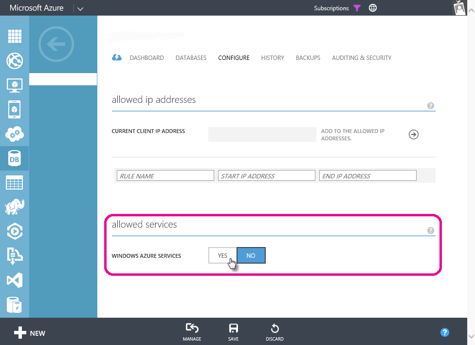

<properties 
   pageTitle="Solución de problemas de actualización programada para bases de datos de SQL Azure"
   description="Solución de problemas de actualización programada para las bases de datos SQL Azure en Power BI"
   services="powerbi" 
   documentationCenter="" 
   authors="guyinacube" 
   manager="mblythe" 
   backup=""
   editor=""
   tags=""
   qualityFocus="no"
   qualityDate=""/>
 
<tags
   ms.service="powerbi"
   ms.devlang="NA"
   ms.topic="article"
   ms.tgt_pltfrm="NA"
   ms.workload="powerbi"
   ms.date="09/21/2016"
   ms.author="asaxton"/>

# Solución de problemas de actualización programada para las bases de datos SQL Azure en Power BI  

Para obtener pasos detallados acerca de cómo configurar la actualización programada, asegúrese de ver [Actualizar datos en Power BI](powerbi-refresh-data.md).

Mientras configura programado actualización para la base de datos de SQL Azure, si se produce un error con el código de error 400 durante la edición de las credenciales, intente lo siguiente para configurar la regla de firewall apropiada:

1.  Inicie sesión en el portal de administración de Azure

2.  Vaya a configuración de actualización para el servidor de SQL Azure

3.  Activar 'Windows Azure Services' en la sección servicios permitidos

  

¿Preguntas más frecuentes? [Pruebe la Comunidad de Power BI](http://community.powerbi.com/)