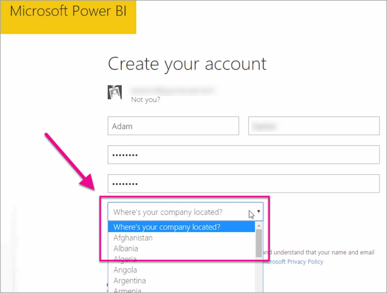

<properties
   pageTitle="¿Dónde se encuentra mi inquilino de Power BI?"
   description="Obtenga información acerca de dónde se encuentra el inquilino de Power BI y cómo se selecciona esa ubicación. Esto es importante comprender que puede afectar a las interacciones con el servicio."
   services="powerbi"
   documentationCenter=""
   authors="guyinacube"
   manager="mblythe"
   backup=""
   editor=""
   tags=""
   qualityFocus="no"
   qualityDate=""/>

<tags
   ms.service="powerbi"
   ms.devlang="NA"
   ms.topic="article"
   ms.tgt_pltfrm="NA"
   ms.workload="powerbi"
   ms.date="09/16/2016"
   ms.author="asaxton"/>
# ¿Dónde se encuentra mi inquilino de Power BI?

<iframe width="560" height="315" src="https://www.youtube.com/embed/0fOxaHJPvdM?showinfo=0" frameborder="0" allowfullscreen></iframe>

Obtenga información acerca de dónde se encuentra el inquilino de Power BI y cómo se selecciona esa ubicación. Esto es importante comprender que puede afectar a las interacciones con el servicio.

## Cómo determinar dónde se encuentra el inquilino de Power BI

La región de su inquilino de búsqueda, puede hacer lo siguiente.

1. ¿Seleccione el **?** en el servicio Power BI.

2. Seleccione **acerca de Power BI**.

3. Busque el valor junto a **los datos se almacenan en**. Se trata de la región que se encuentran en.

## Cómo se selecciona la región de datos

La región de datos se basa en el país en el que se seleccionó cuando creó el inquilino. Esto se aplica para suscribirse a Office 365 además nergía rBI como esta información se comparte. Si se trata de un nuevo inquilino, al registrarse, verá un país de lista desplegable.

Esta selección es lo que impulsa la ubicación de donde se almacenarán los datos. Power BI seleccionará una región de datos más cercana a esta selección.

> [AZURE.WARNING] ¡No se puede cambiar esta selección!

¿Preguntas más frecuentes? [Pruebe la Comunidad de Power BI](http://community.powerbi.com/)