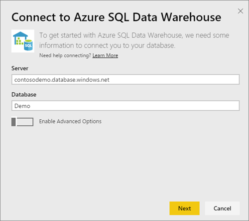

<properties 
   pageTitle="Almacenamiento de datos SQL Azure con DirectQuery"
   description="Almacenamiento de datos SQL Azure con DirectQuery"
   services="powerbi" 
   documentationCenter="" 
   authors="guyinacube" 
   manager="mblythe" 
   backup=""
   editor=""
   tags=""
   qualityFocus="no"
   qualityDate=""/>
 
<tags
   ms.service="powerbi"
   ms.devlang="NA"
   ms.topic="article"
   ms.tgt_pltfrm="NA"
   ms.workload="powerbi"
   ms.date="09/21/2016"
   ms.author="asaxton"/>

# Almacenamiento de datos SQL Azure con DirectQuery

Almacenamiento de datos de SQL Azure con DirectQuery le permite crear informes dinámicos basados en datos y métricas que ya tiene en el almacén de datos de SQL Azure. Con DirectQuery, las consultas se envían a su almacén de datos de SQL Azure en tiempo real como explorar los datos. Esto, combinado con la escala de almacenamiento de datos de SQL permite a los usuarios crear informes dinámicos en minutos con terabytes de datos. Además, la introducción de la **Abrir en Power BI** botón permite a los usuarios conectarse directamente Power BI a su almacén de datos SQL sin tener que especificar manualmente la información.

NOTAS: Al utilizar el conector de almacenamiento de datos SQL:

-   Especificar el nombre completo del servidor cuando se conecte (consulte a continuación para obtener más información)

-   Asegúrese de que las reglas de firewall para el servidor están configuradas para "Permitir el acceso a los servicios de Azure"

-   Cada acción, como seleccionar una columna o agregar un filtro directamente consultará el almacén de datos

-   Los mosaicos se establecen para actualizar aproximadamente cada 15 minutos y no es necesario programar actualización.  Esto se puede ajustar en la configuración avanzada cuando se conecte.

-   Preguntas y respuestas no está disponible para los conjuntos de datos DirectQuery

-   cambios de esquema no se recogen automáticamente

Estas restricciones y notas pueden cambiar mientras seguimos mejorando las experiencias. El paso para conectar se detallan a continuación.

## Con el botón 'Abrir en Power BI'

Es la manera más fácil de mover entre el almacén de datos SQL y Power BI con el **Abrir en Power BI** botón dentro del Portal de vista previa de Azure. Este botón permite perfectamente comenzar a crear nuevos paneles en Power BI.

1. Para empezar, vaya a la instancia del almacén de datos SQL en el Portal de vista previa de Azure. Tenga en cuenta que almacenamiento de datos de SQL tiene sólo una presencia en el portal de vista previa de Azure en este momento.

2. Haga clic en el **Abrir en Power BI** botón

    

3. Si no puedes iniciar sesión directamente o si no tiene una cuenta de Power BI, necesitará iniciar sesión.

4. Se le dirigirá a la página de conexión de almacenamiento de datos SQL, con la información de almacenamiento de datos SQL rellenado previamente. Escriba sus credenciales y aciertos conectar para crear una conexión.

## Conexión a través de Power BI

Almacén de datos SQL también aparece en la página de Power BI obtener datos. 

1. Seleccione **obtener datos** en la parte inferior del panel de navegación izquierdo.  

    

2. Dentro de **bases de datos**, seleccione **obtener**.

    

3. Seleccione **almacenamiento de datos SQL** \> **Conectar**.

    

4. Escriba la información necesaria para conectarse. El **Buscar parámetros** sección siguiente muestra dónde se pueden encontrar estos datos en el Portal de Azure.

    
   
    
   
    

    > 
            **Nota**: el nombre de usuario será un usuario que se define en la instancia del almacén de datos de SQL Azure.

5. Profundice en el conjunto de datos seleccionando el icono nuevo o el conjunto de datos recién creada, indicado por un asterisco. Este conjunto de datos tendrá el mismo nombre que la base de datos.

    

6. Puede explorar todas las tablas y columnas. Seleccione una columna enviará una consulta en el origen, creando dinámicamente su visual. Los filtros también se convertirá en las consultas a su almacén de datos. Estos objetos visuales se pueden guardar en un informe nuevo y anclarse de nuevo al escritorio.

    

## Buscar valores de parámetro

El nombre completo del servidor y el nombre de la base de datos pueden encontrarse en el Portal de vista previa de Azure. Tenga en cuenta que almacenamiento de datos de SQL tiene sólo una presencia en el portal de vista previa de Azure en este momento.

## Consulte también

[Introducción a Power BI](powerbi-service-get-started.md)  
[Obtener datos para Power BI](powerbi-service-get-data.md)  
[Almacenamiento de datos SQL Azure](https://azure.microsoft.com/en-us/documentation/services/sql-data-warehouse/)  
¿Preguntas más frecuentes? [Pruebe la Comunidad de Power BI](http://community.powerbi.com/)