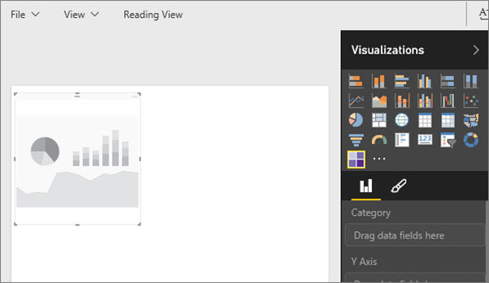

<properties
   pageTitle="Agregar una visualización personalizada a un informe de Power BI"
   description="Agregar un objeto visual personalizado a un informe de Power BI"
   services="powerbi"
   documentationCenter=""
   authors="mihart"
   manager="mblythe"
   backup=""
   editor=""
   tags=""
  featuredVideoId="gido6wr5pvE"
  qualityFocus="no"
   qualityDate=""/>

<tags
   ms.service="powerbi"
   ms.devlang="NA"
   ms.topic="article"
   ms.tgt_pltfrm="NA"
   ms.workload="powerbi"
   ms.date="08/25/2016"
   ms.author="mihart"/>
# Agregar una visualización personalizada a un informe de Power BI

Ha [descargado una plantilla personalizada de visual](powerbi-custom-visuals-download-from-the-gallery.md) y guardarlo en el equipo o en otra ubicación.  El paso siguiente consiste en importar esa plantilla visual en un informe para que se agrega como una opción al panel de visualización.
    

Inspección descargará un objeto visual personalizado y agregarlo a su informe. A continuación, siga las instrucciones detalladas a continuación el vídeo para probarlo.

<iframe width="560" height="315" src="https://www.youtube.com/embed/gido6wr5pvE" frameborder="0" allowfullscreen></iframe>

>
            **Importante**: una plantilla personalizada de visual se agrega a un informe específico cuando importa. Si desea utilizar la plantilla visual en otro informe, debe importarlo en ese informe.
Cuando se guarda un informe con un objeto visual personalizado mediante el **Guardar como** opción, se guarda una copia de la plantilla visual personalizada con el nuevo informe.

1. Abra [Power BI](http://app.powerbi.com) y seleccione el informe que desea agregar la visualización personalizadas.  

2.  Abra el informe en [vista de edición de](powerbi-service-interact-with-a-report-in-editing-view.md).

2. En el **visualizaciones** panel, seleccione el botón de puntos suspensivos (...).

    

3. Seleccione **importación** y desplácese hasta la ubicación donde guardó la visualización personalizada descargada (archivo .pbiviz).

4. 
            **IMPORTANTE**: Revise la advertencia y asegúrese de que el objeto visual proviene de una fuente de confianza. Microsoft recomienda que trabaje con su departamento de TI si no está seguro de si se usa un personalizado específico Visual que obtuvo desde la Galería de elementos visuales de Power BI, a través de correo electrónico, o de algún otro origen.
Consulte [Revisar elementos visuales personalizados para la seguridad y privacidad](powerbi-custom-visuals-review-for-security-and-privacy.md).

5. Seleccione **Abrir**. El icono de visualización personalizadas (también denominado *plantilla*) se agrega al panel de visualización.

    

    Una plantilla personalizada de visual se agrega al panel de visualización de un informe concreto cuando importa. Ahora está disponible para seleccionar y usar en ese informe.
    Si desea utilizar el objeto visual en otro informe, debe importarlo en el panel de visualización del informe también.

    Cuando se guarda un informe con un objeto visual personalizado mediante el **Guardar como** opción, se guarda una copia de la plantilla visual personalizada con el nuevo informe.

    Una vez que se importa una plantilla visual personalizada no puede quitar del panel de visualización del informe seleccionado. Si se usó para crear una visualización, puede quitar la visualización; pero el icono permanecerá en el panel de visualización.

6. Todavía en la vista de edición, seleccione el icono de visualización personalizadas.  Esto agrega una marca de agua (plantilla) a su lienzo de informe.

    

7. Arrastre los campos a la plantilla para crear la visualización. También puede anclar la visualización a un panel. Este ejemplo muestra la visualización de mapa de calor de tabla personalizada.

    

8. Continuar trabajando con y explorar esta visualización como lo haría con cualquier otra visualización (nativo) en Power BI.

### Consulte también

            [Visual lista de reproducción personalizada de Microsoft en YouTube](https://www.youtube.com/playlist?list=PL1N57mwBHtN1vIjfvuBIzZllrmKo-Vz6x)

            [Visualizaciones en Power BI](powerbi-service-visualizations-for-reports.md)

            [Visualizaciones personalizadas en Power BI](powerbi-custom-visuals.md)

            [La Galería de elementos visuales personalizados de Power BI](https://app.powerbi.com/visuals)

            [Usar visualizaciones personalizadas en Power BI Desktop](powerbi-custom-visuals-use.md)

            [Revise los elementos visuales personalizados para la seguridad y privacidad](powerbi-custom-visuals-review-for-security-and-privacy.md)

            [Introducción a las herramientas de desarrollo de elementos visuales personalizados (vista previa)](powerbi-custom-visuals-getting-started-with-developer-tools.md)

            [Vídeo: Crear visualizaciones personalizadas para Power BI con Sachin Patney y Nico Cristache](https://www.youtube.com/watch?v=kULc2VbwjCc)

¿Preguntas más frecuentes? 
            [Pruebe la Comunidad de Power BI](http://community.powerbi.com/)
