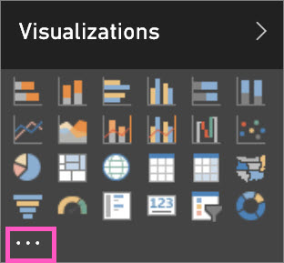

<properties
   pageTitle="Add a custom visualization to a Power BI report"
   description="Add a custom visual to a Power BI report"
   services="powerbi"
   documentationCenter=""
   authors="mihart"
   manager="mblythe"
   backup=""
   editor=""
   tags=""
  featuredVideoId="gido6wr5pvE"
  qualityFocus="no"
   qualityDate=""/>

<tags
   ms.service="powerbi"
   ms.devlang="NA"
   ms.topic="article"
   ms.tgt_pltfrm="NA"
   ms.workload="powerbi"
   ms.date="08/25/2016"
   ms.author="mihart"/>
# Add a custom visualization to a Power BI report

You've <bpt id="p1">[</bpt>downloaded a custom visual template<ept id="p1">](powerbi-custom-visuals-download-from-the-gallery.md)</ept> and saved it to your computer or another location.  The next step is to import that visual template into a report so that it is added, as an option, to your Visualization pane.
    

Watch Will download a custom visual and add it to his report. Then follow the step-by-step instructions below the video to try it yourself.

<iframe width="560" height="315" src="https://www.youtube.com/embed/gido6wr5pvE" frameborder="0" allowfullscreen></iframe>

><bpt id="p1">**</bpt>Important<ept id="p1">**</ept>: A custom visual template is added to a specific report when imported. If you'd like to use the visual template in another report, you need to import it into that report as well.
When a report with a custom visual is saved using the <bpt id="p1">**</bpt>Save As<ept id="p1">**</ept> option, a copy of the custom visual template is saved with the new report.

1. Open <bpt id="p1">[</bpt>Power BI<ept id="p1">](http://app.powerbi.com)</ept> and select the report where you want to add the custom visualization.  

2.  Open the report in <bpt id="p1">[</bpt>Editing View<ept id="p1">](powerbi-service-interact-with-a-report-in-editing-view.md)</ept>.

2. In the <bpt id="p1">**</bpt>Visualizations<ept id="p1">**</ept> pane, select the ellipses (...).

    

3. Select <bpt id="p1">**</bpt>Import<ept id="p1">**</ept> and navigate to the location where you saved the downloaded custom visualization (.pbiviz file).

4. <bpt id="p1">**</bpt>IMPORTANT<ept id="p1">**</ept>: Review the warning and ensure the visual comes from a trustworthy source. Microsoft recommends you work with your IT department if you're not sure whether to use a specific Custom Visual you obtained from the Power BI visuals gallery, through email, or from some other source.
See <bpt id="p1">[</bpt>Review custom visuals for security and privacy<ept id="p1">](powerbi-custom-visuals-review-for-security-and-privacy.md)</ept>.

5. Seleccione **Abrir**. The custom visualization icon (also called <bpt id="p1">*</bpt>template<ept id="p1">*</ept>) is added to the Visualization pane.

    

    A custom visual template is added to a specific report's Visualization pane when imported. It is now available for you to select and use in that report.
    If you'd like to use the visual in another report, you need to import it into that report's Visualization pane as well.

    When a report with a custom visual is saved using the <bpt id="p1">**</bpt>Save As<ept id="p1">**</ept> option, a copy of the custom visual template is saved with the new report.

    Once you import a custom visual template you cannot remove it from that specific report's Visualization pane. If you've used it to create a visualization, you can remove the visualization; but the icon will remain in the Visualization pane.

6. Still in Editing View, select the custom visualization icon.  This adds a watermark (template) to your report canvas.

    

7. Drag fields onto the template to create the visualization. Optionally, pin the visual to a dashboard. This example shows the Table Heatmap custom visualization.

    

8. Continue to work with and explore this visualization as you would any other (native) visualization in Power BI.

### Consulte también

<bpt id="p1">[</bpt>Microsoft's custom visual playlist on YouTube<ept id="p1">](https://www.youtube.com/playlist?list=PL1N57mwBHtN1vIjfvuBIzZllrmKo-Vz6x)</ept>

<bpt id="p1">[</bpt>Visualizations in Power BI<ept id="p1">](powerbi-service-visualizations-for-reports.md)</ept>

<bpt id="p1">[</bpt>Custom Visualizations in Power BI<ept id="p1">](powerbi-custom-visuals.md)</ept>

<bpt id="p1">[</bpt>The Power BI custom visuals gallery<ept id="p1">](https://app.powerbi.com/visuals)</ept>

<bpt id="p1">[</bpt>Use custom visualizations in Power BI Desktop<ept id="p1">](powerbi-custom-visuals-use.md)</ept>

<bpt id="p1">[</bpt>Review custom visuals for security and privacy<ept id="p1">](powerbi-custom-visuals-review-for-security-and-privacy.md)</ept>

<bpt id="p1">[</bpt>Getting started with custom visuals developer tools (Preview)<ept id="p1">](powerbi-custom-visuals-getting-started-with-developer-tools.md)</ept>

<bpt id="p1">[</bpt>Video: Creating custom visualizations for Power BI with Sachin Patney and Nico Cristache<ept id="p1">](https://www.youtube.com/watch?v=kULc2VbwjCc)</ept>

More questions? <bpt id="p1">[</bpt>Try the Power BI Community<ept id="p1">](http://community.powerbi.com/)</ept>
