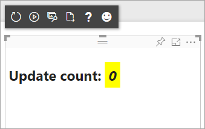

<properties
   pageTitle="Crear un objeto visual personalizado con las herramientas de desarrollo visual personalizado"
   description="Elementos visuales personalizados permiten satisfacer las necesidades de los usuarios y coincide con el diseño de su aplicación. Obtenga información acerca de cómo crear un objeto visual personalizado para Power BI mediante las herramientas de desarrollo."
   services="powerbi"
   documentationCenter=""
   authors="guyinacube"
   manager="mblythe"
   backup=""
   editor=""
   tags=""
   qualityFocus="no"
   qualityDate=""/>

<tags
   ms.service="powerbi"
   ms.devlang="NA"
   ms.topic="article"
   ms.tgt_pltfrm="NA"
   ms.workload="powerbi"
   ms.date="09/23/2016"
   ms.author="asaxton"/>

# Crear un objeto visual personalizado con las herramientas de desarrollo visual personalizado

Elementos visuales personalizados permiten satisfacer las necesidades de los usuarios y coincide con el diseño de su aplicación. Obtenga información acerca de cómo crear un objeto visual personalizado para Power BI mediante las herramientas de desarrollo.

> [AZURE.NOTE] Puede utilizar este documento para poner en funcionamiento. Para obtener información detallada, consulte la información de referencia dentro de la [repositorio de git de elementos visuales de BI energía](https://github.com/Microsoft/PowerBI-visuals).

## Requisitos

- NodeJS requiere 4.0 + (5.0 o posterior recomendado) [Descargar NodeJS](https://nodejs.org)

## Instalar NodeJS y las herramientas de BI de energía

Para crear un objeto visual personalizado, debe instalar NodeJS. NodeJS es necesario para ejecutar las herramientas de línea de comandos.

1. Descargue e instale [NodeJS](https://nodejs.org). Se requiere la versión 4.0 o posterior, pero se recomienda tener 5.0 o posterior.

2. Instale las herramientas de línea de comandos. Ejecute el siguiente comando desde un símbolo del sistema.

        npm install -g powerbi-visuals-tools

3. Puede confirmar que las herramientas se instalan al ejecutar el siguiente comando sin parámetros.

        pbiviz

    Debería ver el resultado de la Ayuda.

    <pre><code>
         +syyso+/
    oms/+osyhdhyso/
    ym/       /+oshddhys+/
    ym/              /+oyhddhyo+/
    ym/                     /osyhdho
    ym/                           sm+
    ym/               yddy        om+
    ym/         shho /mmmm/       om+
     /    oys/ +mmmm /mmmm/       om+
    oso  ommmh +mmmm /mmmm/       om+
   ymmmy smmmh +mmmm /mmmm/       om+
   ymmmy smmmh +mmmm /mmmm/       om+
   ymmmy smmmh +mmmm /mmmm/       om+
   +dmd+ smmmh +mmmm /mmmm/       om+
         /hmdo +mmmm /mmmm/ /so+//ym/
               /dmmh /mmmm/ /osyhhy/
                 //   dmmd
                       ++

       PowerBI Custom Visual Tool

    Uso: pbiviz [opciones] [command]

    Comandos:

    nuevas actualizaciones de crear una nueva información visual, mostrar información acerca del inicio actual de visual inicio el paquete visual actual paquete visual actual en una actualización del archivo pbiviz [versión] [nombre] las definiciones de api y esquemas en el actual objeto visual. Cambia la versión si ayuda especificada [cmd] Mostrar la Ayuda de [cmd]

    Opciones:

    -h,--help información de uso de salida -V,--version salida el número de versión--certificado localhost de instalación de instalar certificado
    </code></pre>

< un nombre "ssl-setup" ></a>
### Programa de instalación del certificado de servidor

Para habilitar una vista previa activa de su visual, se necesita un servidor de confianza https. Antes de empezar, debe instalar un certificado SSL que le permitirá activos visuales cargar en el explorador web. 

> [AZURE.NOTE] Se trata de una configuración única de su estación de trabajo de desarrollador.

Para *Agregar* un certificado, ejecute el siguiente comando.

    pbiviz --install-cert

**Sistema operativo Windows**

1. Seleccione **Instalar certificado...***.

    

2. Seleccione **usuario actual** y, a continuación, seleccione **siguiente**.

    

3. Seleccione **colocar todos los certificados en el siguiente almacén** y seleccione **Examinar...**.

4. Seleccione **entidades emisoras raíz de confianza** y, a continuación, seleccione **Aceptar**. Seleccione **siguiente**.

    

5. Seleccione **Finalizar**.

    

6. Seleccione **Sí** en el cuadro de diálogo de advertencia de seguridad.

    

7. Cierre los exploradores que esté abierta.

> [AZURE.NOTE] Si no se reconoce el certificado, debe reiniciar el equipo.

**OSX**

1. Si está bloqueado el bloqueo en la parte superior izquierda, selecciónela para desbloquear. Buscar *localhost* y haga doble clic en el certificado.

    


2. Seleccione **siempre de confianza** y cierre la ventana.

    

3. Escriba su nombre de usuario y su contraseña. Seleccione **actualizar la configuración de**.

    

4. Cierre los exploradores que esté abierta.

> [AZURE.NOTE] Si no se reconoce el certificado, debe reiniciar el equipo.

## Habilitar vista previa activa de desarrolladores visual

Para habilitar una vista previa activa de su objeto visual personalizado, siga estos pasos. Esto permite que el objeto visual que se utilizará en el servicio Power BI al editar informes.

1. Busque e inicie sesión en [app.powerbi.com](https://app.powerbi.com).

2. Seleccione el **icono de engranaje** y, a continuación, seleccione **configuración**.

    

3. Seleccione **Developer** y, a continuación, seleccione **developer Enable visual para las pruebas**.

    

4. Seleccione el **Developer Visual** en la **visualización** panel.

    

    > [AZURE.NOTE] Esto requiere que se ejecute `pbiviz start` desde la carpeta visual en el equipo de desarrollo. Para obtener más información acerca de cómo crear el objeto visual, vea [marcador de posición](#placeholder) en este artículo.

5. Seleccione el objeto visual en el lienzo de informes. Puede enlazar datos de la misma forma que otros elementos visuales.

Ahora puede comenzar a desarrollar su visual.

## Crear un nuevo objeto visual

Puede crear un nuevo proyecto visual, ejecute el comando siguiente.

```
pbiviz new My Visual name
```

Puede reemplazar *Mi nombre Visual* con el nombre que desee asignar el objeto visual. Esto se puede cambiar posteriormente mediante la modificación de la `name` y `displayName` campos de generado `pbiviz.json` archivo.

Este comando creará una nueva carpeta en donde se ejecutó el comando directamente. Genera una plantilla de inicio básico para el objeto visual. Una vez completado el comando, puede abrir el directorio y utilizar su editor favorito para empezar a trabajar en el nuevo objeto visual.

## Probar su visual en Power BI

Puede probar su visual dentro del servicio Power BI en informes y paneles.

<a name="running-your-visual"></a>
### Ejecuta el objeto visual

Puede ejecutar su visual haciendo lo siguiente.

1. Abra un símbolo del sistema.

2. Cambie el directorio para que sea la carpeta visual. Esta es la carpeta que contiene el `pbiviz.json` archivo.

3. Ejecute el siguiente comando:

    ```
    pbiviz start
    ```

    

Si se encuentra en una ubicación incorrecta, verá un error similar al siguiente.

```
    error  LOAD ERROR Error: pbiviz.json not found. You must be in the root of a visual project to run this command.
        at e (C:\Users\[user]\AppData\Roaming\npm\node_modules\powerbi-visuals-tools\lib\VisualPackage.js:67:35)
        at Function.loadVisualPackage (C:\Users\[user]\AppData\Roaming\npm\node_modules\powerbi-visuals-tools\lib\VisualPackage.js:62:16)
        at Object.<anonymous> (C:\Users\[user]\AppData\Roaming\npm\node_modules\powerbi-visuals-tools\bin\pbiviz-start.js:43:15)
        at Module._compile (module.js:556:32)
        at Object.Module._extensions..js (module.js:565:10)
        at Module.load (module.js:473:32)
        at tryModuleLoad (module.js:432:12)
        at Function.Module._load (module.js:424:3)
        at Module.runMain (module.js:590:10)
        at run (bootstrap_node.js:394:7)
```

### Ver el objeto visual en Power BI

Para ver el objeto visual en un informe, vaya a dicho informe y seleccione el objeto visual en la **visualizaciones** panel.

> [AZURE.NOTE] Debe ejecutar el `pbiviz start` comando antes de hacerlo como discribed en la [ejecuta su visual](#running-your-visual) sección.


A continuación, verá la plantilla de inicio para el objeto visual.



|Elemento de barra de herramientas|Descripción|
|---|---|
|Actualizar visual|Actualizar manualmente el objeto visual si la recarga automática está deshabilitada.|
|Volver a cargar automáticamente de alternancia|Cuando se activa, el objeto visual se actualizará automáticamente cada vez que guarde el archivo de visual.|
|Mostrar dataview|Muestra la vista de datos subyacente del objeto visual para la depuración|
|Obtener ayuda|Documentación en GitHub|
|Enviar comentarios|Háganos saber si hay cualquier forma que podemos mejorar la experiencia! (Requiere cuenta de GitHub)|

## El objeto visual para su uso en Power BI Desktop y la distribución del paquete

Para poder cargar el objeto visual en [Power BI Desktop](https://powerbi.microsoft.com/desktop/), o compartir con la Comunidad en la [Galería Power BI Visual](https://visuals.powerbi.com), debe generar un `pbiviz` archivo.

Puede empaquetar su visual haciendo lo siguiente.

1. Abra un símbolo del sistema.

2. Cambie el directorio para que sea la carpeta visual. Esta es la carpeta que contiene el `pbiviz.json` archivo.

3. Ejecute el siguiente comando:

    ```
    pbiviz package
    ```

Este comando creará un `pbiviz` en la `dist/` directorio del proyecto visual. Si ya existe un `pbiviz` archivo está presente, se sobrescribirá.

## Actualización de la versión de API de elementos visuales

Al crear una mediante visual `pbiviz new`, una copia de las definiciones de tipo adecuadas de API y los esquemas de json se copian en el directorio de su objeto visual. Puede usar el `pbiviz update` comando para actualizar estos archivos si es necesario. Esto puede ser útil si lanzamos una revisión para una versión anterior de la API o si desea actualizar a la última versión de API.

### Actualizar la versión existente de la API

Si se lance una actualización a una API existente, puede obtener la versión más reciente mediante el procedimiento siguiente.

```
#Update your version of pbiviz
npm install -g powerbi-visuals-tools

#Run update from the root of your visual project, where pbiviz.json is located
pbiviz update
```

Esto descargará las herramientas más recientes de npm que incluyen los esquemas y definiciones de tipo actualizadas. Mediante `pbiviz update` sobrescribirá el `apiVersion` propiedad en su *pbiviz.json* campo o con la versión más reciente.

### Actualizar a una versión diferente de la API

Puede actualizar a una versión de API diferente utilizando los mismos pasos, como se mencionó anteriormente. Puede especificar explícitamente la versión de API que desea utilizar.

```
#Update your version of pbiviz
npm install -g powerbi-visuals-tools

#Run update from the root of your visual project, where pbiviz.json is located
pbiviz update 1.2.0
```

Esto actualizaría yoru visual a API versión 1.2.0. Puede reemplazar `1.2.0` con cualquier versión que desea usar.

> [AZURE.WARNING] La versión de API predeterminada utilizada por las herramientas siempre será la versión estable de la API. Las versiones posteriores a la versión de API predeterminada son inestables y sujeto a cambiarán. Pueden tener un comportamiento inesperado y se comportan de forma diferente entre el servicio Power BI y Power BI Desktop. Para la versión actual de la API estable, consulte el [cambiar el registro](https://github.com/Microsoft/PowerBI-visuals/blob/master/ChangeLog.md). Para obtener más información acerca de las versiones preliminares, consulte el [plan](https://github.com/Microsoft/PowerBI-visuals/blob/master/Roadmap/README.md).

## Dentro del proyecto visual

El proyecto de visual es la carpeta que se crea al ejecutar el `pbiviz new` comando. 

### Estructura de archivos

|Elemento|Descripción|
|---|---|
|activos /|Se utiliza para almacenar activos visuales (icono, capturas de pantalla, etc.).|
|Dist /|Al ejecutar `pbiviz package`, se generará el archivo pbiviz aquí.|
|src /|Código máquina para el objeto visual.|
|estilo /|Menos estilos para el objeto visual.|
|.gitignore|Indica a git que omita los archivos que no deben realizar el seguimiento en el repositorio.|
|Capabilities.JSON|Permite definir la [capacidades](https://github.com/Microsoft/PowerBI-visuals/blob/master/Capabilities/Capabilities.md) de su visual.|
|Package.JSON|Utilizado por [npm](https://www.npmjs.com/) para administrar los módulos.|
|pbiviz.JSON|Archivo de configuración principal.|
|TSConfig.JSON|Configuración de compilador de typescript. Obtenga más información sobre [tsconfig.json](https://www.typescriptlang.org/docs/handbook/tsconfig-json.html).|

### pbiviz.JSON

Este archivo es el archivo de configuración principal para el objeto visual. Contiene metadatos, así como información acerca de los archivos, necesarios para compilar el proyecto.

```
{
    "visual": {
        "name": "myVisual", // internal visual name (should not contain spaces)
        "displayName": "My Visual!", // visual name displayed to user (used in gallery)
        "guid": "PBI_CV_xxxxxxx", // a unique id for this visual MUST BE UNIQUE
        "visualClassName": "Visual" // the entry class for your visual
        "version": "1.0.0", // visual version. Should be semantic version (increment if you update the visual)
        "description": "", // description used in gallery
        "supportUrl": "", // url to where users can get support for this visual
        "gitHubUrl": "" // url to the source in github (if applicable)
    },
    "apiVersion": "1.0.0", //API version this visual was created with
    "author": {
        "name": "", // your name
        "email": "" // your e-mail
    },
    "assets": {
        "icon": "assets/icon.png" // relative path to your icon file (20x20 png)
    },
    "style": "style/visual.less", // relative path to your less file
    "capabilities": "capabilities.json" // relative path to your capabilities definition 
}
```

### Origen Visual (TypeScript)

Código de Visual debe escribirse en TypeScript, que es un superconjunto de JavaScript que admiten características más avanzadas y acceso anticipado a la funcionalidad de ES6/ES7.

Todos los archivos de máquina deben almacenarse en el `src/` directorio y agregados a la `files` de matriz en `tsconfig.json`. Esto permite que el compilador de TypeScript cargar ellos y en qué orden.

Cuando se crea el objeto visual, todos de la máquina se compilarán en un único archivo de JavaScript. Esto le permite hacer referencia a los elementos exportados desde otros archivos sin necesidad de manualmente `require` ellos siempre que ambos archivos se muestran en la tsconfig.

Puede crear todos los archivos y las clases que necesitan crear el objeto visual.

Obtenga más información sobre [TypeScript](http://www.typescriptlang.org/).

### Estilo visual (menor)

Estilo visuales se administra mediante hojas de estilos en cascada (CSS). Para su convience, usamos el menos precompilador que admite algunas características avanzadas como el anidamiento, variables, mixins, condiciones, bucles, etc.. Si no desea utilizar ninguna de estas características, puede escribir simplemente CSS corriente en el archivo menor.

Todo menos archivos deben estar almacenados en el `style/` directory. El archivo especificado en el `style` campo dentro de su `pbiviz.json` se cargará el archivo. Los archivos adicionales se deben cargar mediante `@import`.

Obtenga más información sobre [menos](http://lesscss.org/).

## Depuración

Para obtener sugerencias sobre cómo depurar el objeto visual personalizado, consulte el [Guía de depuración](https://github.com/Microsoft/PowerBI-visuals/blob/master/tools/debugging.md).

## Enviar el objeto visual en la galería visual personalizado de Power BI

Puede [enviar su visual](https://app.powerbi.com/visuals/info#submit) que se incluirán en la Galería de elementos visuales de Power BI. Esto implica el envío de un correo electrónico con el archivo pbiviz adjunto.

## Solucionar problemas

**No se encontró el comando de Pbiviz (o errores similares)**

Si ejecuta `pbiviz` en su terminal / línea de comandos, verá la pantalla de ayuda. De lo contrario, no está instalado correctamente. Asegúrese de que tiene al menos la versión 4.0 de NodeJS instalado.

Para obtener más información, consulte [instalar NodeJS y las herramientas de BI energía](#install-nodejs-and-the-power-bi-tools)...

**No se puede encontrar la depuración visual en la ficha de visualizaciones**

La depuración visual es similar a un icono de símbolo del sistema dentro de la **visualizaciones** ficha.


Si no aparece, asegúrese de que ha habilitado en la configuración de Power BI. 

> [AZURE.NOTE] La depuración visual actualmente sólo está disponible en el servicio Power BI y no en Power BI Desktop o la aplicación móvil. El paquete visual seguirá funcionando en todas partes.

Para obtener más información, consulte [Habilitar la vista previa activa de desarrolladores visual](#enable-live-preview-of-developer-visual)...

**No puede ponerse en contacto con el servidor de visual**

Ejecute el servidor visual con el comando `pbiviz start` en su terminal / línea de comandos desde la raíz del proyecto visual. Si el servidor se está ejecutando, es probable que su vertificates SSL no se instalaron correctamente.

Para obtener más información, consulte [ejecuta su visual](#running-your-visual) o [el programa de instalación del certificado de servidor](#ssl-setup).


## Consulte también

[Visualizaciones en Power BI](powerbi-service-visualizations-for-reports.md)  
[Visualizaciones personalizadas en Power BI](powerbi-custom-visuals.md)  
[La Galería de elementos visuales personalizados de Power BI](https://app.powerbi.com/visuals)  
[TypeScript](http://www.typescriptlang.org/)  
[Menos CSS](http://lesscss.org/)  
¿Preguntas más frecuentes? [Pruebe la Comunidad de Power BI](http://community.powerbi.com/)