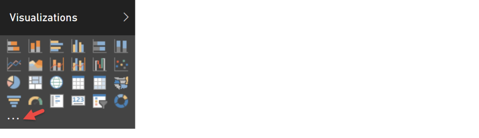

<properties
   pageTitle="Agregar un objeto visual personalizado a un informe (escritorio)"
   description="Agregar un objeto visual personalizado a un informe en el escritorio"
   services="powerbi"
   documentationCenter=""
   authors="mihart"
   manager="mblythe"
   backup=""
   editor=""
   tags=""
   qualityFocus="monitoring"
   qualityDate="03/15/2016"/>

<tags
   ms.service="powerbi"
   ms.devlang="NA"
   ms.topic="article"
   ms.tgt_pltfrm="NA"
   ms.workload="powerbi"
   ms.date="09/30/2016"
   ms.author="mihart"/>

# Agregar un objeto visual personalizado a un informe (escritorio)  

Ha [descargado una plantilla personalizada de visual](powerbi-custom-visuals-download-from-the-gallery.md) y guardarlo en el equipo o en otra ubicación.  El paso siguiente consiste en importar esa plantilla visual en un informe para que se agrega como una opción al panel de visualización.

>[AZURE.IMPORTANT]
Una plantilla personalizada de visual se agrega a un informe específico cuando importa. Si desea utilizar la plantilla visual en otro informe, debe importarlo en dicho informe también.
Cuando se guarda un informe con un objeto visual personalizado mediante el **Guardar como** opción, se guarda una copia de la plantilla visual personalizada con el nuevo informe.

1. Abra Power BI Desktop y seleccione el informe que desea agregar la visualización personalizadas.  Abra el informe en [vista de edición de](powerbi-service-interact-with-a-report-in-editing-view.md).

2.  Hay dos opciones para importar una plantilla personalizada de visual: desde la **archivo** menú o desde el **visualizaciones** panel.

    **En el menú archivo de escritorio**

    - En el informe **archivo** menú, elija **importación** &gt; **Power BI personalizada Visual**. Debe estar en la vista de edición.  
      

    **En el panel de visualización**
    - En el **visualizaciones** panel, elija **Insertar (...)**.
        

    - Seleccione **importar un objeto visual personalizado**.  
        

3. 
            **Revise la advertencia**.

    Un objeto visual personalizado tiene acceso a los datos en el informe que utilice en el objeto visual personalizado y puede realizar acciones en su nombre. Si comparte el informe con otras personas, cuando visualiza el informe visual personalizado puede hacer el mismo, pero por sus compañeros de trabajo. Tenga cuidado para revisar el objeto visual personalizado para asegurarse de que proviene de una fuente de confianza. Microsoft recomienda que trabajar con su departamento de TI si no está seguro de si se usa un personalizado específico Visual que obtuvo desde la Galería de elementos visuales de Power BI, a través de correo electrónico, o de algún otro origen.  

    

4. Seleccione un archivo .pbiviz en la **abiertos** cuadro de diálogo.

5. Un icono (también se denomina un *plantilla*) se agrega a su **visualizaciones** panel.  

    

6. Seleccione la plantilla visual personalizada para agregar al informe como lo haría con cualquiera de las otras plantillas en el panel de visualizaciones. Agregar campos y filtros y compilar el objeto visual.

7.  Formato del objeto visual personalizado como lo haría con cualquier otro visual.  Desde el ** visualizaciones** panel, seleccione el icono de pincel. Las opciones de formato disponibles varían por tipo visual.

### Consulte también

[Agregar un objeto visual personalizado a un informe en el servicio Power BI](powerbi-custom-visuals-add-to-report.md)  
[Crear y enviar un objeto visual personalizado](powerbi-custom-visuals-create-for-the-gallery.md)  
[Visualizaciones en Power BI](powerbi-service-visualizations-for-reports.md)  
Volver al [personalizados visualizaciones en Power BI](powerbi-custom-visuals.md)  
[La Galería de elementos visuales personalizados de Power BI](https://app.powerbi.com/visuals)  
¿Preguntas más frecuentes? [Pruebe la Comunidad de Power BI](http://community.powerbi.com/)
