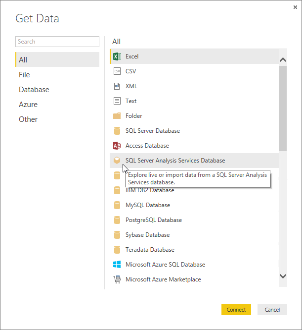
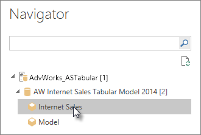

<properties
   pageTitle="Analysis Services TDS en Power BI Desktop"
   description="Analysis Services TDS en Power BI Desktop"
   services="powerbi"
   documentationCenter=""
   authors="davidiseminger"
   manager="mblythe"
   backup=""
   editor=""
   tags=""
   qualityFocus="no"
   qualityDate=""/>

<tags
   ms.service="powerbi"
   ms.devlang="NA"
   ms.topic="article"
   ms.tgt_pltfrm="NA"
   ms.workload="powerbi"
   ms.date="09/29/2016"
   ms.author="davidi"/>
# Analysis Services TDS en Power BI Desktop

Con Power BI Desktop, hay dos maneras puede conectarse y obtener datos de los modelos de SQL Server Analysis Services Tabular: explorar mediante una conexión activa o seleccione los elementos e importar en Power BI Desktop.

Echemos un vistazo.

            **Explorar mediante una conexión activa** : cuando se utiliza una conexión activa, los elementos de su modelo Tabular o perspectiva, como tablas, columnas, y las medidas aparecen en la lista de campos de Power BI Desktop. Puede utilizar las herramientas avanzadas de visualización y el informe de Power BI Desktop para explorar el modelo Tabular de formas nuevas y altamente interactivas.

Cuando se conecta en directo, no se importa ningún dato del modelo Tabular en Power BI Desktop. Cada vez que interactúe con una visualización, Power BI Desktop consulta el modelo Tabular y calcula los resultados que vea. Siempre está buscando en los datos más recientes. Tenga en cuenta, los modelos tabulares son muy seguros. Elementos que aparecen en Power BI Desktop dependen de los permisos para el modelo Tabular que está conectado.

Cuando ha creado informes dinámicos en Power BI Desktop, se puede compartir mediante la publicación en su sitio de Power BI. Al publicar un archivo de Power BI Desktop con una conexión activa a un modelo Tabular en su sitio de Power BI, una puerta de enlace de datos local debe tener instalado y configurado por un administrador. Para obtener más información, consulte [puerta de enlace de datos local](powerbi-gateway-onprem.md).

            **Seleccionar elementos e importar en Power BI Desktop** : cuando se conecta con esta opción, puede seleccionar elementos como tablas, columnas y medidas en el modelo Tabular o perspectiva y cargarlos en un modelo de Power BI Desktop. Puede utilizar el Editor de consultas avanzadas de Power BI Desktop forma aún más lo que desea. Puede utilizar características de modelado de Power BI Desktop al modelo más los datos. No se mantiene ninguna conexión activa entre Power BI Desktop y el modelo Tabular. A continuación, puede explorar el modelo de Power BI Desktop sin conexión o publicar en su sitio de Power BI.

## Para conectarse a un modelo Tabular

1. En Power BI Desktop, en la **Inicio** haga clic en la ficha **obtener datos**.

 

2. Haga clic en **base de datos de SQL Server Analysis Services**, a continuación, haga clic en **Conectar**.

 

3. Escriba el nombre del servidor y seleccione un modo de conexión. 

 

4. Este paso depende en el modo de conexión seleccionado:

-   Si se conecta en directo, en navegación, seleccione un modelo Tabular o perspectiva.

    

-   Si decide seleccionar elementos y obtener los datos, en el navegador, seleccione un modelo Tabular o perspectiva. También podrá seleccionar sólo las tablas o columnas para cargar. Para dar forma a los datos antes de la carga, haga clic en Editar para abrir el Editor de consultas. Cuando esté listo, haga clic en cargar para importar los datos en Power BI Desktop.
>  

## Preguntas más frecuentes

            **Pregunta:** se necesita una puerta de enlace de datos local?

            **Respuesta:** depende. Si usa Power BI Desktop para conectarse en directo a un modelo Tabular, pero no tenga intención de publicación para el sitio de Power BI, no necesitará una puerta de enlace. Por otro lado, si piensa en la publicación en su sitio de Power BI, una puerta de enlace de datos es necesario para garantizar una comunicación segura entre el servicio Power BI y el servidor de Analysis Services local. Asegúrese de hablar con el administrador del servidor de Analysis Services antes de instalar una puerta de enlace de datos.

Si elige seleccionar elementos y obtener datos, está importando datos de modelo Tabular en el archivo de Power BI Desktop, por lo que no es necesario ninguna puerta de enlace.

 

            **Pregunta:** Cuál es la diferencia entre la conexión activa a un modelo Tabular desde el servicio Power BI en comparación con la conexión en vivo desde Power BI Desktop?

            **Respuesta:** al conectarse en directo a un modelo Tabular desde su sitio en el servicio de Power BI para Analysis Services base de datos locales en su organización, una puerta de enlace de datos local es necesario para proteger las comunicaciones entre ellos. Cuando se conecta en directo a un modelo Tabular desde Power BI Desktop, una puerta de enlace no es necesario porque Power BI Desktop y el servidor de Analysis Services que va a conectar son ejecución local de su organización. Sin embargo, si publica el archivo de Power BI Desktop a su sitio de Power BI, se requiere una puerta de enlace.

 

            **Pregunta:** Si crea una conexión activa, ¿puedo conectarme a otro origen de datos en el mismo archivo de Power BI Desktop?

            **Respuesta:** no. No puede explorar datos activos y conectarse a otro tipo de origen de datos en el mismo archivo. Si ya ha importado los datos o conectado a un origen de datos en un archivo de Power BI Desktop, debe crear un nuevo archivo para que explore en vivo.

 

            **Pregunta:** Si crea una conexión activa, ¿puedo modificar el modelo o la consulta en Power BI Desktop?

            **Respuesta:** no. De la consulta y modelado de características de Power BI Desktop están deshabilitadas al explorar datos activos.

 

            **Pregunta:** Si crea una conexión activa, es seguro?

            **Respuesta:** Sí. Las credenciales de Windows actuales se utilizan para conectarse al servidor de Analysis Services. No puede utilizar Basic o las credenciales almacenadas en el servicio Power BI o Power BI Desktop al explorar live.

 

            **Pregunta:** en el navegador, puedo ver un modelo y una perspectiva. ¿Cuál es la diferencia?

            **Respuesta:** una perspectiva es una vista determinada de un modelo Tabular. Puede incluir sólo tablas, columnas o medidas según una necesidad de análisis de datos único. Un modelo Tabular siempre contiene al menos una perspectiva, lo que podría incluir todo el contenido del modelo. Si no está seguro de que se debe seleccionar, consulte con su administrador.

## Para cambiar el nombre del servidor después de la conexión inicial

Después de crear un archivo de Power BI Desktop con una conexión activa a explorar, puede haber algunos casos donde desea cambiar la conexión a un servidor diferente. Por ejemplo, si creó el archivo de Power BI Desktop al conectarse a un servidor de desarrollo y antes de la publicación para el servicio Power BI, desea cambiar la conexión al servidor de producción.

1. Seleccione **Editar consultas** desde la cinta.

 

2. Escriba el nombre del nuevo servidor.

 
