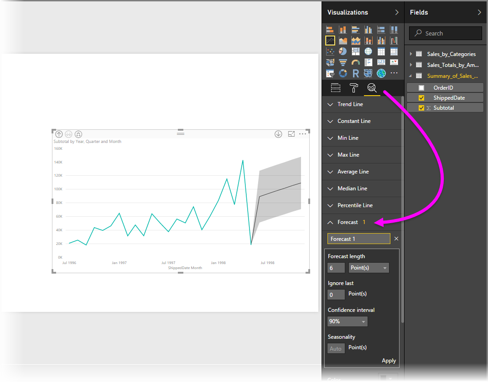

<properties
   pageTitle="Panel de análisis en Power BI Desktop"
   description="Crear líneas de referencia dinámica para elementos visuales de Power BI Desktop"
   services="powerbi"
   documentationCenter=""
   authors="davidiseminger"
   manager="mblythe"
   backup=""
   editor=""
   tags=""
   qualityFocus="no"
   qualityDate=""/>

<tags
   ms.service="powerbi"
   ms.devlang="NA"
   ms.topic="article"
   ms.tgt_pltfrm="NA"
   ms.workload="powerbi"
   ms.date="09/08/2016"
   ms.author="davidi"/>

# Panel de análisis en Power BI Desktop

Con el **análisis** panel en **Power BI Desktop**, puede agregar dinámica *líneas de referencia* en elementos visuales y proporcione el foco para estas importantes tendencias o conocimientos. El **análisis** panel se encuentra en la **visualizaciones** área de Power BI Desktop, desde la versión de agosto de 2016 (versión 2.37.4464.321 o posterior), como se muestra a continuación.

>   Nota: La **análisis** panel sólo aparece cuando se selecciona un elemento visual en el lienzo de Power BI Desktop.

## Habilitar la previsión (vista previa)

Además, la versión con el de 2016 de septiembre de **Power BI Desktop** (versión 2.39.4526.362 o posterior), también puede realizar *previsión* desde el **análisis** panel. Debe habilitar esta característica de vista previa, yendo a **archivo > Opciones y configuración > opciones** seleccionando **características de vista previa** en el panel izquierdo. Active la casilla de verificación junto a **Forecasting** para habilitar la característica, tal como se muestra en la siguiente imagen. Debe reiniciar **Power BI Desktop** para que los cambios surtan efecto.

## Mediante el panel de análisis.

Con el **análisis** panel, puede crear los siguientes tipos de líneas de referencia dinámica (no todas las líneas están disponibles para todos los tipos visuales):

-   Línea constante del eje x
-   Línea constante del eje y
-   Línea de min
-   Línea máximo
-   Promedio de la línea
-   Línea mediana
-   Línea de percentil

Las secciones siguientes muestran cómo se puede utilizar el **análisis** panel y las líneas de referencia dinámica en las visualizaciones.

Para ver las líneas de referencia dinámica disponible para un objeto visual, siga estos pasos:

1.  Seleccione o cree un objeto visual y seleccione el **análisis** icono desde la **visualizaciones** sección.

    

2.  Seleccione la flecha hacia abajo para el tipo de línea que desea crear para expandir sus opciones. En este caso, seleccionaremos **promedio de la línea**.

    

3.  Para crear una nueva línea, seleccione **+ Agregar**. A continuación, puede especificar un nombre para la línea, haga doble clic en el cuadro de texto y luego escribiendo su nombre.

    Tener todo tipo de opciones de la línea, como la selección de su *color*, *transparencia*, *estilo* y *posición* (con respecto a los elementos de datos del objeto visual) y si se debe incluir la etiqueta. Y lo que es importante, puede seleccionar que **medida** del objeto visual que desea que la línea en que basarse seleccionando el **medida** lista desplegable, que se rellena automáticamente con los elementos de datos desde el objeto visual. En este caso, seleccionaremos *Weather* como medida, asígnele la etiqueta *tiempo promedio*, y personalizar algunas de las otras opciones, como se muestra a continuación.

    

4.  Si desea tener una etiqueta de datos aparecen, mueva la **etiqueta datos** control deslizante en. Al hacerlo, obtendrá una gran variedad de opciones adicionales para la etiqueta de datos, como se muestra en la siguiente imagen.

    

5.  Observe el número que aparece junto a la **promedio de la línea** de elemento en el **análisis** panel. Que indica cuántas líneas dinámicos que tiene actualmente en el objeto visual y de qué tipo. Si agregamos un **línea Max** para *coste de la vida*, puede ver que el **análisis** panel muestra ahora también tenemos un **línea Max** línea de referencia dinámica aplicada a este objeto visual.

    

Si el objeto visual seleccionado no puede tener líneas de referencia dinámica aplicadas (en este caso, un **mapa** visual), verá lo siguiente cuando se selecciona el **análisis** panel.

Hay todo tipo de información interesante que puede resaltar mediante la creación de líneas de referencia dinámica con el **análisis** panel.

Estamos planeando más características y funcionalidades, que incluyen expansión que elementos visuales pueden tener líneas de referencia dinámica aplicadas a ellos, así que vuelva a menudo para ' s new.

## Aplicar la previsión

Puede usar el **previsión** característica, seleccione un objeto visual y luego expandir la **previsión** sección de la **análisis** panel. Puede especificar cuántas entradas para modificar la previsión, como el *previsión longitud*, el *intervalo de confianza*, y otros. La siguiente imagen muestra una línea básica visual con previsión aplicado, pero puede usar su imaginación (y jugar con el *previsión* característica) para ver cómo puede aplicar a los modelos.

## Limitaciones

La capacidad para usar líneas de referencia dinámica se basa en el tipo de visual que se va a utilizar. La siguiente lista muestra las líneas dinámicas están actualmente disponibles para los elementos visuales:

Un uso completo de las líneas dinámicas están disponibles en los elementos visuales siguientes:

-   Gráfico de áreas
-   Gráfico de líneas
-   Gráfico de dispersión
-   Gráfico de columnas en clúster
-   Gráfico de barras en clúster

Sólo pueden utilizar los elementos visuales siguientes un *línea constante* desde el **análisis** panel:

-   Área apilada
-   Gráficos de barras apiladas
-   Columna apilada
-   Barra 100% apilada
-   Columna 100% apilada

Para los objetos visuales siguientes, un *línea de tendencia* actualmente es la única opción:

-   Línea no apiladas
-   Gráfico de columnas en clúster

Por último, elementos visuales no cartesiano actualmente no pueden aplicar las líneas dinámicas desde el **análisis** panel, como:

-   Matriz
-   Gráfico circular
-   Donut
-   Tabla

## Más información

Hay todo tipo de cosas que puede hacer con Power BI Desktop. Para obtener más información sobre sus capacidades, consulte los siguientes recursos:

-   [Novedades de Power BI Desktop](powerbi-desktop-latest-update.md)
-   [Descargar Power BI Desktop](powerbi-desktop-get-the-desktop.md)
-   [Introducción a Power BI Desktop](powerbi-desktop-getting-started.md)
-   [Información general sobre consultas con Power BI Desktop](powerbi-desktop-query-overview.md)
-   [Tipos de datos en Power BI Desktop](powerbi-desktop-data-types.md)
-   [La forma y combinar datos con Power BI Desktop](powerbi-desktop-shape-and-combine-data.md)
-   [Tareas comunes de consultas en Power BI Desktop](powerbi-desktop-common-query-tasks.md)    

 
