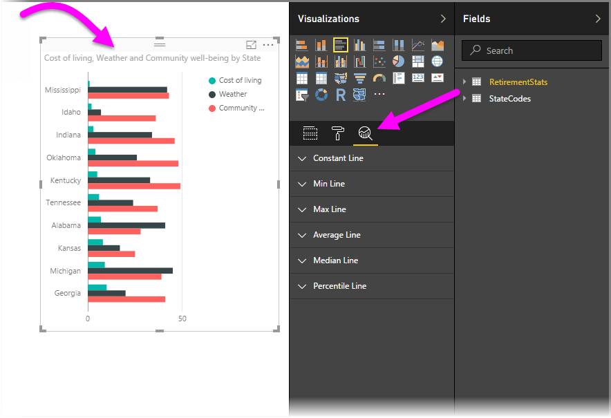
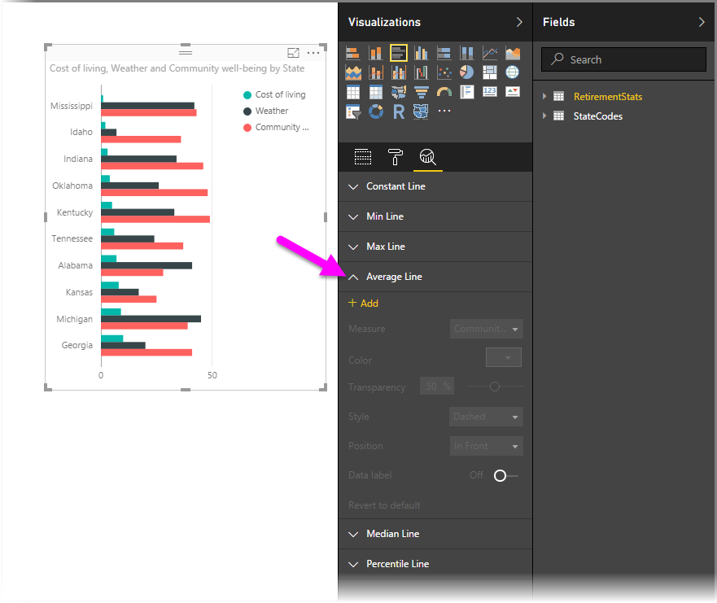

<properties
   pageTitle="Analytics pane in Power BI Desktop"
   description="Create dynamic reference lines for visuals in Power BI Desktop"
   services="powerbi"
   documentationCenter=""
   authors="davidiseminger"
   manager="mblythe"
   backup=""
   editor=""
   tags=""
   qualityFocus="no"
   qualityDate=""/>

<tags
   ms.service="powerbi"
   ms.devlang="NA"
   ms.topic="article"
   ms.tgt_pltfrm="NA"
   ms.workload="powerbi"
   ms.date="09/08/2016"
   ms.author="davidi"/>

# Analytics pane in Power BI Desktop

With the <bpt id="p1">**</bpt>Analytics<ept id="p1">**</ept> pane in <bpt id="p2">**</bpt>Power BI Desktop<ept id="p2">**</ept>, you can add dynamic <bpt id="p3">*</bpt>reference lines<ept id="p3">*</ept> to visuals, and provide focus for important trends or insights. The <bpt id="p1">**</bpt>Analytics<ept id="p1">**</ept> pane is found in the <bpt id="p2">**</bpt>Visualizations<ept id="p2">**</ept> area of Power BI Desktop, beginning with the August 2016 release (version 2.37.4464.321 or later), as shown below.

>   Note: The <bpt id="p1">**</bpt>Analytics<ept id="p1">**</ept> pane only appears when you select a visual on the Power BI Desktop canvas.

## Enable Forecasting (Preview)

In addition, with the September 2016 release of <bpt id="p1">**</bpt>Power BI Desktop<ept id="p1">**</ept> (version 2.39.4526.362 or later), you can also perform <bpt id="p2">*</bpt>forecasting<ept id="p2">*</ept> from the <bpt id="p3">**</bpt>Analytics<ept id="p3">**</ept> pane. You must enable this preview feature, by going to <bpt id="p1">**</bpt>File &gt; Options and settings &gt; Options<ept id="p1">**</ept> then selecting <bpt id="p2">**</bpt>Preview Features<ept id="p2">**</ept> from the left pane. Select the checkbox next to <bpt id="p1">**</bpt>Forecasting<ept id="p1">**</ept> to enable the feature, as shown in the following image. You'll need to restart <bpt id="p1">**</bpt>Power BI Desktop<ept id="p1">**</ept> for your changes to take effect.

## Using the Analytics pane

With the <bpt id="p1">**</bpt>Analytics<ept id="p1">**</ept> pane, you can create the following types of dynamic reference lines (not all lines are available for all visual types):

-   X-Axis constant line
-   Y-Axis constant line
-   Min line
-   Max line
-   Average line
-   Median line
-   Percentile line

The following sections show how you can use the <bpt id="p1">**</bpt>Analytics<ept id="p1">**</ept> pane and dynamic reference lines in your visualizations.

To view the available dynamic reference lines for a visual, follow these steps:

1.  Select or create a visual, then select the <bpt id="p1">**</bpt>Analytics<ept id="p1">**</ept> icon from the <bpt id="p2">**</bpt>Visualizations<ept id="p2">**</ept> section.

    

2.  Select the down arrow for the type of line you want to create to expand its options. In this case, we'll select <bpt id="p1">**</bpt>Average Line<ept id="p1">**</ept>.

    

3.  To create a new line, select <bpt id="p1">**</bpt>+ Add<ept id="p1">**</ept>. You can then specify a name for the line by double-clicking the text box, then typing in your name.

    You have all sorts of options for your line, such as selecting its <bpt id="p1">*</bpt>color<ept id="p1">*</ept>, <bpt id="p2">*</bpt>transparency<ept id="p2">*</ept>, <bpt id="p3">*</bpt>style<ept id="p3">*</ept> and <bpt id="p4">*</bpt>position<ept id="p4">*</ept> (relative to the visual's data elements), and whether to include the label. And importantly, you can select which <bpt id="p1">**</bpt>Measure<ept id="p1">**</ept> in the visual you want your line to be based upon by selecting the <bpt id="p2">**</bpt>Measure<ept id="p2">**</ept> drop down, which is automatically populated with data elements from the visual. In this case, we'll select <bpt id="p1">*</bpt>Weather<ept id="p1">*</ept> as the measure, label it <bpt id="p2">*</bpt>Average Weather<ept id="p2">*</ept>, and customize a few of the other options as shown below.

    

4.  If you want to have a data label appear, move the <bpt id="p1">**</bpt>Data label<ept id="p1">**</ept> slider on. When you do so, you get a whole host of additional options for your data label, as shown in the following image.

    

5.  Notice the number that appears next to the <bpt id="p1">**</bpt>Average line<ept id="p1">**</ept> item in the <bpt id="p2">**</bpt>Analytics<ept id="p2">**</ept> pane. That tells you how many dyanmic lines you currently have on your visual, and of which type. If we add a <bpt id="p1">**</bpt>Max line<ept id="p1">**</ept> for <bpt id="p2">*</bpt>Cost of Living<ept id="p2">*</ept>, you can see that the <bpt id="p3">**</bpt>Analytics<ept id="p3">**</ept> pane shows that we now also have a <bpt id="p4">**</bpt>Max line<ept id="p4">**</ept> dynamic reference line applied to this visual.

    

If the visual you've selected can't have dynamic reference lines applied to it (in this case, a <bpt id="p1">**</bpt>Map<ept id="p1">**</ept> visual), you'll see the following when you select the <bpt id="p2">**</bpt>Analytics<ept id="p2">**</ept> pane.

There are all sorts of interesting insights you can highlight by creating dynamic reference lines with the <bpt id="p1">**</bpt>Analytics<ept id="p1">**</ept> pane.

We're planning more features and capabilities, including expanding which visuals can have dynamic reference lines applied to them, so check back often for what's new.

## Apply Forecasting

You can use the <bpt id="p1">**</bpt>Forecast<ept id="p1">**</ept> feature by selecting a visual, then expanding the <bpt id="p2">**</bpt>Forecast<ept id="p2">**</ept> section of the <bpt id="p3">**</bpt>Analytics<ept id="p3">**</ept> pane. You can specify many inputs to modify the forecast, such as the <bpt id="p1">*</bpt>Forecast length<ept id="p1">*</ept>, the <bpt id="p2">*</bpt>Confidence interval<ept id="p2">*</ept>, and others. The following image shows a basic line visual with forecasting applied, but you can use your imagination (and play around with the <bpt id="p1">*</bpt>forecasting<ept id="p1">*</ept> feature) to see how it can apply to your models.

## Limitaciones

The ability to use dynamic reference lines is based on the type of visual being used. The following list shows which dynamic lines are currently available for which visuals:

Full use of dynamic lines are available on the following visuals:

-   Area chart
-   Line chart
-   Scatter chart
-   Clustered Column chart
-   Clustered Bar chart

The following visuals can use only a <bpt id="p1">*</bpt>constant line<ept id="p1">*</ept> from the <bpt id="p2">**</bpt>Analytics<ept id="p2">**</ept> pane:

-   Stacked Area
-   Stacked Bar
-   Stacked Column
-   100% Stacked Bar
-   100% Stacked Column

For the following visuals, a <bpt id="p1">*</bpt>trend line<ept id="p1">*</ept> is currently the only option:

-   Non-stacked Line
-   Clustered Column chart

Lastly, non-Cartesian visuals cannot currently apply dynamic lines from the <bpt id="p1">**</bpt>Analytics<ept id="p1">**</ept> pane, such as:

-   Matrix
-   Pie chart
-   Donut
-   Tabla

## Más información

There are all sorts of things you can do with Power BI Desktop. For more information on its capabilities, check out the following resources:

-   [What's New in Power BI Desktop](powerbi-desktop-latest-update.md)
-   [Download Power BI Desktop](powerbi-desktop-get-the-desktop.md)
-   [Getting Started with Power BI Desktop](powerbi-desktop-getting-started.md)
-   [Query Overview with Power BI Desktop](powerbi-desktop-query-overview.md)
-   [Data Types in Power BI Desktop](powerbi-desktop-data-types.md)
-   [Shape and Combine Data with Power BI Desktop](powerbi-desktop-shape-and-combine-data.md)
-   [Common Query Tasks in Power BI Desktop](powerbi-desktop-common-query-tasks.md)    

 
