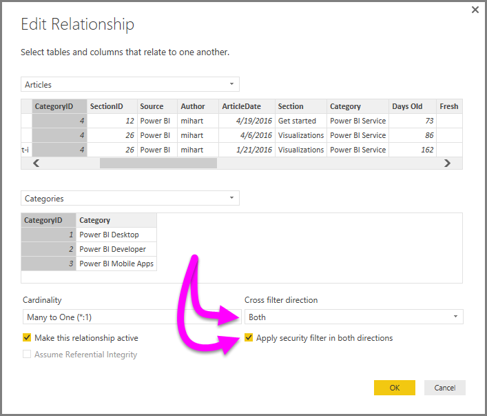

<properties
   pageTitle="Bidirectional cross-filtering in Power BI Desktop (Preview)"
   description="Enable cross-filtering using DirectQuery in Power BI Desktop"
   services="powerbi"
   documentationCenter=""
   authors="davidiseminger"
   manager="mblythe"
   backup=""
   editor=""
   tags=""
   qualityFocus="no"
   qualityDate=""/>

<tags
   ms.service="powerbi"
   ms.devlang="NA"
   ms.topic="article"
   ms.tgt_pltfrm="NA"
   ms.workload="powerbi"
   ms.date="09/29/2016"
   ms.author="davidi"/>

# Bidirectional cross-filtering using DirectQuery in Power BI Desktop (Preview)

When filtering tables to create the appropriate view of data, report creators (and data modelers) face challenges when determining how filtering is applied to a report; the filter context of a table was held on one side of the relationship, but not the other, often requiring complex DAX formulas to get the desired results.

With bidirectional cross-filtering, report creators (and data modelers) now have more control over how filters are applied when working with related tables, enabling those filters to be applied on <bpt id="p1">*</bpt>both<ept id="p1">*</ept> sides of a table relationship. This is accomplished by having the filter context propagated to a second related table on the other side of a table relationship.

A <bpt id="p1">[</bpt>detailed whitepaper<ept id="p1">](http://download.microsoft.com/download/2/7/8/2782DF95-3E0D-40CD-BFC8-749A2882E109/Bidirectional%20cross-filtering%20in%20Analysis%20Services%202016%20and%20Power%20BI.docx)</ept> is available that explains bidirectional cross-filtering in Power BI Desktop (the whitepaper also covers SQL Server Analysis Services 2016, both have the same behavior).

-   Download the <bpt id="p1">[</bpt>Bidirectional cross-filtering for Power BI Desktop<ept id="p1">](http://download.microsoft.com/download/2/7/8/2782DF95-3E0D-40CD-BFC8-749A2882E109/Bidirectional%20cross-filtering%20in%20Analysis%20Services%202016%20and%20Power%20BI.docx)</ept> whitepaper

### Enabling bidirectional cross-filtering for DirectQuery

In order to use cross-filtering for DirectQuery, you must first enable it. This is a preview features, which means its availability and behavior is subject to change in upcoming releases of Power BI Desktop.

To enable cross-filtering for DirectQuery in Power BI Desktop, select <bpt id="p1">**</bpt>File &gt; Options and settings &gt; Options<ept id="p1">**</ept>, then check the box next to <bpt id="p2">**</bpt>Enable cross filtering in both directions for DirectQuery<ept id="p2">**</ept>, as shown in the following image.

> <bpt id="p1">**</bpt>Note:<ept id="p1">**</ept> When creating cross filtering DAX formulas in Power BI Desktop, use <bpt id="p2">*</bpt>UserPrincipalName<ept id="p2">*</ept> (which is often the same as a user's login, such as <bpt id="p3">*</bpt>joe@contoso.com<ept id="p3">*</ept>) instead of <bpt id="p4">*</bpt>UserName<ept id="p4">*</ept>. As such, you may need to create a related table that maps <bpt id="p1">*</bpt>UserName<ept id="p1">*</ept> (or EmployeeID, for example) to <bpt id="p2">*</bpt>UserPrincipleName<ept id="p2">*</ept>.

To enable cross-filtering, in the <bpt id="p1">**</bpt>Edit Relationship<ept id="p1">**</ept> dialog for a relationship, the following must be selected:

-   The <bpt id="p1">**</bpt>Cross filter direction<ept id="p1">**</ept> must be set to <bpt id="p2">**</bpt>Both<ept id="p2">**</ept>
-   The <bpt id="p1">**</bpt>Apply security filter in both directions<ept id="p1">**</ept> must also be selected

    

For more information, and for examples of how bidirectional cross-filtering works, check out the <bpt id="p1">[</bpt>whitepaper<ept id="p1">](http://download.microsoft.com/download/2/7/8/2782DF95-3E0D-40CD-BFC8-749A2882E109/Bidirectional%20cross-filtering%20in%20Analysis%20Services%202016%20and%20Power%20BI.docx)</ept> mentioned earlier in this article.
