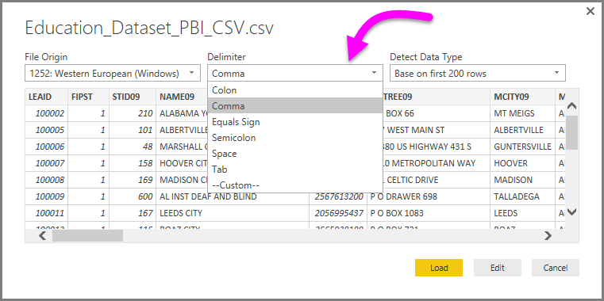

<properties
   pageTitle="Conectarse a un archivo CSV en Power BI Desktop"
   description="Conectarse a y utilizar datos de archivos CSV en Power BI Desktop fácilmente"
   services="powerbi"
   documentationCenter=""
   authors="davidiseminger"
   manager="mblythe"
   backup=""
   editor=""
   tags=""
   qualityFocus="no"
   qualityDate=""/>

<tags
   ms.service="powerbi"
   ms.devlang="NA"
   ms.topic="article"
   ms.tgt_pltfrm="NA"
   ms.workload="powerbi"
   ms.date="09/29/2016"
   ms.author="davidi"/>

# Conectarse a un archivo CSV en Power BI Desktop

Conectarse a un valor separados por comas (*CSV*) archivo de Power BI Desktop es muy similar a conectarse a un libro de Excel. Ambos métodos son fáciles y este artículo se indican los pasos cómo conectarse a cualquier archivo CSV a las que tiene acceso.

Comenzar desde la selección de Power BI Desktop **obtener datos > CSV** desde el **Inicio** cinta de opciones.

Seleccione el archivo CSV desde el **abiertos** cuadro de diálogo que aparece.

Al seleccionar **abiertos**, Power BI Desktop tiene acceso al archivo y determina ciertos atributos de archivo, como el origen del archivo, el tipo de delimitador, el número de filas debe utilizarse para detectar los datos de tipos y en el archivo.

Estos atributos de archivos y opciones se muestran en las selecciones de la lista desplegable en la parte superior de la **Importar CSV** cuadro de diálogo, se muestra a continuación. Puede cambiar cualquiera de estas configuraciones detectadas seleccionando manualmente, otra opción de cualquiera de los selectores de la lista desplegable.

Cuando esté satisfecho con las selecciones, puede seleccionar **carga** importar el archivo en Power BI Desktop, o bien puede seleccionar **Editar** para abrir **Editor de consultas** aún más la forma y transformar los datos antes de importarlo.

Después de cargar los datos en Power BI Desktop, vea la tabla y sus columnas (que se presentan como campos de Power BI Desktop) en el **campos** panel, en la parte derecha de la vista de informe en Power BI Desktop.

Eso es todo lo que debe hacer: los datos de su archivo CSV están ahora en Power BI Desktop.

Puede usar esos datos en Power BI Desktop para crear efectos visuales, informes, o para interactuar con cualquier otro dato que desee conectar con e importar, como libros de Excel, las bases de datos o cualquier otro origen de datos.

## Más información

Hay todo tipo de datos que puede conectarse con Power BI Desktop. Para obtener más información sobre los orígenes de datos, consulte los siguientes recursos:

-   [Introducción a Power BI Desktop](powerbi-desktop-getting-started.md)

-   [Orígenes de datos en Power BI Desktop](powerbi-desktop-data-sources.md)

-   [La forma y combinar datos con Power BI Desktop](powerbi-desktop-shape-and-combine-data.md)

-   [Conectarse a libros de Excel en Power BI Desktop](powerbi-desktop-connect-excel.md)   

-   [Introducir datos directamente en Power BI Desktop](powerbi-desktop-enter-data-directly-into-desktop.md)   
