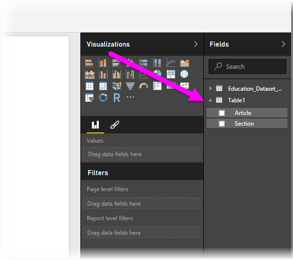

<properties
   pageTitle="Connect to CSV files in Power BI Desktop"
   description="Easily connect to and use CSV file data in Power BI Desktop"
   services="powerbi"
   documentationCenter=""
   authors="davidiseminger"
   manager="mblythe"
   backup=""
   editor=""
   tags=""
   qualityFocus="no"
   qualityDate=""/>

<tags
   ms.service="powerbi"
   ms.devlang="NA"
   ms.topic="article"
   ms.tgt_pltfrm="NA"
   ms.workload="powerbi"
   ms.date="09/29/2016"
   ms.author="davidi"/>

# Connect to CSV files in Power BI Desktop

Connecting to a comma-separated value (<bpt id="p1">*</bpt>CSV<ept id="p1">*</ept>) file from Power BI Desktop is a lot like connecting to an Excel workbook. Both are easy, and this article steps you through how to connect to any CSV file to which you have access.

To start with, from Power BI Desktop select <bpt id="p1">**</bpt>Get Data &gt; CSV<ept id="p1">**</ept> from the <bpt id="p2">**</bpt>Home<ept id="p2">**</ept> ribbon.

Select your CSV file from the <bpt id="p1">**</bpt>Open<ept id="p1">**</ept> dialog that appears.

When you select <bpt id="p1">**</bpt>Open<ept id="p1">**</ept>, Power BI Desktop accesses the file and determines certain file attributes, such as the file origin, delimiter type, and how many rows should be used to detect the data types in the file.

These file attributes and options are shown in the drop-down selections at the top of the <bpt id="p1">**</bpt>CSV import<ept id="p1">**</ept> dialog window, shown below. You can change any of these detected settings manually, by choosing another option from any of the drop-down selectors.

When you’re satisfied with the selections, you can select <bpt id="p1">**</bpt>Load<ept id="p1">**</ept> to import the file into Power BI Desktop, or you can select <bpt id="p2">**</bpt>Edit<ept id="p2">**</ept> to open <bpt id="p3">**</bpt>Query Editor<ept id="p3">**</ept> and further shape or transform the data before importing it.

Once you load the data into Power BI Desktop, you see the table and its columns (which are presented as Fields in Power BI Desktop) in the <bpt id="p1">**</bpt>Fields<ept id="p1">**</ept> pane, along the right of the Report view in Power BI Desktop.

That’s all you have to do – the data from your CSV file is now in Power BI Desktop.

You can use that data in Power BI Desktop to create visuals, reports, or interact with any other data you might want to connect with and import, such as Excel workbooks, databases, or any other data source.

## Más información

There are all sorts of data you can connect to using Power BI Desktop. For more information on data sources, check out the following resources:

-   [Getting Started with Power BI Desktop](powerbi-desktop-getting-started.md)

-   [Data Sources in Power BI Desktop](powerbi-desktop-data-sources.md)

-   [Shape and Combine Data with Power BI Desktop](powerbi-desktop-shape-and-combine-data.md)

-   [Connect to Excel workbooks in Power BI Desktop](powerbi-desktop-connect-excel.md)   

-   [Enter data directly into Power BI Desktop](powerbi-desktop-enter-data-directly-into-desktop.md)   
