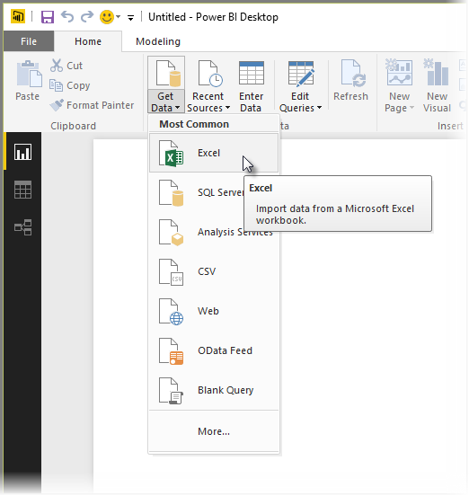
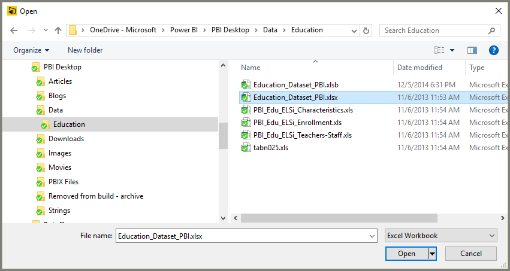
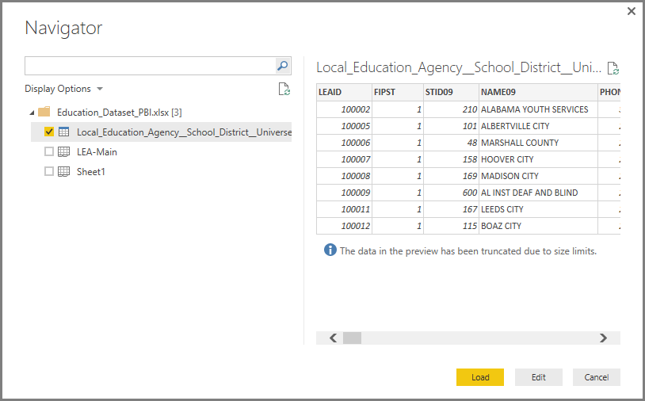
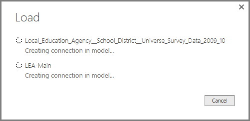
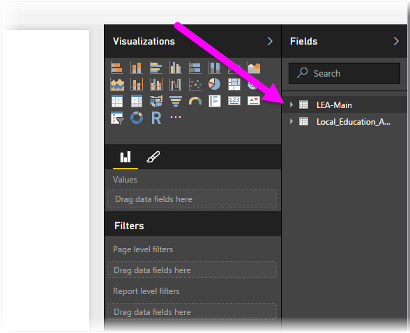

<properties
   pageTitle="Conectarse a Excel en Power BI Desktop"
   description="Conectarse a y utilizar los datos de libro de Excel en Power BI Desktop fácilmente"
   services="powerbi"
   documentationCenter=""
   authors="davidiseminger"
   manager="mblythe"
   backup=""
   editor=""
   tags=""
   qualityFocus="no"
   qualityDate=""/>

<tags
   ms.service="powerbi"
   ms.devlang="NA"
   ms.topic="article"
   ms.tgt_pltfrm="NA"
   ms.workload="powerbi"
   ms.date="09/29/2016"
   ms.author="davidi"/>

# Conectarse a Excel en Power BI Desktop

Conectarse a un libro de Excel desde Power BI Desktop es sencilla, y este artículo le guiará a través de los pasos.

En Power BI Desktop, seleccione **obtener datos > Excel** desde el **Inicio** cinta de opciones.

Seleccione el libro desde el **abiertos** cuadro de diálogo que aparece.

Power BI Desktop presenta las tablas en otros elementos de datos del libro en la **Navigator** ventana. Al seleccionar una tabla en el panel izquierdo, aparece una vista previa de los datos en el panel derecho.

Puede seleccionar el botón Cargar para importar los datos, o si desea editar los datos mediante **Editor de consultas** antes de ponerla en Power BI Desktop, seleccione la **Editar** botón.

Al cargar los datos, Power BI Desktop muestra la **cargar** ventana y muestra la actividad asociada a la carga de los datos.  

Cuando haya finalizado, Power BI Desktop muestra las tablas y campos que importó el libro de Excel en la **campos** panel, en el lado derecho del escritorio.

Y eso es todo!

Ahora está preparado para utilizar los datos importados desde el libro de Excel en Power BI Desktop para crear efectos visuales, informes, o para interactuar con cualquier otro dato que desee conectar con e importar, como otros libros de Excel, las bases de datos o cualquier otro origen de datos.

## Más información

Hay todo tipo de datos que puede conectarse con Power BI Desktop. Para obtener más información sobre los orígenes de datos, consulte los siguientes recursos:

-   [Introducción a Power BI Desktop](powerbi-desktop-getting-started.md)

-   [Orígenes de datos en Power BI Desktop](powerbi-desktop-data-sources.md)

-   [La forma y combinar datos con Power BI Desktop](powerbi-desktop-shape-and-combine-data.md)

-   [Conectarse a un archivo CSV en Power BI Desktop](powerbi-desktop-connect-csv.md)   

-   [Introducir datos directamente en Power BI Desktop](powerbi-desktop-enter-data-directly-into-desktop.md)   
