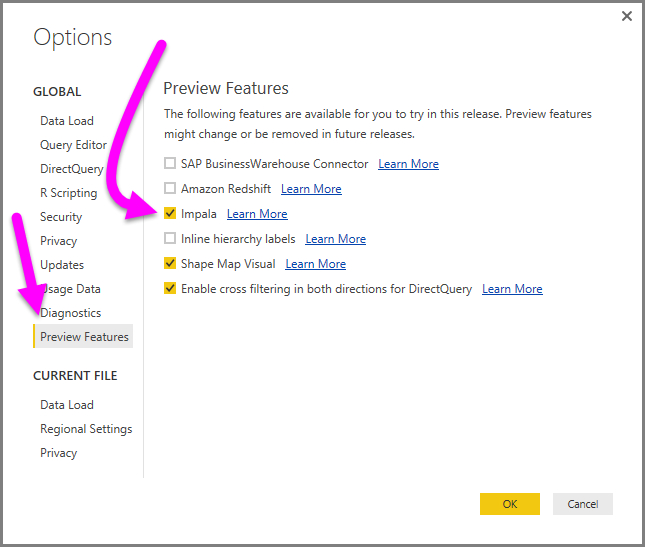
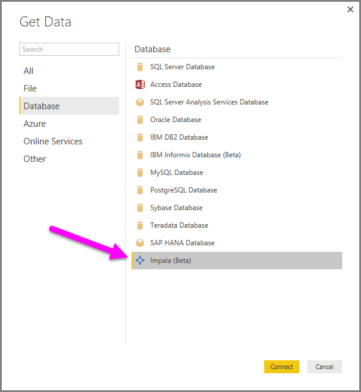
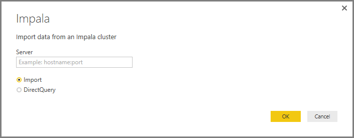
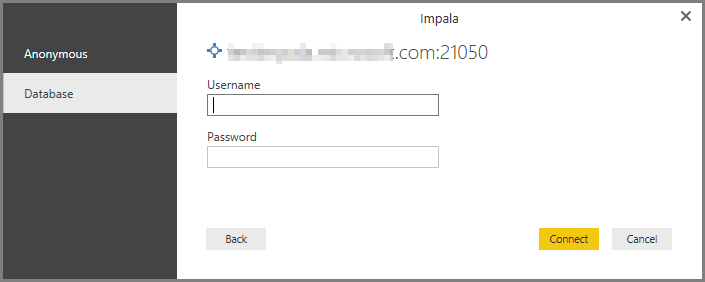
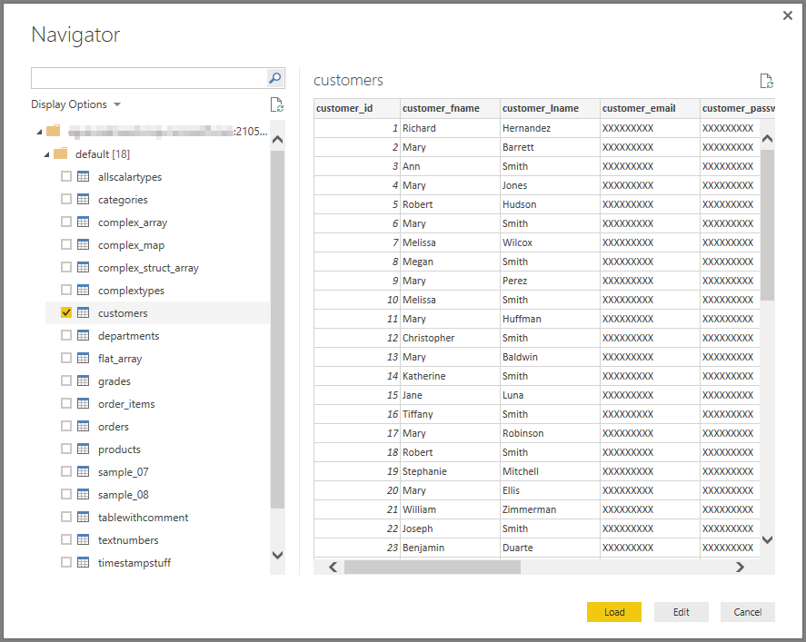

<properties
   pageTitle="Conectarse a una base de datos Impala en Power BI Desktop (vista previa)"
   description="Conectarse a y utilizar una base de datos Impala en Power BI Desktop fácilmente"
   services="powerbi"
   documentationCenter=""
   authors="davidiseminger"
   manager="mblythe"
   backup=""
   editor=""
   tags=""
   qualityFocus="no"
   qualityDate=""/>

<tags
   ms.service="powerbi"
   ms.devlang="NA"
   ms.topic="article"
   ms.tgt_pltfrm="NA"
   ms.workload="powerbi"
   ms.date="10/03/2016"
   ms.author="davidi"/>

# Conectarse a una base de datos Impala en Power BI Desktop (vista previa)

En Power BI Desktop, puede conectarse a un **Impala** de base de datos y usar los datos subyacentes igual que cualquier otro origen de datos en Power BI Desktop. Esta versión de la **Impala** conector está en versión preliminar y está sujeta a cambios.

## Habilitar la característica Impala (vista previa)

Para obtener acceso a la **Impala** conector, primero debe habilitar esta característica de vista previa. En **Power BI Desktop**, seleccione **archivo > Opciones y configuración > opción** a continuación, en el **opciones** ventana, seleccione el **características de vista previa** sección y habilitar **Impala**, tal como se muestra a continuación.

Cuando Active esa casilla, se activa la **Impala** característica de vista previa. Debe reiniciar Power BI Desktop para que el cambio surta efecto. Una vez hecho, la característica de vista previa está disponible.

## Conectarse a una base de datos Impala

Una vez que se ha habilitado la opción de vista previa de característica, para conectarse a un **Impala** Seleccione la base de datos **obtener datos** desde el **Inicio** la cinta de opciones en Power BI Desktop. Seleccione **base de datos** de las categorías de la izquierda y, consulte **Impala (Beta)**.

En el **Impala** ventana que aparece, escriba o pegue el nombre de su servidor Impala en el cuadro y seleccione **Aceptar**. Tenga en cuenta que puede elegir **importar** datos directamente en Power BI, o bien pueden usar **DirectQuery**. Puede obtener más información [mediante DirectQuery](powerbi-desktop-use-directquery.md).

Cuando se le solicite, colocar en su nombre de usuario y contraseña, o conectarse de forma anónima - cualquier es compatible.

>
            **Nota:** una vez que se coloca en su nombre de usuario y contraseña para un determinado **Impala** server, Power BI Desktop utiliza las mismas credenciales de intentos de conexión posteriores. Puede modificar esas credenciales yendo a **archivo > Opciones y configuración > configuración del origen de datos**.

Una vez que se conecta correctamente, un **Navigator** ventana aparece y muestra los datos disponibles en el servidor, en el que puede seleccionar uno o varios elementos para importar y usar en **Power BI Desktop**.

## Consideraciones y limitaciones

Hay algunos límites y consideraciones a tener en cuenta en esta versión de vista previa de la **Impala** conector:

-   Los planes futuros incluyen habilitar compatibilidad de actualización usando la **Power BI Gateway**.

## Más información

Hay todo tipo de datos que puede conectarse con Power BI Desktop. Para obtener más información sobre los orígenes de datos, consulte los siguientes recursos:

-   [Introducción a Power BI Desktop](powerbi-desktop-getting-started.md)

-   [Orígenes de datos en Power BI Desktop](powerbi-desktop-data-sources.md)

-   [La forma y combinar datos con Power BI Desktop](powerbi-desktop-shape-and-combine-data.md)

-   [Conectarse a libros de Excel en Power BI Desktop](powerbi-desktop-connect-excel.md)   

-   [Introducir datos directamente en Power BI Desktop](powerbi-desktop-enter-data-directly-into-desktop.md)   
