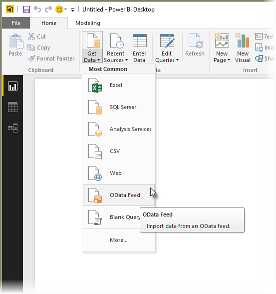

<properties
   pageTitle="Conectarse a una fuente OData en Power BI Desktop"
   description="Conectarse a y utilizar una fuente OData en Power BI Desktop fácilmente"
   services="powerbi"
   documentationCenter=""
   authors="davidiseminger"
   manager="mblythe"
   backup=""
   editor=""
   tags=""
   qualityFocus="no"
   qualityDate=""/>

<tags
   ms.service="powerbi"
   ms.devlang="NA"
   ms.topic="article"
   ms.tgt_pltfrm="NA"
   ms.workload="powerbi"
   ms.date="09/29/2016"
   ms.author="davidi"/>

# Conectarse a fuentes de OData en Power BI Desktop

En Power BI Desktop, puede conectarse a un **fuente de OData** y usar los datos subyacentes igual que cualquier otro origen de datos en Power BI Desktop.

Para conectarse a una fuente de OData, seleccione **obtener datos > fuente de OData** desde el **Inicio** la cinta de opciones en Power BI Desktop.

En el **fuente de OData** ventana que aparece, escriba o pegue los OData en el cuadro Dirección URL de fuente y seleccione **Aceptar**.

Power BI Desktop se conecta a la fuente de OData y muestra las tablas disponibles y otros elementos de datos en el **Navigator** ventana. Al seleccionar un elemento, el panel derecho de la **Navigator** ventana muestra una vista previa de los datos. Puede seleccionar tantas tablas como que desea importar. El **Navigator** ventana muestra una vista previa de la tabla seleccionada actualmente.

Puede elegir el **Editar** botón que inicia **Editor de consultas**, donde puede dar forma y transformar los datos de la fuente antes de importarlo en Power BI Desktop OData. O puede seleccionar la **carga** botón e importar todos los elementos de datos que seleccionó en el panel izquierdo.

Cuando se selecciona **carga**, Power BI Desktop importa los elementos seleccionados y muestra un **carga** ventana de progreso de la importación.

Una vez que haya finalizado, Power BI Desktop hace las tablas seleccionadas y otros elementos de datos disponibles en la **campos** panel, que se encuentra en el lado derecho de la *informes* vista en Power BI Desktop.

Y eso es todo!

Ahora está listo para utilizar los datos importados desde la fuente OData en Power BI Desktop para crear efectos visuales, informes, o para interactuar con cualquier otro dato que desee conectar con e importar, como otros libros de Excel, las bases de datos o cualquier otro origen de datos.

## Más información

Hay todo tipo de datos que puede conectarse con Power BI Desktop. Para obtener más información sobre los orígenes de datos, consulte los siguientes recursos:

-   [Introducción a Power BI Desktop](powerbi-desktop-getting-started.md)

-   [Orígenes de datos en Power BI Desktop](powerbi-desktop-data-sources.md)

-   [La forma y combinar datos con Power BI Desktop](powerbi-desktop-shape-and-combine-data.md)

-   [Conectarse a libros de Excel en Power BI Desktop](powerbi-desktop-connect-excel.md)   

-   [Introducir datos directamente en Power BI Desktop](powerbi-desktop-enter-data-directly-into-desktop.md)   
