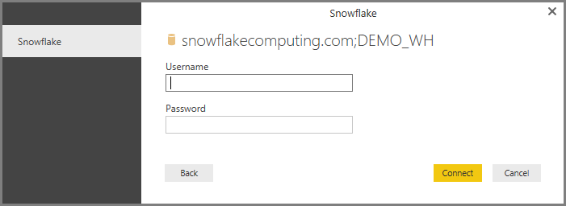

<properties
   pageTitle="Connect to a Snowflake computing warehouse in Power BI Desktop (Preview)"
   description="Easily connect to and use a Snowflake computing warehouse in Power BI Desktop"
   services="powerbi"
   documentationCenter=""
   authors="davidiseminger"
   manager="mblythe"
   backup=""
   editor=""
   tags=""
   qualityFocus="no"
   qualityDate=""/>

<tags
   ms.service="powerbi"
   ms.devlang="NA"
   ms.topic="article"
   ms.tgt_pltfrm="NA"
   ms.workload="powerbi"
   ms.date="09/30/2016"
   ms.author="davidi"/>

# Connect to a Snowflake computing warehouse in Power BI Desktop (Preview)

In Power BI Desktop, you can connect to a <bpt id="p1">**</bpt>Snowflake<ept id="p1">**</ept> computing warehouse and use the underlying data just like any other data source in Power BI Desktop. This release of the <bpt id="p1">**</bpt>Snowflake<ept id="p1">**</ept> connector is in Preview, and is subject to change.

## Enable the Snowflake (Preview) feature

To get access to the <bpt id="p1">**</bpt>Snowflake<ept id="p1">**</ept> connector, you first need to enable this preview feature. In <bpt id="p1">**</bpt>Power BI Desktop<ept id="p1">**</ept>, select <bpt id="p2">**</bpt>File &gt; Options and settings &gt; Option<ept id="p2">**</ept> then in the <bpt id="p3">**</bpt>Options<ept id="p3">**</ept> window, select the <bpt id="p4">**</bpt>Preview Features<ept id="p4">**</ept> section and enable <bpt id="p5">**</bpt>Snowflake<ept id="p5">**</ept>, as shown below.

When you check that box, you turn on the <bpt id="p1">**</bpt>Snowflake<ept id="p1">**</ept> preview feature. You'll need to restart Power BI Desktop for the change to take effect. Once you do, the preview feature is available.

You also <bpt id="p1">*</bpt>must<ept id="p1">*</ept> install the <bpt id="p2">**</bpt>Snowflake ODBC driver<ept id="p2">**</ept> on computers that use the <bpt id="p3">**</bpt>Snowflake<ept id="p3">**</ept> connector, using the architecture that matches the installation of <bpt id="p4">**</bpt>Power BI Desktop<ept id="p4">**</ept>, either 32-bit or 64-bit. Just follow the following link and <bpt id="p1">[</bpt>download the appropriate Snowflake ODBC driver<ept id="p1">](http://go.microsoft.com/fwlink/?LinkID=823762)</ept>.

## Connect to a Snowflake computing warehouse

Once you've enabled to preview feature, to connect to a <bpt id="p1">**</bpt>Snowflake<ept id="p1">**</ept> computing warehouse select <bpt id="p2">**</bpt>Get Data<ept id="p2">**</ept> from the <bpt id="p3">**</bpt>Home<ept id="p3">**</ept> ribbon in Power BI Desktop. Select <bpt id="p1">**</bpt>Database<ept id="p1">**</ept> from the categories on the left, and you see <bpt id="p2">**</bpt>Snowflake (Beta)<ept id="p2">**</ept>.

In the <bpt id="p1">**</bpt>Snowflake<ept id="p1">**</ept> window that appears, type or paste the name of your Snowflake computing warehouse into the box and select <bpt id="p2">**</bpt>OK<ept id="p2">**</ept>. Note that you can choose to <bpt id="p1">**</bpt>Import<ept id="p1">**</ept> data directly into Power BI, or you can use <bpt id="p2">**</bpt>DirectQuery<ept id="p2">**</ept>. You can learn more about <bpt id="p1">[</bpt>using DirectQuery<ept id="p1">](powerbi-desktop-use-directquery.md)</ept>.

When prompted, put in your username and password.

><bpt id="p1">**</bpt>Note:<ept id="p1">**</ept> Once you put in your username and password for a particular <bpt id="p2">**</bpt>Snowflake<ept id="p2">**</ept> server, Power BI Desktop uses those same credentials in subsequent connection attempts. You can modify those credentials by going to <bpt id="p1">**</bpt>File &gt; Options and settings &gt; Data source settings<ept id="p1">**</ept>.

Once you successfully connect, a <bpt id="p1">**</bpt>Navigator<ept id="p1">**</ept> window appears and displays the data available on the server, from which you can select one or multiple elements to import and use in <bpt id="p2">**</bpt>Power BI Desktop<ept id="p2">**</ept>.

You can <bpt id="p1">**</bpt>Load<ept id="p1">**</ept> the selected table, which brings the entire table into <bpt id="p2">**</bpt>Power BI Desktop<ept id="p2">**</ept>, or you can <bpt id="p3">**</bpt>Edit<ept id="p3">**</ept> the query, which opens <bpt id="p4">**</bpt>Query Editor<ept id="p4">**</ept> so you can filter and refine the set of data you want to use, and then load that refined set of data into <bpt id="p5">**</bpt>Power BI Desktop<ept id="p5">**</ept>.

## Más información

There are all sorts of data you can connect to using Power BI Desktop. For more information on data sources, check out the following resources:

-   [Getting Started with Power BI Desktop](powerbi-desktop-getting-started.md)

-   [Data Sources in Power BI Desktop](powerbi-desktop-data-sources.md)

-   [Shape and Combine Data with Power BI Desktop](powerbi-desktop-shape-and-combine-data.md)

-   [Connect to Excel workbooks in Power BI Desktop](powerbi-desktop-connect-excel.md)   

-   [Enter data directly into Power BI Desktop](powerbi-desktop-enter-data-directly-into-desktop.md)   
