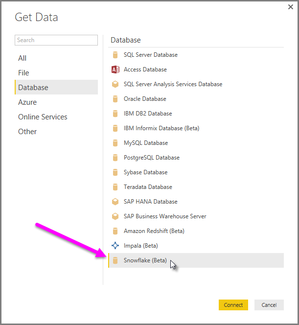
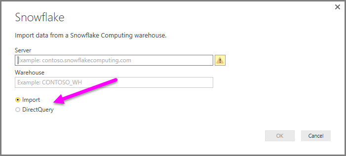

<properties
   pageTitle="Conectarse a un almacén informático de copo de nieve en Power BI Desktop (vista previa)"
   description="Conectarse a y utilizar un almacén informática de copo de nieve en Power BI Desktop fácilmente"
   services="powerbi"
   documentationCenter=""
   authors="davidiseminger"
   manager="mblythe"
   backup=""
   editor=""
   tags=""
   qualityFocus="no"
   qualityDate=""/>

<tags
   ms.service="powerbi"
   ms.devlang="NA"
   ms.topic="article"
   ms.tgt_pltfrm="NA"
   ms.workload="powerbi"
   ms.date="09/30/2016"
   ms.author="davidi"/>

# Conectarse a un almacén informático de copo de nieve en Power BI Desktop (vista previa)

En Power BI Desktop, puede conectarse a un **copo de nieve** informática de almacenamiento y utilizar los datos subyacentes igual que cualquier otro origen de datos en Power BI Desktop. Esta versión de la **copo de nieve** conector está en versión preliminar y está sujeta a cambios.

## Habilitar la característica de copo de nieve (vista previa)

Para obtener acceso a la **copo de nieve** conector, primero debe habilitar esta característica de vista previa. En **Power BI Desktop**, seleccione **archivo > Opciones y configuración > opción** a continuación, en el **opciones** ventana, seleccione el **características de vista previa** sección y habilitar **copo de nieve**, tal como se muestra a continuación.

Cuando Active esa casilla, se activa la **copo de nieve** característica de vista previa. Debe reiniciar Power BI Desktop para que el cambio surta efecto. Una vez hecho, la característica de vista previa está disponible.

También *debe* instalar el **controlador ODBC de copo de nieve** en equipos que usan el **copo de nieve** conector, usando la arquitectura que coincida con la instalación de **Power BI Desktop**, 32 bits o 64 bits. Siga el siguiente vínculo y [Descargue el controlador ODBC de copo de nieve adecuado](http://go.microsoft.com/fwlink/?LinkID=823762).

## Conectarse a un almacén informático de copo de nieve

Una vez que se ha habilitado la opción de vista previa de característica, para conectarse a un **copo de nieve** informática seleccione almacenamiento **obtener datos** desde el **Inicio** cinta de opciones de Power BI Desktop. Seleccione **base de datos** de las categorías de la izquierda y, consulte **(Beta) de copo de nieve**.

En el **copo de nieve** ventana que aparece, escriba o pegue el nombre de la informática de copo de nieve de almacenamiento en el cuadro y seleccione **Aceptar**. Tenga en cuenta que puede elegir **importar** datos directamente en Power BI, o bien pueden usar **DirectQuery**. Puede obtener más información [mediante DirectQuery](powerbi-desktop-use-directquery.md).

Cuando se le solicite, coloca en su nombre de usuario y contraseña.

>
            **Nota:** una vez que se coloca en su nombre de usuario y contraseña para un determinado **copo de nieve** server, Power BI Desktop utiliza las mismas credenciales de intentos de conexión posteriores. Puede modificar esas credenciales yendo a **archivo > Opciones y configuración > configuración del origen de datos**.

Una vez que se conecta correctamente, un **Navigator** ventana aparece y muestra los datos disponibles en el servidor, en el que puede seleccionar uno o varios elementos para importar y usar en **Power BI Desktop**.

Puede **cargar** la tabla seleccionada, lo que se muestra la tabla completa en **Power BI Desktop**, o bien puede **Editar** la consulta, que se abre **Editor de consultas** para que pueda filtrar y refinar el conjunto de datos que desea utilizar y, a continuación, cargar ese conjunto de datos en refinados **Power BI Desktop**.

## Más información

Hay todo tipo de datos que puede conectarse con Power BI Desktop. Para obtener más información sobre los orígenes de datos, consulte los siguientes recursos:

-   [Introducción a Power BI Desktop](powerbi-desktop-getting-started.md)

-   [Orígenes de datos en Power BI Desktop](powerbi-desktop-data-sources.md)

-   [La forma y combinar datos con Power BI Desktop](powerbi-desktop-shape-and-combine-data.md)

-   [Conectarse a libros de Excel en Power BI Desktop](powerbi-desktop-connect-excel.md)   

-   [Introducir datos directamente en Power BI Desktop](powerbi-desktop-enter-data-directly-into-desktop.md)   
