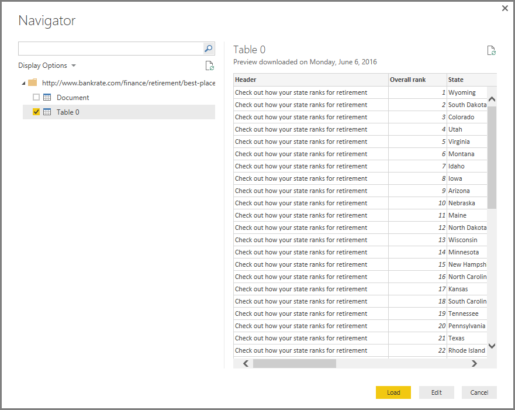

<properties
   pageTitle="Conectarse a una página Web de Power BI Desktop"
   description="Conectarse a y utilizar datos de la página Web de Power BI Desktop fácilmente"
   services="powerbi"
   documentationCenter=""
   authors="davidiseminger"
   manager="mblythe"
   backup=""
   editor=""
   tags=""
   qualityFocus="no"
   qualityDate=""/>

<tags
   ms.service="powerbi"
   ms.devlang="NA"
   ms.topic="article"
   ms.tgt_pltfrm="NA"
   ms.workload="powerbi"
   ms.date="09/29/2016"
   ms.author="davidi"/>

# Conectarse a una página Web de Power BI Desktop

Puede conectarse a una página Web y para importar sus datos en Power BI Desktop, para utilizar en los objetos visuales y en los modelos de datos.

En Power BI Desktop, seleccione **obtener datos > Web** desde el **Inicio** cinta de opciones.

Un cuadro de diálogo aparecerá la dirección URL de la página Web desde el que desea importar los datos.

Una vez que haya escrito en (o pegado) la dirección URL, seleccione **Aceptar**. Power BI Desktop se conecta a esa página, a continuación, muestra los datos disponibles de la página en el **Navigator** ventana. Cuando se selecciona uno de los elementos de datos disponibles, como una tabla de la página completa, el **Navigator** ventana muestra una vista previa de los datos en el lado derecho de la ventana.

Puede elegir el **Editar** botón que inicia **Editor de consultas**, donde puede dar forma y transformar los datos en la página Web antes de importarlo en Power BI Desktop. O puede seleccionar la **carga** botón e importar todos los elementos de datos que seleccionó en el panel izquierdo.

Cuando se selecciona **carga**, Power BI Desktop importa los elementos seleccionados y pone a disposición en la **campos** panel, que se encuentra en el lado derecho de la vista de informes en Power BI Desktop.

Que es todo para conectarse a una página Web y llevar sus datos a Power BI Desktop.

Desde allí, puede arrastrar los campos al lienzo del informe y crear todas las visualizaciones que desee. También se puede trabajar los datos de esa página Web justo como lo haría con cualquier otro dato: puede modelar, puede crear relaciones entre éste y otros orígenes de datos en el modelo y hacer lo contrario, lo que le gustaría crear simplemente el informe de Power BI que desee.

Para ver la conexión a una página Web en más profundidad y acción, eche un vistazo la [Power BI Desktop Guía de introducción a](powerbi-desktop-getting-started.md).

## Más información

Hay todo tipo de datos que puede conectarse con Power BI Desktop. Para obtener más información sobre los orígenes de datos, consulte los siguientes recursos:

-   [Orígenes de datos en Power BI Desktop](powerbi-desktop-data-sources.md)

-   [La forma y combinar datos con Power BI Desktop](powerbi-desktop-shape-and-combine-data.md)

-   [Conectarse a libros de Excel en Power BI Desktop](powerbi-desktop-connect-excel.md)   

-   [Conectarse a un archivo CSV en Power BI Desktop](powerbi-desktop-connect-csv.md)   

-   [Introducir datos directamente en Power BI Desktop](powerbi-desktop-enter-data-directly-into-desktop.md)   
