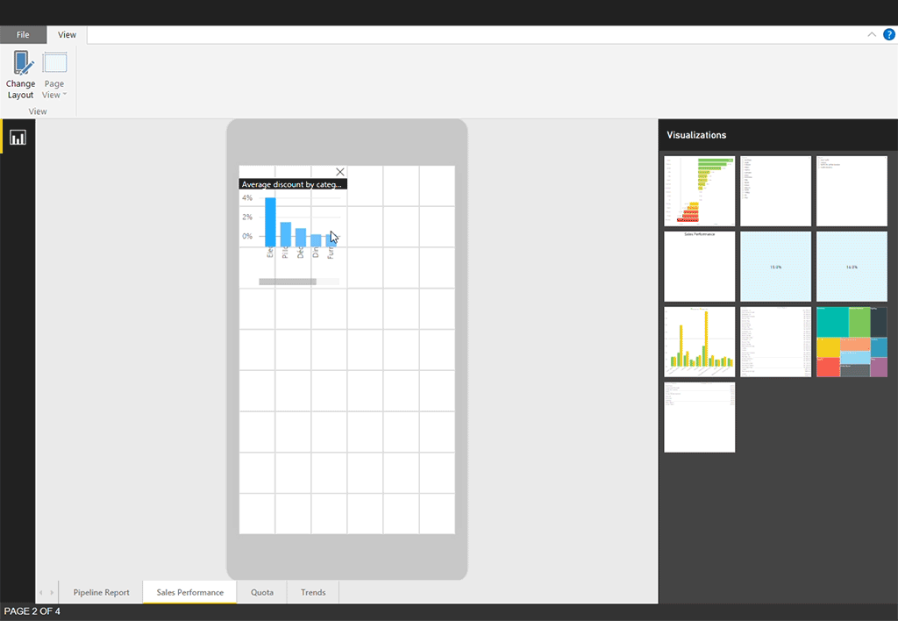

<properties 
   pageTitle="Crear informes optimizados para las aplicaciones de teléfono de Power BI"
   description="Aprenda a optimizar las páginas del informe en Power BI Desktop para las aplicaciones de teléfono de Power BI."
   services="powerbi" 
   documentationCenter="" 
   authors="maggiesMSFT" 
   manager="mblythe" 
   backup=""
   editor=""
   tags=""
   qualityFocus="no"
   qualityDate=""/>
 
<tags
   ms.service="powerbi"
   ms.devlang="NA"
   ms.topic="article"
   ms.tgt_pltfrm="NA"
   ms.workload="powerbi"
   ms.date="09/27/2016"
   ms.author="maggies"/>

# Crear informes optimizados para las aplicaciones de teléfono de Power BI

Cuando se [crear un informe en Power BI Desktop](powerbi-desktop-report-view.md), puede mejorar la experiencia de uso de teléfonos mediante la creación de una versión del informe específicamente para el teléfono. Adaptar el informe para el teléfono reorganizar y cambiar el tamaño de los efectos visuales, quizás no incluidos todas ellas, para una experiencia óptima.  

## Diseñar una página de informe para el teléfono en Power BI Desktop

Después de [crear un informe en Power BI Desktop](powerbi-desktop-report-view.md), puede optimizar los teléfonos.

1. En Power BI Desktop, seleccione **vista informe** en la barra de navegación izquierda.

    

2. En la **Inicio** ficha, seleccione **cambiar el diseño**.  

    

    Vea un teléfono en blanco del lienzo. Todos los elementos visuales en la página de informe original se muestran en el panel de visualizaciones de la derecha.
 
2. Para agregar un elemento visual al diseño del teléfono, arrástrelo desde el panel de visualizaciones al lienzo del teléfono.

    Informes de Phone utilizan un diseño de cuadrícula. Al arrastrar elementos visuales al lienzo móvil, se ajustan a la cuadrícula.

    

    Puede agregar todos o algunos de los informe maestro página elementos visuales a la página de informe de teléfono. Puede agregar cada visual sólo una vez.

3.  Puede cambiar el tamaño de los objetos visuales en la cuadrícula, como lo haría para los mosaicos en paneles y paneles móviles.

    > [AZURE.NOTE] La cuadrícula del informe phone escala a través de teléfonos de tamaños diferentes, por lo que será tan bueno en pequeñas teléfonos de pantallas grandes y el informe.

    

## Notas acerca de cómo crear diseños de informe de teléfono
- Para los informes con varias páginas, puede optimizar todas las páginas o sólo algunas. 
- En un teléfono, desplazarse entre páginas al desplazarse desde el lado o punteando en el menú de la página.
- No se puede modificar la configuración de formato para simplemente el teléfono. Aplicar formato es coherente entre los diseños maestros y móviles. Por ejemplo, los tamaños de fuente será el mismo.
- Para cambiar un elemento visual, como cambiar su formato, conjunto de datos, filtros o cualquier otro atributo, devolver el modo de creación de informes regulares.

    > 
            **Sugerencia**: de forma predeterminada, Power BI proporciona títulos y nombres de página para los informes de teléfono de la aplicación móvil. Si ha creado elementos visuales del texto de títulos y nombres de página en el informe, considere la posibilidad de no agrega a los informes de teléfono.     

## Quita un objeto visual del diseño de teléfono

-  Para quitar un elemento visual, haga clic en la X en la parte superior derecha del objeto visual en el lienzo de teléfono, o selecciónelo y presione **Eliminar**.

    > [AZURE.NOTE] Quitar un elemento visual aquí sólo quita del lienzo móvil, el objeto visual y el informe original no se verán afectados.
    
    

## Mejorar segmentaciones de datos para que funcionen bien en los informes de teléfono
Segmentaciones de datos ofrecen en el lienzo de filtrado de datos de informe. Al diseñar las segmentaciones de datos en el modo de creación de informes regulares, puede modificar algunas opciones de segmentación de datos para que sean más fáciles de utilizar en los informes de teléfono:

- Decidir si los lectores de informes pueden seleccionar sólo uno o más de un elemento.
- Asegúrese de la segmentación de datos vertical u horizontal. 
- Coloque un cuadro alrededor de la segmentación de datos para facilitar el análisis del informe.

Obtenga más información sobre [crear segmentaciones de datos en el servicio Power BI](powerbi-learning-3-4-create-slicers.md).

## Publicar un informe de teléfono
- Para publicar la versión de teléfono de un informe, se [publicar el informe principal de Power BI Desktop al servicio Power BI](powerbi-desktop-upload-desktop-files.md), y se publica la versión de teléfono al mismo tiempo.

    Obtenga más información sobre [recursos compartidos y permisos en Power BI](powerbi-service-how-should-i-share-my-dashboard.md).

## Visualización de informes optimizados y no optimizado en un teléfono 

En las aplicaciones móviles en teléfonos, Power BI detecta automáticamente informes de phone optimizado y no optimizado. Si existe un informe optimizado por teléfono, la aplicación de teléfono de Power BI abre automáticamente el informe en modo de informe de teléfono.

Si no existe un informe optimizado por teléfono, el informe se abrirá en la no optimizada, horizontal en la vista.  

Cuando se encuentra en un informe de teléfono, cambiar la orientación del teléfono horizontal abrirá el informe en la vista no optimizada con el diseño del informe original, si optimizar el informe o no.

Si solo optimiza algunas páginas, los lectores aparecerá un mensaje en vista vertical, que indica que el informe está disponible en horizontal.

Los lectores de informes pueden activar sus teléfonos lateralmente para ver la página en modo horizontal.

## Interactuar con los informes de phone optimizado en un teléfono

Puede desplazarse en un informe de teléfono, realzado cruzado y seleccionadas elementos visuales y elementos visuales abiertos en modo de enfoque. Obtenga más información acerca de qué es similar a [interactuar con informes de Power BI optimizados para el teléfono](powerbi-mobile-view-phone-report.md).

## Cómo escalación objetos visuales en un informe de teléfono
Teléfono de Power BI informes usen un concepto denominado "virtuales píxeles" para garantizar una experiencia optimizada a través de varios dispositivos, tamaños de pantalla y factores de forma.  

Al crear un informe de teléfono, se alinean los elementos visuales a una cuadrícula. En la cuadrícula, son algunos aspectos, como el tamaño del cuadrado en relación con el tamaño de la pantalla y otros aspectos, como el espaciado de lado son constantes.
Esto permite que la cuadrícula para escalar correctamente a través de diferentes tamaños de pantalla.

Por ejemplo, el tamaño de una cuadrícula "cuadrado" en un iPhone SE será ~ xx píxeles. El mismo cuadrado en un iPhone 6s Plus será ~ píxeles AA. Por lo tanto, los informes de phone que se crean escalará bien en todos los teléfonos modernos.    

### Consulte también
- [Crear una vista de teléfono de un panel en Power BI](powerbi-service-create-dashboard-phone-view.md)
- [Ver informes de Power BI optimizados para el teléfono](powerbi-mobile-view-phone-report.md)
- ¿Preguntas más frecuentes? [Pruebe a formular a la Comunidad de Power BI](http://community.powerbi.com/)
