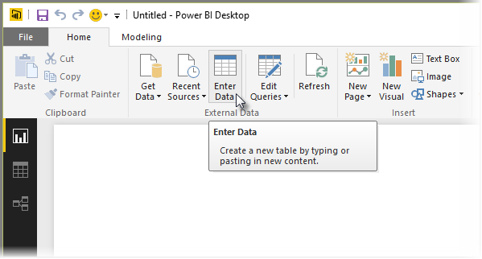
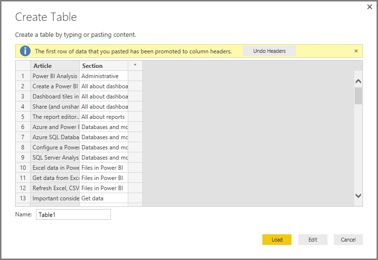

<properties
   pageTitle="Introducir datos directamente en Power BI Desktop"
   description="Agregar fácilmente los datos directamente en Power BI Desktop"
   services="powerbi"
   documentationCenter=""
   authors="davidiseminger"
   manager="mblythe"
   backup=""
   editor=""
   tags=""
   qualityFocus="no"
   qualityDate=""/>

<tags
   ms.service="powerbi"
   ms.devlang="NA"
   ms.topic="article"
   ms.tgt_pltfrm="NA"
   ms.workload="powerbi"
   ms.date="09/29/2016"
   ms.author="davidi"/>

# Introducir datos directamente en Power BI Desktop

Con Power BI Desktop, puede escribir directamente los datos y usar esos datos en los informes y visualizaciones. Por ejemplo, puede copiar partes de un libro o una página web, a continuación, péguelo en Power BI Desktop.

Para escribir los datos directamente, seleccione **Escriba datos** desde el **Inicio** cinta de opciones.

Power BI Desktop puede intentar realizar transformaciones menores en los datos, si no adecuado, al igual al cargar datos desde cualquier origen. Por ejemplo, en el caso siguiente que promueve la primera fila de datos a los encabezados.

Si desea que los datos de formas especificado (o pegado), puede seleccionar el botón Editar para que aparezca **Editor de consultas**, donde puede dar forma y transformar los datos antes de ponerla en Power BI Desktop. O puede seleccionar la **carga** botón para importar los datos tal y como aparece.

Al seleccionar **carga**, Power BI Desktop crea una nueva tabla a partir de los datos y hace que esté disponible en la **campos** panel. En la siguiente imagen, se muestra la nueva tabla, denominada Power BI Desktop *Table1* de forma predeterminada, y los dos campos dentro de esa tabla que se crearon.

Y eso es todo, resulta fácil escribir datos en Power BI Desktop.

Ahora está preparado para utilizar los datos en Power BI Desktop para crear efectos visuales, informes, o para interactuar con cualquier otro dato que desee conectar con e importar, como libros de Excel, las bases de datos o cualquier otro origen de datos.

## Más información

Hay todo tipo de datos que puede conectarse con Power BI Desktop. Para obtener más información sobre los orígenes de datos, consulte los siguientes recursos:

-   [Introducción a Power BI Desktop](powerbi-desktop-getting-started.md)

-   [Orígenes de datos en Power BI Desktop](powerbi-desktop-data-sources.md)

-   [La forma y combinar datos con Power BI Desktop](powerbi-desktop-shape-and-combine-data.md)

-   [Conectarse a libros de Excel en Power BI Desktop](powerbi-desktop-connect-excel.md)   

-   [Conectarse a un archivo CSV en Power BI Desktop](powerbi-desktop-connect-csv.md)   
