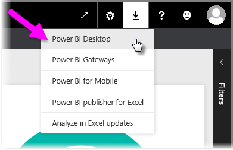

<properties
   pageTitle="Get Power BI Desktop"
   description="Download and install Power BI Desktop"
   services="powerbi"
   documentationCenter=""
   authors="davidiseminger"
   manager="mblythe"
   backup=""
   editor=""
   tags=""
   qualityFocus="monitoring"
   qualityDate="03/31/2016"/>

<tags
   ms.service="powerbi"
   ms.devlang="NA"
   ms.topic="get-started-article"
   ms.tgt_pltfrm="NA"
   ms.workload="powerbi"
   ms.date="09/29/2016"
   ms.author="davidi"/>
# Get Power BI Desktop

<bpt id="p1">**</bpt>Power BI Desktop<ept id="p1">**</ept> provides advanced query, modeling, and report creation features that enables you to build data models, create reports, and share your work by publishing to the Power BI service.

To download the most recent version of Power BI Desktop, you can select the download icon from the Power BI service, and select <bpt id="p1">**</bpt>Power BI Desktop<ept id="p1">**</ept>.

You can also download the latest version of Power BI Desktop directly from <bpt id="p1">[</bpt>this download link<ept id="p1">](https://powerbi.microsoft.com/desktop)</ept>.

Either way, once <bpt id="p1">**</bpt>Power BI Desktop<ept id="p1">**</ept> is downloaded, you're prompted to run the installation file:

<bpt id="p1">**</bpt>Power BI Desktop<ept id="p1">**</ept> is installed as an application, and runs on your desktop.

When you launch <bpt id="p1">**</bpt>Power BI Desktop<ept id="p1">**</ept>, a <bpt id="p2">*</bpt>Welcome<ept id="p2">*</ept> screen is displayed.

From there, you can begin creating data models or reports, then share them with others on the Power BI service. Check out the <bpt id="p1">**</bpt>More information<ept id="p1">**</ept> links at the end of this article for links to guides that can help you get started using <bpt id="p2">**</bpt>Power BI Desktop<ept id="p2">**</ept>.

## Requisitos mínimos

The following list provides the minimum requirements to run <bpt id="p1">**</bpt>Power BI Desktop<ept id="p1">**</ept>:

-    Windows 7 / Windows Server 2008 R2, or later
-    .NET 4.5
-    Internet Explorer 9 o posterior
-    <bpt id="p1">**</bpt>Memory (RAM):<ept id="p1">**</ept> At least 1 GB available, 1.5 GB or more recommended.
-    <bpt id="p1">**</bpt>Display:<ept id="p1">**</ept> At least 1440x900 or 1600x900 (16:9) recommended. Lower resolutions such as 1024x768 or 1280x800 are not recommended, as certain controls (such as closing the startup screen) display beyond those resolutions.
-    <bpt id="p1">**</bpt>CPU:<ept id="p1">**</ept> 1 gigahertz (GHz) or faster x86- or x64-bit processor recommended.

## Más información

Once you get <bpt id="p1">**</bpt>Power BI Desktop<ept id="p1">**</ept> installed, the following content can help you get up and running quickly:

-   [Getting Started with Power BI Desktop](powerbi-desktop-getting-started.md)
-   [Query Overview with Power BI Desktop](powerbi-desktop-query-overview.md)
-   [Data Sources in Power BI Desktop](powerbi-desktop-data-sources.md)
-   [Connect to Data in Power BI Desktop](powerbi-desktop-connect-to-data.md)
-   [Shape and Combine Data with Power BI Desktop](powerbi-desktop-shape-and-combine-data.md)
-   [Common Query Tasks in Power BI Desktop](powerbi-desktop-common-query-tasks.md)   
