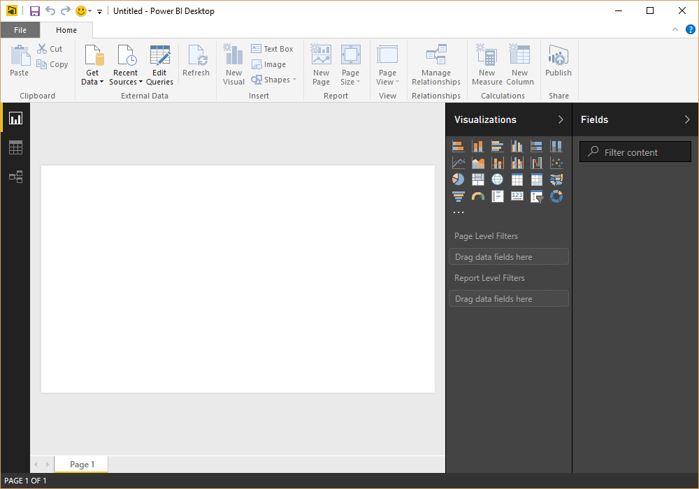
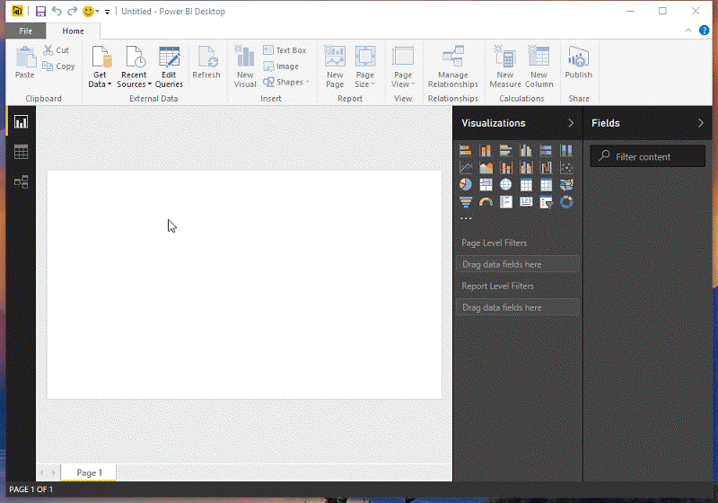
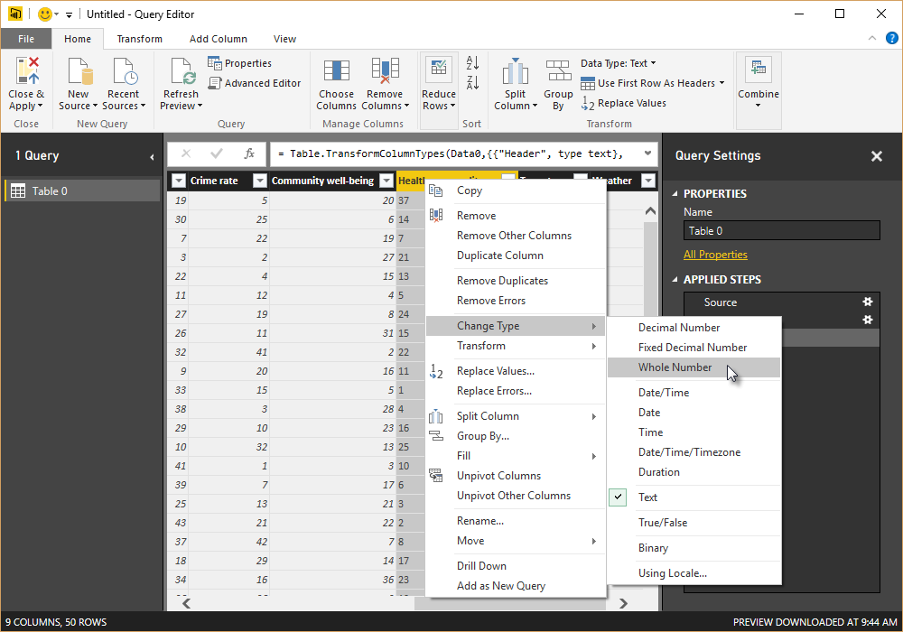
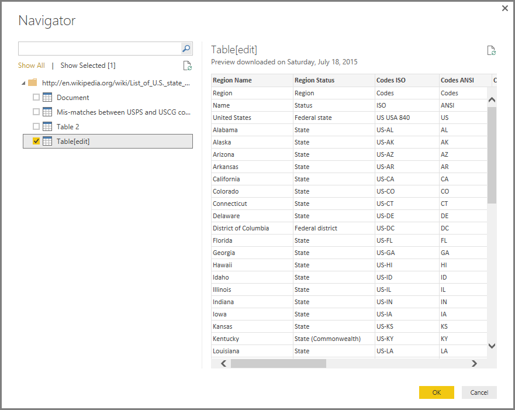
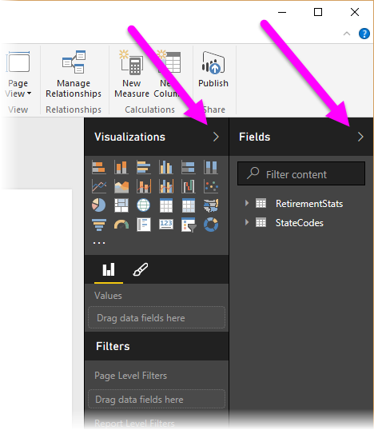
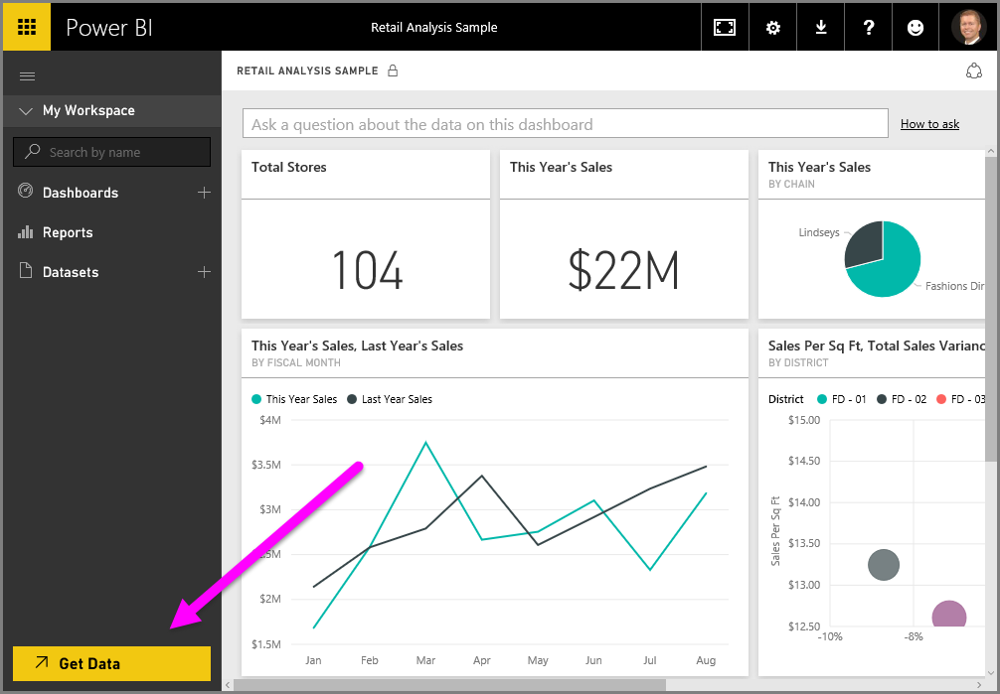
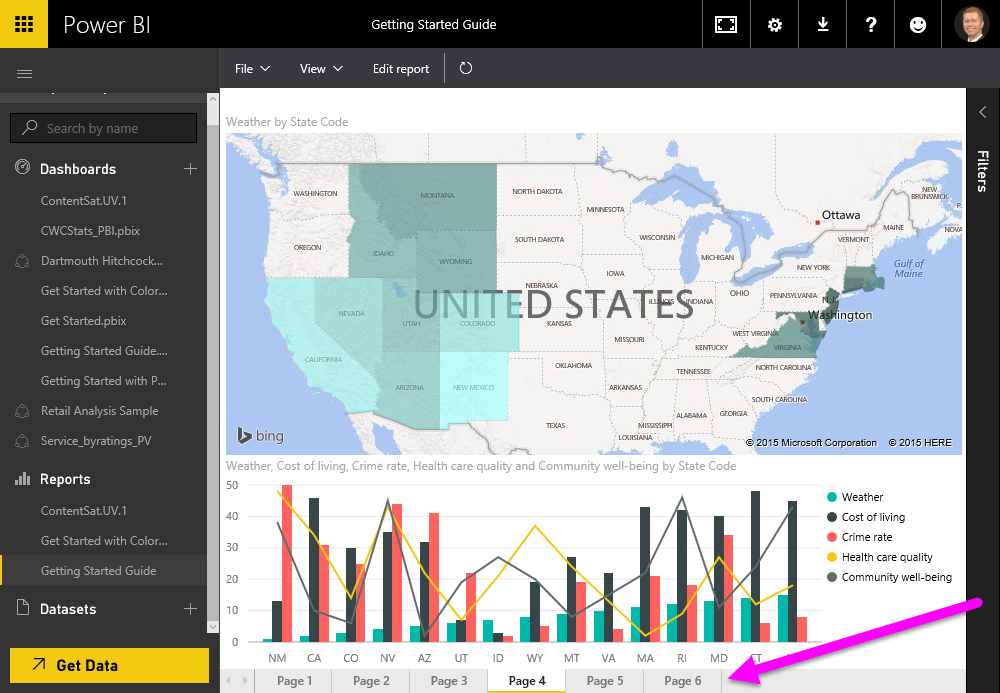

<properties
   pageTitle="Introducción a Power BI Desktop"
   description="Introducción a Power BI Desktop"
   services="powerbi"
   documentationCenter=""
   authors="davidiseminger"
   manager="mblythe"
   backup=""
   editor=""
   tags=""
   qualityFocus="no"
   qualityDate=""/>

<tags
   ms.service="powerbi"
   ms.devlang="NA"
   ms.topic="get-started-article"
   ms.tgt_pltfrm="NA"
   ms.workload="powerbi"
   ms.date="09/29/2016"
   ms.author="davidi"/>
# Introducción a Power BI Desktop

Bienvenido a la **Power BI Desktop Getting Started Guide**. Este breve paseo introductorio de obtiene Power BI Desktop se familiarizará con cómo funciona, se muestra lo que puede hacer y acelera la capacidad de crear modelos de datos sólido, junto con increíbles informes, que expandirán sus esfuerzos de inteligencia empresarial. 

¿Prefiere ver en lugar de leer? No dude en [echar un vistazo al vídeo de introducción](powerbi-desktop-videos.md). Y si desea ver el vídeo con datos de ejemplo correspondientes, puede [descargar este libro de Excel de ejemplo](http://go.microsoft.com/fwlink/?LinkID=521962).

Power BI Desktop le permite crear una colección de consultas, conexiones de datos e informes que se pueden compartir fácilmente con otros usuarios. Power BI Desktop se integra tecnologías probadas de Microsoft – eficaz consulta motor, modelado de datos y visualizaciones – y funciona perfectamente con en línea [**servicio Power BI**](https://app.powerbi.com/).

Con la combinación de **Power BI Desktop** (donde los analistas y otros pueden crear conexiones de datos eficaces, modelos e informes) y el [**servicio Power BI**](https://preview.powerbi.com/) (informes de Power BI Desktop donde pueden compartirse por lo que los usuarios pueden ver e interactuar con ellos), nuevas perspectivas del mundo de los datos son más fáciles de modelo, crear, compartir y ampliar.

Analistas de datos encontrarán Power BI Desktop eficaz, flexible y una herramienta muy accesible para conectarse con el mundo de los datos de forma, crear modelos eficaces y elaborar informes bien estructurados.

## Cómo utilizar esta guía

Puede usar a esta guía de dos maneras: examinarlo en busca de información general o leer cada sección para una comprensión segura del funcionamiento de Power BI Desktop.

Si tiene prisa puede realizar un reconocimiento visual de esta guía en un par de minutos y tener una idea clara de cómo funciona el Power BI Desktop y cómo utilizarlo. La mayor parte de esta guía se compone de pantallas que muestran visualmente el funcionamiento de Power BI Desktop.

Para una explicación más exhaustiva, puede leer cada sección, siga los pasos y alejarse con su propio archivo de Power BI Desktop está listo para publicar en el **Power BI** de servicio y compartir con otros usuarios.

## Funcionamiento de Power BI Desktop

Con Power BI Desktop, le *conectarse a los datos* (normalmente varios orígenes de datos), *de forma que los datos* (con las consultas que generan modelos de datos precisos y convincente) y usar ese modelo con *crear informes* (que otros pueden aprovechar, parten y compartir).

Una vez completados los pasos para su satisfacción: connect, forma y generar informes: puede guardar ese trabajo en formato de archivo de Power BI Desktop, que es la extensión pbix. Se pueden compartir archivos de Power BI Desktop como cualquier otro archivo, pero la forma más convincente para compartir archivos de Power BI Desktop es cargarlos (compartirlos) en el [**servicio Power BI**](https://preview.powerbi.com/). 

Power BI Desktop centraliza, simplifica y agiliza lo contrario, lo que puede ser un proceso disperso, arduo y desconectado del diseño y creación de informes y repositorios de business intelligence.

¿Listo para probarlo? Comencemos.

## Instalar y ejecutar Power BI Desktop

Puede descargar Power BI Desktop desde el **Power BI** servicio seleccionando la **engranaje** icono, a continuación, seleccione **Power BI Desktop**.

Power BI Desktop se instala como una aplicación y se ejecuta en el escritorio.

Cuando se ejecuta Power BI Desktop, un *bienvenida* se muestra la pantalla.

Puede **obtener datos**, consulte **orígenes recientes**, o **abrir otras** **informes** directamente desde el *bienvenida* pantalla (desde los vínculos en el panel izquierdo). Si cierra la pantalla (seleccione el **x** en la esquina superior derecha), el **informe** de Power BI Desktop se muestra.

Hay tres vistas en Power BI Desktop: **informe** vista, **datos** vista, y **relaciones** vista. Power BI Desktop incluye también **Editor de consultas**, que se abre en una ventana independiente. En **el Editor de consultas**, puede crear consultas y transformar los datos y luego cargar que refinada de los datos de modelo en Power BI Desktop y crea informes.

La pantalla siguiente muestra los iconos de la vista de tres a lo largo de la izquierda de Power BI Desktop: **informe**, **datos**, y **relaciones**, de arriba a abajo. La vista mostrada actualmente se indica mediante la barra amarilla en la parte izquierda. En este caso, **informe** actualmente se muestra la vista. Puede cambiar las vistas, seleccione cualquiera de los tres iconos.

Con Power BI Desktop instalado está listo para conectarse a datos, datos de formas y crear informes (normalmente en ese orden). En las siguientes secciones, se hace un recorrido a través de cada uno a su vez.

## Conectarse a datos

Con Power BI Desktop instalado, está listo para conectar con el mundo en expansión continua de datos. Hay *todo tipo* de orígenes de datos disponibles en la ventana de consulta. La siguiente imagen muestra cómo conectarse a datos, seleccionando la **Inicio** la cinta de opciones, a continuación, **obtener datos \> más**.

 

Para este paseo, nos conectaremos a un par de diferentes **Web** orígenes de datos.

Imagine va a retirar: desea vivir donde hay mucho sol, impuestos preferibles y buena cobertura de salud o quizás sea un analista de datos y desea que esa información para ayudar a sus clientes. Por ejemplo, quizás desee ayudar a las ventas de gafas de sol minorista destino donde se destaca el sol con más frecuencia.

En cualquier caso, el siguiente recurso Web tiene datos interesantes acerca de estos temas y mucho más:

[*http://www.Bankrate.com/Finance/Retirement/Best-Places-retire-How-State-ranks.aspx*](http://www.bankrate.com/finance/retirement/best-places-retire-how-state-ranks.aspx)

Seleccione **obtener datos \> Web** y pegue la dirección.

 

Al seleccionar **Aceptar**, el **consulta** funcionalidad de Power BI Desktop entra en acción. Consulta pone en contacto con el recurso Web y la **Navigator** ventana devuelve la información encontrada en la página Web. En este caso, encuentra una tabla (*tabla 0*) y el documento Web general. Estamos interesados en la tabla, por lo que se seleccione en la lista. El **Navigator** ventana muestra una vista previa.

 

En este punto se puede modificar la consulta antes de cargar la tabla seleccionando **Editar** desde la parte inferior de la ventana, o se puede cargar la tabla.

Cuando se selecciona **Editar**, se abre el Editor de consultas y se presenta una vista representativa de la tabla. El **configuración de consulta** panel se muestra (si no es así, puede seleccionar **vista** desde la cinta de opciones, a continuación, **Mostrar \> configuración de consulta** para mostrar la **configuración de consulta** panel). Éste es el aspecto que parece.

 

Para obtener más información sobre cómo conectarse a datos, consulte [Conectar a datos en Power BI Desktop](powerbi-desktop-connect-to-data.md).

En la siguiente sección, hemos ajustar los datos de forma que cumpla las necesidades. El proceso de ajustar datos conectados se denomina *forma* datos.

## La forma y combinar datos

Ahora que nos hemos conectado a un origen de datos, debemos ajustar los datos para nuestras necesidades. Ajustar a veces significa *transformar* los datos, como cambiar el nombre de las columnas o tablas, convertir texto en números, quitar filas, establecer la primera fila como encabezado, etcétera.

El editor de consultas en Power BI Desktop hace un amplio uso de los menús contextuales, además de tener las tareas disponibles en la cinta de opciones. La mayoría de lo que puede seleccionar en el **transformar** cinta también está disponible haciendo clic en un elemento (por ejemplo, una columna) y en el menú que aparece.

## Datos de formas

Al dar forma a datos en el **Editor de consultas**, se proporcionan instrucciones paso a paso (que **Editor de consultas** lleva a cabo automáticamente) para ajustar los datos como **Editor de consultas** carga y presenta. El origen de datos original no se ve afectado; sólo la vista de los datos se ajusta, o *en forma de*.

Los pasos especificados (como cambiar el nombre de una tabla, transformar un tipo de datos o eliminar columnas) se registran por **Editor de consultas**, y cada vez que esta consulta conecta al origen de datos, esos pasos se llevan a cabo para que los datos siempre tiene la forma de especificar la forma. Este proceso se produce siempre que se utilice la consulta en Power BI Desktop o para cualquier persona que use su consulta compartida, como en el **Power BI** servicio. Estos pasos se capturan, de manera secuencial, en el **configuración de consulta** panel bajo **pasos aplicados**.

La siguiente imagen muestra la **configuración de consulta** panel para una consulta que se ha dado forma; se examinará cada uno de estos pasos en los párrafos siguientes.

 

Vamos a volver a nuestros datos de jubilación que encontramos al conectarse a un origen de datos de Web, y la forma de datos para que se adapten a nuestras necesidades.

Para empezar, la mayoría de las clasificaciones se presentaron en **Editor de consultas** como números enteros, pero no todas ellas (una columna contiene texto y números, por lo que no se convirtió automáticamente). Necesitamos que los datos sean números. No hay problema: simplemente con el botón secundario en el encabezado de columna y seleccione **Cambiar tipo \> número entero** para cambiar el tipo de datos. Si se necesita elegir más de una columna, se puede seleccionar una columna, mantenga presionada la tecla **MAYÚS**, seleccione columnas adyacentes adicionales y, a continuación, haga clic en un encabezado de columna para cambiar todas las columnas seleccionadas. También puede utilizar **CTRL** para seleccionar las columnas no adyacentes.

 

También puede cambiar, o *transformar,* las columnas de texto al encabezado utilizando la **transformar** cinta de opciones. Aquí está el **transformar** cinta de opciones, con una flecha que señala hacia la **tipo de datos** botón, que permite transformar el tipo de datos actual a otro.

 

Tenga en cuenta que en **configuración de consulta**, la **pasos aplicados** reflejar los cambios realizados. Si desea quitar cualquier paso del proceso de forma, simplemente seleccione el paso y, a continuación, seleccione la **X** a la izquierda del paso.

 

Necesitamos realizar algunos cambios más para obtener la consulta donde queremos:

-   
            *Quitar la primera columna* : no se necesita, sólo incluye filas redundantes que dicen "Mira cómo clasifica el estado para la jubilación" que es un artefacto de una tabla basada en Web que

<!-- -->

-   
            *Corregir algunos errores* : en la página Web, una columna tenía texto combinado con los números (algunos Estados están vinculados en una categoría). Esto funciona bien en el sitio Web, pero no para nuestro análisis de datos. Es fácil (en este caso) a corregir y muestra algunas enfriar características y capacidades de **Editor de consultas** y su **pasos aplicados**

<!-- -->

-   
            *Cambiar el nombre de la tabla* : **tabla 0** no es un descriptor útil, pero cambiarlo simple

Cada uno de estos pasos se muestra en **[forma y combinar datos en Power BI Desktop](powerbi-desktop-shape-and-combine-data.md)**. No dude en consultar la página o continúe revisando este documento para ver lo que debe hacer a continuación. La siguiente sección se recoge una vez aplicados los cambios anteriores.

## Combinar datos

Datos acerca de los distintos Estados es interesantes y serán útiles para crear consultas y esfuerzos de análisis adicionales. Pero hay un problema: mayoría de los datos, usa una abreviatura de dos letras para códigos de estado, no el nombre completo del estado. Se necesita una manera para asociar los nombres de los Estados con sus abreviaturas.

Estamos de suerte: hay otro origen de datos públicos que hace justamente eso, pero necesita una cantidad considerable de forma antes de que podemos conectarnos a la tabla de jubilación. Este es el recurso Web de abreviaturas de estado:

<http://en.wikipedia.org/wiki/List_of_U.S._state_abbreviations>

Desde el **Inicio** la cinta de opciones en **Editor de consultas**, seleccionamos **obtener datos \> Web** y escriba la dirección, seleccione **Aceptar**, y el **Navigator** ventana muestra la información encontrada en la página Web.

 

Seleccionamos **Table [edit]** porque incluye los datos deseados, pero va a tardar bastante forma para reducir los datos de la tabla. Cada uno de estos pasos también se muestra en **[forma y combinar datos en Power BI Desktop](powerbi-desktop-shape-and-combine-data.md)**. Para resumir los pasos, aquí es lo que hacemos:

Seleccionamos **Editar**, a continuación:

-   
            *Quite las dos primeras filas* : son resultado de la manera en que se creó la tabla de la página Web, y no necesitamos.

<!-- -->

-   
            *Quitar las 26 filas inferiores* : son todos los territorios, que no es necesario incluir.

<!-- -->
-   
            *Filtrar Washington DC* : la retirada de la tabla de estadísticas no incluye el controlador de dominio, por lo que excluiremos de nuestra lista.

<!-- -->

-   
            *Quitar unas cuantas columnas innecesarias* – sólo necesitamos la asignación del estado a su oficial abreviatura de dos letras, por lo que podemos quitar otras columnas.

<!-- -->

-   
            *Usar la primera fila como encabezados* : puesto que se eliminaron las primeras tres filas, la fila superior actual es el encabezado que queremos.

            **Nota:** es un buen momento para señalar que la *secuencia* de los pasos aplicados en **Editor de consultas** es importante y puede afectar a cómo los datos tiene la forma. También es importante tener en cuenta cómo un paso puede afectar a otro paso posterior; Si quita un paso de la **pasos aplicados**, los pasos siguientes no pueden comportarse buscado originalmente, debido al impacto de la secuencia de la consulta de pasos.

-   
            *Cambiar el nombre de las columnas y la propia tabla* – como de costumbre, hay un par de formas para cambiar el nombre de una columna, puede que prefiera.

 

Con el *stateCode* tabla en la forma, se pueden combinar las dos tablas o consultas, en una; ya que las tablas que ahora tenemos son el resultado de las consultas se aplica a los datos, se conocen a menudo como *consultas*.

Hay dos formas principales de combinar las consultas, *combinación* y *anexar*.

Cuando haya una o varias columnas que le gustaría agregar a otra consulta, se **mezcla** las consultas. Cuando haya más filas de datos que le gustaría agregar a una consulta existente, se **anexar** la consulta.

En este caso queremos fusionar las consultas. Para empezar, se selecciona la consulta *en la que* queremos que la otra consulta para combinar, a continuación, seleccione **consultas de combinación** desde el **Inicio** ficha en la cinta de opciones.

 

El **mezcla** aparecerá la ventana, pide seleccionar la tabla que se quiere combina con la tabla seleccionada y, a continuación, las columnas coincidentes que se utilizará para la combinación. Seleccione *estado* desde el *RetirementStats* tabla (consulta), a continuación, seleccionar la *stateCode* consulta (fácil en este caso, puesto que hay sólo una consulta: cuando se conecta a varios orígenes de datos, hay muchas consultas para elegir). Cuando se selecciona las columnas coincidentes correctas: *estado* de *RetirementStats*, y *nombre del estado* de *stateCode* : el **mezcla** ventana similar al siguiente y el **Aceptar** botón está habilitado.

 

Un **nueva columna** se crea al final de la consulta, que es el contenido de la tabla (consulta) que se combinó con la consulta existente. Todas las columnas de la consulta combinada se comprimen en el **Nuevacolumna**, pero puede seleccionar **expandir** la tabla e incluir cualquier columna que desee. Para expandir la tabla combinada y seleccionar qué columnas desea incluir, seleccione el icono de expandir (). El **expandir** aparecerá la ventana.

 

En este caso, solamente queremos la *código de estado* columna, así que seleccione sólo esa columna y, a continuación, seleccione **Aceptar**. Desactivar la casilla de verificación de **usar el nombre de columna original como prefijo** ya que no necesita o desea que; si deja seleccionada, la columna combinada se denominará *Nuevacolumna.State Code* (el nombre de columna original o *nueva columna*, un punto y, a continuación el nombre de la columna que se incluyen en la consulta).

            **Nota:** desea jugar con la forma de incorporar *nueva columna* tabla? Puede experimentar un poco y, si no le gusta los resultados, elimine ese paso de la **pasos aplicados** lista en el **configuración de consulta** panel; la consulta regresará al estado anterior a la aplicación **expandir** paso. Como una segunda oportunidad, lo que puede hacer tantas veces como sea necesario hasta que el proceso de expansión tenga la apariencia que desee.

Ahora tenemos una sola consulta (tabla) que combina dos orígenes de datos, cada uno de los cuales se ha dado forma a nuestras necesidades. Esta consulta puede servir como base para una gran cantidad de adicionales, datos conexiones interesantes, como estadísticas de costes de alojamiento, datos demográficos u oportunidades de trabajo en cualquier estado.

Para obtener una descripción más completa de cada uno de ellos de forma y combinar datos pasos, consulte [forma y combinar datos en Power BI Desktop](powerbi-desktop-shape-and-combine-data.md).

Por ahora, tenemos datos suficientes para crear algunos informes interesantes, todo ello en Power BI Desktop. Puesto que es un hito vamos a guardar este archivo de Power BI Desktop, lo llamaremos **Getting Started with Power BI Desktop**. Para aplicar los cambios en **Editor de consultas** y cargarlos en Power BI Desktop, seleccione **Cerrar & aplicar** desde el **Inicio** cinta de opciones.

## Generar informes

Pueden realizarse cambios adicionales después de cargar la tabla, y puede volver a cargar un modelo para aplicar los cambios que realice. Pero por ahora basta con esto. En Power BI Desktop **informe** vista, puede empezar a generar informes.

El **informe** vista tiene cinco áreas principales:

1.  La cinta de opciones, que muestra las tareas comunes asociadas con los informes y visualizaciones

2.  El **informe** vista o lienzo, donde se crean y se organizan visualizaciones

3.  El **páginas** ficha área a lo largo de la parte inferior, lo que le permite seleccionar o agregar una página de informe

4.  El **visualizaciones** panel, donde puede cambiar visualizaciones, personalizar los colores o ejes, aplicar filtros, arrastre los campos etc.

5.  El **campos** panel, donde se pueden arrastrar elementos de consulta y filtros hasta el **informe** Ver, o bien, para el **filtros** área de la **visualizaciones** panel

 

El **visualizaciones** y **campos** se puede contraer el panel, seleccione la flecha pequeña situada a lo largo del borde, lo que proporciona más espacio en el **informe** vista para crear visualizaciones interesantes. Cuando se modifica visualizaciones, también verá estas flechas hacia arriba o hacia abajo, lo que significa que se puede expandir o contraer esa sección, según corresponda.

 

Para crear una visualización, basta con arrastrar un campo desde la **campos** lista hasta el **informe** vista. En este caso, vamos a arrastrar el *estado* campo *RetirementStats*, y vea Qué sucede.

 

Observe que... Power BI Desktop crea automáticamente una visualización de mapa, ya que reconoce que la *estado* campo contenida datos de ubicación geográfica.

Observe que en el **visualizaciones** panel, puedo seleccionar diferentes tipos de visualizaciones, y en el área situada debajo de los iconos, puedo arrastrar campos a las distintas áreas para aplicar una leyenda, o modificar la visualización.

 

Vamos a avanzar un poco y verá lo que el **informe** vista aspecto después de un puñado de visualizaciones agregadas, así como algunas nuevas páginas de informe. Para obtener más información acerca de los informes, consulte [vista de informe en Power BI Desktop](powerbi-desktop-report-view.md).

La primera página del informe proporciona una perspectiva de los datos basados en *clasificación general*. Cuando se selecciona una de las visualizaciones, el **campos y filtros** panel muestra los campos seleccionados y la estructura de la visualización (qué campos se aplicaron a la **eje compartido**, **valores de columna**, y **valores de la línea**).

 

Hay seis **páginas** en este informe, cada una se visualizan ciertos elementos de los datos.

1.  La primera página que se muestra arriba, muestra todos los Estados según *clasificación general*.

2.  La segunda página se centra en los 10 principales estados según *clasificación general*.

3.   En la tercera página, se visualizan los 10 mejores Estados de coste de la vida (y los datos asociados).

4.   Tiempo es el enfoque de la cuarta página, filtrada por los 15 estados más soleados.

5.   En la quinta página, se representa gráficamente bienestar social y se visualizan para los 15 estados.

6.   Por último, crime se visualizan las estadísticas, que muestra las mejores (y bueno, los últimos) 10 estados.

Este es el aspecto de la página del informe centradas en el coste de la vida.

 

Hay todo tipo de informes y visualizaciones que puede crear interesantes.

## Compartir su trabajo

Ahora que tenemos un informe de Power BI Desktop razonablemente completo, puede compartirlo con otras personas en la **Power BI** servicio. Hay varias maneras de compartir su trabajo en Power BI Desktop. Puede publicar en el **Power BI** service, puede cargar el archivo .pbix directamente desde el servicio Power BI, o puede guardar el archivo .pbix y enviar como cualquier otro archivo.

En primer lugar, echemos un vistazo a la publicación en el **Power BI** directamente desde Power BI Desktop. En la **Inicio** cinta de opciones, seleccione **publicar**.

Deberá iniciar sesión Power BI.

Cuando haya iniciado sesión y el proceso de publicación, verá el siguiente cuadro de diálogo.

Cuando inicie sesión en Power BI, verá Power BI Desktop archivo que se carga en el **paneles**, **informes**, y **conjuntos de datos** secciones del servicio.

Otra manera de compartir su trabajo es cargar desde el **Power BI** servicio. El siguiente vínculo, se abrirá la **Power BI** servicio en un explorador:

`https://app.powerbi.com`

Seleccione **obtener datos** para iniciar el proceso de cargar el informe de Power BI Desktop.

 

El **obtener datos** aparece la página, en el que puede seleccionar dónde obtener los datos desde. En este caso, seleccionamos **obtener** desde el **archivos** cuadro.

El **archivos** aparece la vista. En este caso, seleccionamos **archivo Local**.

Cuando se selecciona el archivo, Power BI carga el archivo.

Cuando se carga el archivo, puede seleccionar el archivo desde el **informes** en el panel izquierdo del servicio Power BI.

El **Power BI** servicio muestra la primera página del informe. En la parte inferior de la página, puede seleccionar cualquier ficha para mostrar esa página del informe.

 

Puede realizar cambios en un informe en el **Power BI** servicio seleccionando **Editar informe** desde la parte superior del lienzo del informe.

Para guardar el informe, seleccione **archivo \> Guardar como** desde el servicio. Hay todo tipo de efectos visuales interesantes que puede crear en el **Power BI** servicio de su informe, que se puede anclar a un *panel*. Para obtener información acerca de los paneles de la **Power BI** servicio**[, vea sugerencias para diseñar un excelente panel](powerbi-service-tips-for-designing-a-great-dashboard.md)**.

 

Una vez guardada, seleccione la **recurso compartido** icono en la página principal.

 

Desde aquí, puede enviar un correo electrónico a los colegas con quién desea compartir el panel.

 

Para obtener más información acerca de cómo crear, compartir y modificar los paneles, consulte [compartir un panel](powerbi-service-share-unshare-dashboard.md).

Hay todo tipo de mash-ups relacionadas con datos atractivas y visualizaciones que puede realizar con Power BI Desktop y con el servicio Power BI. Consulte la sección siguiente para obtener más información.

## Más información

Hay todo tipo de cosas que puede hacer con Power BI Desktop. Para obtener más información sobre sus capacidades, consulte los siguientes recursos:

-   [Información general sobre consultas con Power BI Desktop](powerbi-desktop-query-overview.md)

-   [Orígenes de datos en Power BI Desktop](powerbi-desktop-data-sources.md)

-   [Conectarse a datos de Power BI Desktop](powerbi-desktop-connect-to-data.md)

-   [La forma y combinar datos con Power BI Desktop](powerbi-desktop-shape-and-combine-data.md)

-   [Tareas comunes de consultas en Power BI Desktop](powerbi-desktop-common-query-tasks.md)   

¿Desea enviar comentarios? Muy bien, use la **Enviar comentarios** elemento de menú en Power BI Desktop. Esperamos su audiencia.

