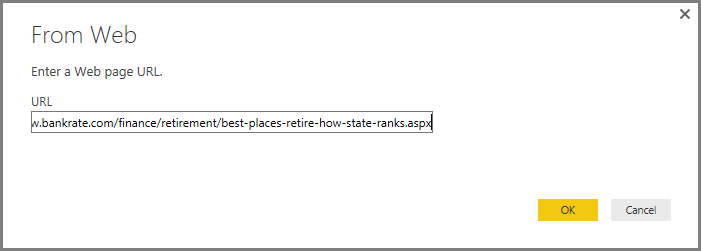
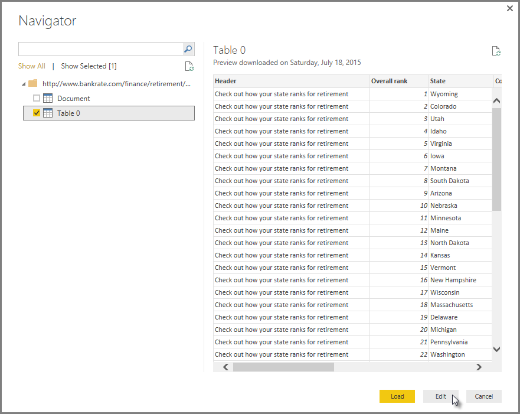
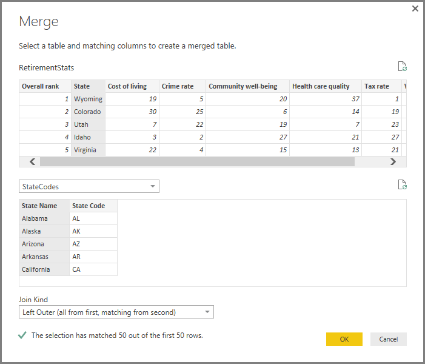
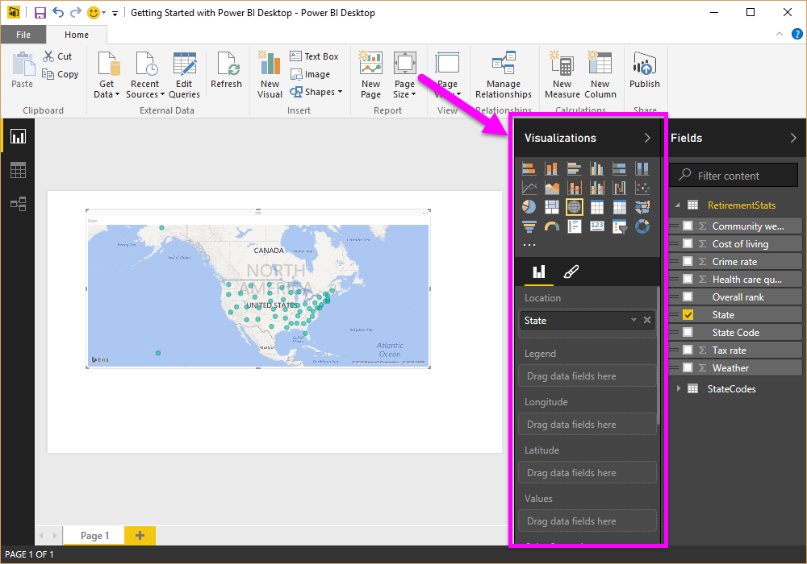
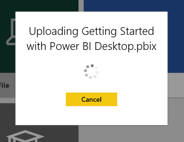
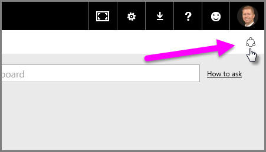

<properties
   pageTitle="Getting started with Power BI Desktop"
   description="Getting started with Power BI Desktop"
   services="powerbi"
   documentationCenter=""
   authors="davidiseminger"
   manager="mblythe"
   backup=""
   editor=""
   tags=""
   qualityFocus="no"
   qualityDate=""/>

<tags
   ms.service="powerbi"
   ms.devlang="NA"
   ms.topic="get-started-article"
   ms.tgt_pltfrm="NA"
   ms.workload="powerbi"
   ms.date="09/29/2016"
   ms.author="davidi"/>
# Getting started with Power BI Desktop

Welcome to the <bpt id="p1">**</bpt>Power BI Desktop Getting Started Guide<ept id="p1">**</ept>. This short tour of Power BI Desktop gets you acquainted with how it works, demonstrates what it can do, and accelerates your ability to build robust data models — along with amazing reports — that amplify your business intelligence efforts. 

Prefer to watch instead of read? Feel free to <bpt id="p1">[</bpt>take a look at our getting started video<ept id="p1">](powerbi-desktop-videos.md)</ept>. And if you want to follow along with the video with matching sample data, you can <bpt id="p1">[</bpt>download this sample Excel workbook<ept id="p1">](http://go.microsoft.com/fwlink/?LinkID=521962)</ept>.

Power BI Desktop lets you create a collection of queries, data connections, and reports that can easily be shared with others. Power BI Desktop integrates proven Microsoft technologies – the powerful Query engine, data modeling, and visualizations – and works seamlessly with the online <bpt id="p1">[</bpt><bpt id="p2">**</bpt>Power BI service<ept id="p2">**</ept><ept id="p1">](https://app.powerbi.com/)</ept>.

With the combination of <bpt id="p1">**</bpt>Power BI Desktop<ept id="p1">**</ept> (where analysts and others can create powerful data connections, models and reports) and the <bpt id="p2">[</bpt><bpt id="p3">**</bpt>Power BI service<ept id="p3">**</ept><ept id="p2">](https://preview.powerbi.com/)</ept> (where Power BI Desktop reports can be shared so users can view and interact with them), new insights from the world of data are easier to model, build, share, and extend.

Data analysts will find Power BI Desktop a powerful, flexible, and a highly accessible tool to connect with and shape the world of data, build robust models, and craft well-structured reports.

## How to Use This Guide

You can use this guide in a couple of ways – scan it for a quick overview, or read through each section for a strong understanding of how Power BI Desktop works.

If you’re in a hurry you can do a visual sweep of this guide in just a couple minutes, and come away with a good sense of how Power BI Desktop operates, and how to use it. Most of this guide consists of screens that visually show how Power BI Desktop works.

For a more thorough understanding you can read through each section, perform the steps, and walk away with your own Power BI Desktop file that’s ready to post onto the <bpt id="p1">**</bpt>Power BI<ept id="p1">**</ept> service, and share with others.

## How Power BI Desktop Works

With Power BI Desktop, you <bpt id="p1">*</bpt>connect to data<ept id="p1">*</ept> (usually multiple data sources), <bpt id="p2">*</bpt>shape that data<ept id="p2">*</ept> (with queries that build insightful, compelling data models), and use that model to <bpt id="p3">*</bpt>create reports<ept id="p3">*</ept> (which others can leverage, build upon, and share).

When the steps are completed to your satisfaction – connect, shape, and report – you can save that work in Power BI Desktop file format, which is the .pbix extension. Power BI Desktop files can be shared like any other file, but the most compelling way to share Power BI Desktop files is to upload them (share them) on the <bpt id="p1">[</bpt><bpt id="p2">**</bpt>Power BI service<ept id="p2">**</ept><ept id="p1">](https://preview.powerbi.com/)</ept>. 

Power BI Desktop centralizes, simplifies, and streamlines what can otherwise be a scattered, disconnected, and arduous process of designing and creating business intelligence repositories and reports.

Ready to give it a try? Comencemos.

## Install and Run Power BI Desktop

You can download Power BI Desktop from the <bpt id="p1">**</bpt>Power BI<ept id="p1">**</ept> service, by selecting the <bpt id="p2">**</bpt>gear<ept id="p2">**</ept> icon, then select <bpt id="p3">**</bpt>Power BI Desktop<ept id="p3">**</ept>.

Power BI Desktop is installed as an application, and runs on your desktop.

When you run Power BI Desktop, a <bpt id="p1">*</bpt>Welcome<ept id="p1">*</ept> screen is displayed.

You can <bpt id="p1">**</bpt>Get Data<ept id="p1">**</ept>, see <bpt id="p2">**</bpt>Recent Sources<ept id="p2">**</ept>, or <bpt id="p3">**</bpt>Open Other<ept id="p3">**</ept> <bpt id="p4">**</bpt>Reports<ept id="p4">**</ept> directly from the <bpt id="p5">*</bpt>Welcome<ept id="p5">*</ept> screen (from the links in the left pane). If you close the screen (select the <bpt id="p1">**</bpt>x<ept id="p1">**</ept> in the top right corner), the <bpt id="p2">**</bpt>Report<ept id="p2">**</ept> view of Power BI Desktop is displayed.

There are three views in Power BI Desktop: <bpt id="p1">**</bpt>Report<ept id="p1">**</ept> view, <bpt id="p2">**</bpt>Data<ept id="p2">**</ept> view, and <bpt id="p3">**</bpt>Relationships<ept id="p3">**</ept> view. Power BI Desktop also includes <bpt id="p1">**</bpt>Query Editor<ept id="p1">**</ept>, which opens in a separate window. In <bpt id="p1">**</bpt>Query Editor<ept id="p1">**</ept>, you can build queries and transform data, then load that refined data model into Power BI Desktop, and create reports.

The following screen shows the three view icons along the left of Power BI Desktop: <bpt id="p1">**</bpt>Report<ept id="p1">**</ept>, <bpt id="p2">**</bpt>Data<ept id="p2">**</ept>, and <bpt id="p3">**</bpt>Relationships<ept id="p3">**</ept>, from top to bottom. The currently displayed view is indicated by the yellow bar along the left. In this case, <bpt id="p1">**</bpt>Report<ept id="p1">**</ept> view is currently displayed. You can change views by selecting any of those three icons.

With Power BI Desktop installed you’re ready to connect to data, shape data, and build reports (usually in that order). In the next few sections, we take a tour through each in turn.

## Connect to Data

With Power BI Desktop installed, you’re ready to connect to the ever expanding world of data. There are <bpt id="p1">*</bpt>all sorts<ept id="p1">*</ept> of data sources available in the Query window. The following image shows how to connect to data, by selecting the <bpt id="p1">**</bpt>Home<ept id="p1">**</ept> ribbon, then <bpt id="p2">**</bpt>Get Data <ph id="ph1">\&gt;</ph> More<ept id="p2">**</ept>.

 

For this quick tour, we'll connect to a couple different <bpt id="p1">**</bpt>Web<ept id="p1">**</ept> data sources.

Imagine you’re retiring – you want to live where there’s lots of sunshine, preferable taxes, and good health care – or perhaps you’re a data analyst, and you want that information to help your customers. For example, perhaps you want to help your sunglasses retailer target sales where the sun shines most frequently.

Either way, the following Web resource has interesting data about those topics, and more:

[*http://www.bankrate.com/finance/retirement/best-places-retire-how-state-ranks.aspx*](http://www.bankrate.com/finance/retirement/best-places-retire-how-state-ranks.aspx)

Select <bpt id="p1">**</bpt>Get Data <ph id="ph1">\&gt;</ph> Web<ept id="p1">**</ept> and paste the address.

 

When you select <bpt id="p1">**</bpt>OK<ept id="p1">**</ept>, the <bpt id="p2">**</bpt>Query<ept id="p2">**</ept> functionality of Power BI Desktop goes to work. Query contacts the Web resource, and the <bpt id="p1">**</bpt>Navigator<ept id="p1">**</ept> window returns what it found on that Web page. In this case, it found a table (<bpt id="p1">*</bpt>Table 0<ept id="p1">*</ept>) and the overall Web Document. We’re interested in the table, so we select it from the list. The <bpt id="p1">**</bpt>Navigator<ept id="p1">**</ept> window displays a preview.

 

At this point we can edit the query before loading the table, by selecting <bpt id="p1">**</bpt>Edit<ept id="p1">**</ept> from the bottom of the window, or we can load the table.

When we select <bpt id="p1">**</bpt>Edit<ept id="p1">**</ept>, Query Editor launches and a representative view of the table is presented. The <bpt id="p1">**</bpt>Query Settings<ept id="p1">**</ept> pane is displayed (if it’s not, you can select <bpt id="p2">**</bpt>View<ept id="p2">**</ept> from the ribbon, then <bpt id="p3">**</bpt>Show <ph id="ph1">\&gt;</ph> Query Settings<ept id="p3">**</ept> to display the <bpt id="p4">**</bpt>Query Settings<ept id="p4">**</ept> pane). Here’s what that looks like.

 

For more information about connecting to data, see <bpt id="p1">[</bpt>Connect to Data in Power BI Desktop<ept id="p1">](powerbi-desktop-connect-to-data.md)</ept>.

In the next section, we adjust the data so it meets our needs. The process of adjusting connected data is called <bpt id="p1">*</bpt>shaping<ept id="p1">*</ept> data.

## Shape and Combine Data

Now that we’ve connected to a data source, we need to adjust the data to meet our needs. Sometimes adjusting means <bpt id="p1">*</bpt>transforming<ept id="p1">*</ept> the data – such as renaming columns or tables, changing text to numbers, removing rows, setting the first row as headers, and so on.

The Query editor in Power BI Desktop makes ample use of right-click menus, in addition to having tasks available on the ribbon. Most of what you can select in the <bpt id="p1">**</bpt>Transform<ept id="p1">**</ept> ribbon is also available by right-clicking an item (such as a column) and choosing from the menu that appears.

## Shape Data

When you shape data in the <bpt id="p1">**</bpt>Query Editor<ept id="p1">**</ept>, you’re providing step-by-step instructions (that <bpt id="p2">**</bpt>Query Editor<ept id="p2">**</ept> carries out for you) to adjust the data as <bpt id="p3">**</bpt>Query Editor<ept id="p3">**</ept> loads and presents it. The original data source is not affected; only this particular view of the data is adjusted, or <bpt id="p1">*</bpt>shaped<ept id="p1">*</ept>.

The steps you specify (such as rename a table, transform a data type, or delete columns) are recorded by <bpt id="p1">**</bpt>Query Editor<ept id="p1">**</ept>, and each time this query connects to the data source those steps are carried out so that the data is always shaped the way you specify. This process occurs whenever you use the query in Power BI Desktop, or for anyone who uses your shared query, such as in the <bpt id="p1">**</bpt>Power BI<ept id="p1">**</ept> service. Those steps are captured, sequentially, in the <bpt id="p1">**</bpt>Query Settings<ept id="p1">**</ept> pane under <bpt id="p2">**</bpt>Applied Steps<ept id="p2">**</ept>.

The following image shows the <bpt id="p1">**</bpt>Query Settings<ept id="p1">**</ept> pane for a query that has been shaped – we’ll go through each of those steps in the next few paragraphs.

 

Let’s get back to our retirement data, which we found by connecting to a Web data source, and shape that data to fit our needs.

For starters, most ratings were brought into <bpt id="p1">**</bpt>Query Editor<ept id="p1">**</ept> as whole numbers, but not all of them (one column contained text and numbers, so it wasn't automatically converted). We need the data to be numbers. No problem – just right-click the column header, and select <bpt id="p1">**</bpt>Change Type <ph id="ph1">\&gt;</ph> Whole Number<ept id="p1">**</ept> to change the data type. If we needed to choose more than one column, we could first select a column then hold down <bpt id="p1">**</bpt>SHIFT<ept id="p1">**</ept>, select additional adjacent columns, and then right-click a column header to change all selected columns. You can also use <bpt id="p1">**</bpt>CTRL<ept id="p1">**</ept> to select non-adjacent columns.

 

You can also change, or <bpt id="p1">*</bpt>transform,<ept id="p1">*</ept> those columns from text to header by using the <bpt id="p2">**</bpt>Transform<ept id="p2">**</ept> ribbon. Here’s the <bpt id="p1">**</bpt>Transform<ept id="p1">**</ept> ribbon, with an arrow pointing toward the <bpt id="p2">**</bpt>Data Type<ept id="p2">**</ept> button, which lets you transform the current data type to another.

 

Note that in <bpt id="p1">**</bpt>Query Settings<ept id="p1">**</ept>, the <bpt id="p2">**</bpt>Applied Steps<ept id="p2">**</ept> reflect the changes that were made. If I want to remove any step from the shaping process, I simply select that step, and then select the <bpt id="p1">**</bpt>X<ept id="p1">**</ept> to the left of the step.

 

We need to make a few more changes to get the query where we want it:

-   <bpt id="p1">*</bpt>Remove the first column<ept id="p1">*</ept> – we don’t need it, it just includes redundant rows that say “Check out how your state ranks for retirement” which is an artifact of this being a Web based table

<!-- -->

-   <bpt id="p1">*</bpt>Fix a few Errors<ept id="p1">*</ept> – on the Web page, one column had text mixed in with the numbers (some states tied in one category). That works well in the website, but not for our data analysis. It's easy (in this case) to fix, and shows some cool features and capabilities of <bpt id="p1">**</bpt>Query Editor<ept id="p1">**</ept> and its <bpt id="p2">**</bpt>Applied Steps<ept id="p2">**</ept>

<!-- -->

-   <bpt id="p1">*</bpt>Change the Table Name<ept id="p1">*</ept> – that <bpt id="p2">**</bpt>Table 0<ept id="p2">**</ept> is not a useful descriptor, but changing it simple

Each of these steps is demonstrated in <bpt id="p1">**</bpt><bpt id="p2">[</bpt>Shape and Combine Data in Power BI Desktop<ept id="p2">](powerbi-desktop-shape-and-combine-data.md)</ept><ept id="p1">**</ept>. Feel free to check out that page, or keep going in this document to see what you would do next. The next section picks up after the changes above are applied.

## Combine Data

That data about various states is interesting, and will be useful for building additional analysis efforts and queries. But there’s one problem: most data out there uses a two-letter abbreviation for state codes, not the full name of the state. We need some way to associate state names with their abbreviations.

We’re in luck: there’s another public data source that does just that, but it needs a fair amount of shaping before we can connect it to our retirement table. Here’s the Web resource for state abbreviations:

<http://en.wikipedia.org/wiki/List_of_U.S._state_abbreviations>

From the <bpt id="p1">**</bpt>Home<ept id="p1">**</ept> ribbon in <bpt id="p2">**</bpt>Query Editor<ept id="p2">**</ept>, we select <bpt id="p3">**</bpt>Get Data <ph id="ph1">\&gt;</ph> Web<ept id="p3">**</ept> and type the address, select <bpt id="p4">**</bpt>OK<ept id="p4">**</ept>, and the <bpt id="p5">**</bpt>Navigator<ept id="p5">**</ept> window shows what it found on that Web page.

 

We select <bpt id="p1">**</bpt>Table[edit]<ept id="p1">**</ept> because it includes the data we want, but it’s going to take quite a bit of shaping to pare that table’s data down. Each of these steps is also demonstrated in <bpt id="p1">**</bpt><bpt id="p2">[</bpt>Shape and Combine Data in Power BI Desktop<ept id="p2">](powerbi-desktop-shape-and-combine-data.md)</ept><ept id="p1">**</ept>. To summarize those steps, here's what we do:

We select <bpt id="p1">**</bpt>Edit<ept id="p1">**</ept>, then:

-   <bpt id="p1">*</bpt>Remove the top two rows<ept id="p1">*</ept> – they’re a result of the way that Web page’s table was created, and we don’t need them.

<!-- -->

-   <bpt id="p1">*</bpt>Remove the bottom 26 rows<ept id="p1">*</ept> – they’re all the territories, which we don’t need to include.

<!-- -->
-   <bpt id="p1">*</bpt>Filter out Washington DC<ept id="p1">*</ept> – the retirement stats table doesn't include DC, so we'll exclude it from our list.

<!-- -->

-   <bpt id="p1">*</bpt>Remove a few unneeded columns<ept id="p1">*</ept> – we only need the mapping of state to its official two-letter abbreviation, so we can remove the other columns.

<!-- -->

-   <bpt id="p1">*</bpt>Use the first row as headers<ept id="p1">*</ept> – since we removed the top three rows, the current top row is the header we want.

<bpt id="p1">**</bpt>Note:<ept id="p1">**</ept> This is a good time to point out that the <bpt id="p2">*</bpt>sequence<ept id="p2">*</ept> of applied steps in <bpt id="p3">**</bpt>Query Editor<ept id="p3">**</ept> is important, and can affect how the data is shaped. It’s also important to consider how one step may impact another subsequent step; if you remove a step from the <bpt id="p1">**</bpt>Applied Steps<ept id="p1">**</ept>, subsequent steps may not behave as originally intended, because of the impact of the query’s sequence of steps.

-   <bpt id="p1">*</bpt>Rename the columns, and the table itself<ept id="p1">*</ept> – as usual, there are a couple ways to rename a column, you can choose whichever you prefer.

 

With the <bpt id="p1">*</bpt>StateCodes<ept id="p1">*</ept> table shaped, we can combine these two tables, or queries, into one; since the tables we now have are a result of the queries we applied to the data, they’re often referred to as <bpt id="p2">*</bpt>queries<ept id="p2">*</ept>.

There are two primary ways of combining queries – <bpt id="p1">*</bpt>merging<ept id="p1">*</ept> and <bpt id="p2">*</bpt>appending<ept id="p2">*</ept>.

When you have one or more columns that you’d like to add to another query, you <bpt id="p1">**</bpt>merge<ept id="p1">**</ept> the queries. When you have additional rows of data that you’d like to add to an existing query, you <bpt id="p1">**</bpt>append<ept id="p1">**</ept> the query.

In this case we want to merge queries. To get started, we select the query <bpt id="p1">*</bpt>into which<ept id="p1">*</ept> we want the other query to merge, then select <bpt id="p2">**</bpt>Merge Queries<ept id="p2">**</ept> from the <bpt id="p3">**</bpt>Home<ept id="p3">**</ept> tab on the ribbon.

 

The <bpt id="p1">**</bpt>Merge<ept id="p1">**</ept> window appears, prompting us to select which table we’d like merged into the selected table, and then, the matching columns to use for the merge. Select <bpt id="p1">*</bpt>State<ept id="p1">*</ept> from the <bpt id="p2">*</bpt>RetirementStats<ept id="p2">*</ept> table (query), then select the <bpt id="p3">*</bpt>StateCodes<ept id="p3">*</ept> query (easy in this case, since there’s only one other query – when you connect to many data sources, there are many queries to choose from). When we select the correct matching columns – <bpt id="p1">*</bpt>State<ept id="p1">*</ept> from <bpt id="p2">*</bpt>RetirementStats<ept id="p2">*</ept>, and <bpt id="p3">*</bpt>State Name<ept id="p3">*</ept> from <bpt id="p4">*</bpt>StateCodes<ept id="p4">*</ept> – the <bpt id="p5">**</bpt>Merge<ept id="p5">**</ept> window looks like the following, and the <bpt id="p6">**</bpt>OK<ept id="p6">**</ept> button is enabled.

 

A <bpt id="p1">**</bpt>NewColumn<ept id="p1">**</ept> is created at the end of the query, which is the contents of the table (query) that was merged with the existing query. All columns from the merged query are condensed into the <bpt id="p1">**</bpt>NewColumn<ept id="p1">**</ept>, but you can select to <bpt id="p2">**</bpt>Expand<ept id="p2">**</ept> the table, and include whichever columns you want. To expand the merged table, and select which columns to include, select the expand icon (<ph id="ph1"></ph>). The <bpt id="p1">**</bpt>Expand<ept id="p1">**</ept> window appears.

 

In this case, we only want the <bpt id="p1">*</bpt>State Code<ept id="p1">*</ept> column, so we select only that column and then select <bpt id="p2">**</bpt>OK<ept id="p2">**</ept>. We clear the checkbox from <bpt id="p1">**</bpt>Use original column name as prefix<ept id="p1">**</ept> because we don’t need or want that; if we leave that selected, the merged column would be named <bpt id="p2">*</bpt>NewColumn.State Code<ept id="p2">*</ept> (the original column name, or <bpt id="p3">*</bpt>NewColumn<ept id="p3">*</ept>, then a dot, then the name of the column being brought into the query).

<bpt id="p1">**</bpt>Note:<ept id="p1">**</ept> Want to play around with how to bring in that <bpt id="p2">*</bpt>NewColumn<ept id="p2">*</ept> table? You can experiment a bit, and if you don’t like the results, just delete that step from the <bpt id="p1">**</bpt>Applied Steps<ept id="p1">**</ept> list in the <bpt id="p2">**</bpt>Query Settings<ept id="p2">**</ept> pane; your query returns to the state prior to applying that <bpt id="p3">**</bpt>Expand<ept id="p3">**</ept> step. It’s like a free do-over, which you can do as many times as you like until the expand process looks the way you want it.

We now have a single query (table) that combined two data sources, each of which has been shaped to meet our needs. This query can serve as a basis for lots of additional, interesting data connections – such as housing cost statistics, demographics, or job opportunities in any state.

For a more complete description of each of these shape and combine data steps, see <bpt id="p1">[</bpt>Shape and Combine Data in Power BI Desktop<ept id="p1">](powerbi-desktop-shape-and-combine-data.md)</ept>.

For now, we have enough data to create a few interesting reports, all within Power BI Desktop. Since this is a milestone let’s save this Power BI Desktop file – we’ll call it <bpt id="p1">**</bpt>Getting Started with Power BI Desktop<ept id="p1">**</ept>. To apply the changes in <bpt id="p1">**</bpt>Query Editor<ept id="p1">**</ept> and load them into Power BI Desktop, select <bpt id="p2">**</bpt>Close &amp; Apply<ept id="p2">**</ept> from the <bpt id="p3">**</bpt>Home<ept id="p3">**</ept> ribbon.

## Build Reports

Additional changes can be made after the table is loaded, and you can reload a model to apply any changes you make. But for now this will do. In Power BI Desktop <bpt id="p1">**</bpt>Report<ept id="p1">**</ept> view, you can begin to build reports.

The <bpt id="p1">**</bpt>Report<ept id="p1">**</ept> view has five main areas:

1.  The ribbon, which displays common tasks associated with reports and visualizations

2.  The <bpt id="p1">**</bpt>Report<ept id="p1">**</ept> view, or canvas, where visualizations are created and arranged

3.  The <bpt id="p1">**</bpt>Pages<ept id="p1">**</ept> tab area along the bottom, which lets you select or add a report page

4.  The <bpt id="p1">**</bpt>Visualizations<ept id="p1">**</ept> pane, where you can change visualizations, customize colors or axes, apply filters, drag fields, and more

5.  The <bpt id="p1">**</bpt>Fields<ept id="p1">**</ept> pane, where query elements and filters can be dragged onto the <bpt id="p2">**</bpt>Report<ept id="p2">**</ept> view, or dragged to the <bpt id="p3">**</bpt>Filters<ept id="p3">**</ept> area of the <bpt id="p4">**</bpt>Visualizations<ept id="p4">**</ept> pane

 

The <bpt id="p1">**</bpt>Visualizations<ept id="p1">**</ept> and <bpt id="p2">**</bpt>Fields<ept id="p2">**</ept> pane can be collapsed by selecting the small arrow along the edge, providing more space in the <bpt id="p3">**</bpt>Report<ept id="p3">**</ept> view to build cool visualizations. When modifying visualizations, you'll also see these arrows pointing up or down, which means you can expand or collapse that section, accordingly.

 

To create a visualization, just drag a field from the <bpt id="p1">**</bpt>Fields<ept id="p1">**</ept> list onto the <bpt id="p2">**</bpt>Report<ept id="p2">**</ept> view. In this case, let’s drag the <bpt id="p1">*</bpt>State<ept id="p1">*</ept> field from <bpt id="p2">*</bpt>RetirementStats<ept id="p2">*</ept>, and see what happens.

 

 

Notice that in the <bpt id="p1">**</bpt>Visualizations<ept id="p1">**</ept> pane, I can select different types of visualizations, and in the area below those icons, I can drag fields to different areas to apply a Legend, or otherwise modify the visualization.

 

Let’s fast-forward a bit, and see what the <bpt id="p1">**</bpt>Report<ept id="p1">**</ept> view looks like after a handful of visualizations have been added, as well as a few new Report pages. For more information about reports, see <bpt id="p1">[</bpt>Report View in Power BI Desktop<ept id="p1">](powerbi-desktop-report-view.md)</ept>.

The first Report page provides a perspective of the data based on <bpt id="p1">*</bpt>Overall rank<ept id="p1">*</ept>. When we select one of the visualizations, the <bpt id="p1">**</bpt>Fields and Filters<ept id="p1">**</ept> pane shows which fields are selected, and the structure of the visualization (which fields are applied to the <bpt id="p2">**</bpt>Shared Axis<ept id="p2">**</ept>, <bpt id="p3">**</bpt>Column Values<ept id="p3">**</ept>, and <bpt id="p4">**</bpt>Line Values<ept id="p4">**</ept>).

 

There are six <bpt id="p1">**</bpt>Pages<ept id="p1">**</ept> in this Report, each visualizing certain elements of our data.

1.  The first page, shown above, shows all states based on <bpt id="p1">*</bpt>Overall rank<ept id="p1">*</ept>.

2.  The second page focuses on the top ten states based on <bpt id="p1">*</bpt>Overall rank<ept id="p1">*</ept>.

3.   For the third page, the best 10 states for cost of living (and associated data) are visualized.

4.   Weather is the focus of the fourth page, filtered to the 15 sunniest states.

5.   On the fifth page, Community well-being is charted and visualized for the top 15 states.

6.   Lastly, crime statistics are visualized, showing the best (and well, the last) ten states.

Here’s what the cost of living-focused Report page looks like.

 

There are all sorts of interesting reports and visualizations you can create.

## Share Your Work

Now that we have a Power BI Desktop report that’s reasonably complete, we can share it with others on the <bpt id="p1">**</bpt>Power BI<ept id="p1">**</ept> service. There are a few ways to share your work in Power BI Desktop. You can publish to the <bpt id="p1">**</bpt>Power BI<ept id="p1">**</ept> service, you can upload the .pbix file directly from the Power BI service, or you can save the .pbix file and send it like any other file.

First, let's look at publishing to the <bpt id="p1">**</bpt>Power BI<ept id="p1">**</ept> service directly from Power BI Desktop. On the <bpt id="p1">**</bpt>Home<ept id="p1">**</ept> ribbon, select <bpt id="p2">**</bpt>Publish<ept id="p2">**</ept>.

You may be prompted to sign in to Power BI.

When you've signed in and the publish process is complete, you see the following dialog.

When you sign in to Power BI, you'll see Power BI Desktop file you just loaded in the <bpt id="p1">**</bpt>Dashboards<ept id="p1">**</ept>, <bpt id="p2">**</bpt>Reports<ept id="p2">**</ept>, and <bpt id="p3">**</bpt>Datasets<ept id="p3">**</ept> sections of the service.

Another way to share your work is to load it from within the <bpt id="p1">**</bpt>Power BI<ept id="p1">**</ept> service. The following link brings up the <bpt id="p1">**</bpt>Power BI<ept id="p1">**</ept> service in a browser:

`https://app.powerbi.com`

Select <bpt id="p1">**</bpt>Get Data<ept id="p1">**</ept> to start the process of loading your Power BI Desktop report.

 

The <bpt id="p1">**</bpt>Get Data<ept id="p1">**</ept> page appears, from which you can select where to get your data from. In this case, we select <bpt id="p1">**</bpt>Get<ept id="p1">**</ept> from the <bpt id="p2">**</bpt>Files<ept id="p2">**</ept> box.

The <bpt id="p1">**</bpt>Files<ept id="p1">**</ept> view appears. In this case, we select <bpt id="p1">**</bpt>Local File<ept id="p1">**</ept>.

When you select the file, Power BI uploads the file.

Once the file is uploaded, you can select the file from the <bpt id="p1">**</bpt>Reports<ept id="p1">**</ept> in the left pane of the Power BI service.

The <bpt id="p1">**</bpt>Power BI<ept id="p1">**</ept> service displays the first page of the report. Along the bottom of the page, you can select any tab to display that page of the report.

 

You can make changes to a report in the <bpt id="p1">**</bpt>Power BI<ept id="p1">**</ept> service by selecting <bpt id="p2">**</bpt>Edit Report<ept id="p2">**</ept> from the top of the report canvas.

To save your report, select <bpt id="p1">**</bpt>File <ph id="ph1">\&gt;</ph> Save As<ept id="p1">**</ept> from the service. There are all sorts of interesting visuals you can create in the <bpt id="p1">**</bpt>Power BI<ept id="p1">**</ept> service from your report, which you can pin to a <bpt id="p2">*</bpt>dashboard<ept id="p2">*</ept>. To learn about dashboards in the <bpt id="p1">**</bpt>Power BI<ept id="p1">**</ept> service<bpt id="p2">**</bpt><bpt id="p3">[</bpt>, see Tips for designing a great dashboard<ept id="p3">](powerbi-service-tips-for-designing-a-great-dashboard.md)</ept><ept id="p2">**</ept>.

 

Once saved, select the <bpt id="p1">**</bpt>Share<ept id="p1">**</ept> icon on the main page.

 

From here, you can send an email to colleagues with whom you’d like to share the dashboard.

 

For more information about creating, sharing, and modifying dashboards, see <bpt id="p1">[</bpt>Share a dashboard<ept id="p1">](powerbi-service-share-unshare-dashboard.md)</ept>.

There are all sorts of compelling data-related mash-ups and visualizations you can do with Power BI Desktop, and with the Power BI service. Check out the next section for more information.

## Más información

There are all sorts of things you can do with Power BI Desktop. For more information on its capabilities, check out the following resources:

-   [Query Overview with Power BI Desktop](powerbi-desktop-query-overview.md)

-   [Data Sources in Power BI Desktop](powerbi-desktop-data-sources.md)

-   [Connect to Data in Power BI Desktop](powerbi-desktop-connect-to-data.md)

-   [Shape and Combine Data with Power BI Desktop](powerbi-desktop-shape-and-combine-data.md)

-   [Common Query Tasks in Power BI Desktop](powerbi-desktop-common-query-tasks.md)   

Want to give us feedback? Great – use the <bpt id="p1">**</bpt>Send Feedback<ept id="p1">**</ept> menu item in Power BI Desktop. We look forward to hearing from you!

