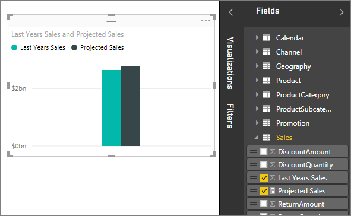

<properties
   pageTitle="Medidas en Power BI Desktop"
   description="Medidas en Power BI Desktop"
   services="powerbi"
   documentationCenter=""
   authors="davidiseminger"
   manager="mblythe"
   backup=""
   editor=""
   tags=""
   qualityFocus="no"
   qualityDate=""/>

<tags
   ms.service="powerbi"
   ms.devlang="NA"
   ms.topic="article"
   ms.tgt_pltfrm="NA"
   ms.workload="powerbi"
   ms.date="09/29/2016"
   ms.author="davidi"/>
# Medidas en Power BI Desktop

Power BI Desktop le ayuda a crear información sobre sus datos con sólo unos clics. Pero a veces que los datos simplemente no incluyen todo lo que necesita para responder a algunas de las preguntas más importantes. Las medidas que pueden ayudarle a conseguirlo.

Las medidas se usan en algunos de lo análisis de datos más comunes; Por ejemplo, sumas, promedios, valores mínimos o máximos, recuentos o cálculos más avanzados creados mediante una fórmula DAX. Los resultados calculados de medidas cambian constantemente en respuesta a la interacción con los informes, lo que permite la exploración de datos ad hoc rápida y dinámica. Echemos un vistazo.

## Descripción de las medidas

En Power BI Desktop, las medidas se crean y se utilizan en la vista de informe o vista de datos. Las medidas creadas por el usuario aparecen en la lista de campos con un icono de calculadora. Puede asignar un nombre a las medidas que desee y agregarlos a una visualización nueva o existente como cualquier otro campo.

## Expresiones de análisis de datos

Las medidas calculan un resultado de una fórmula de la expresión. Al crear sus propias medidas, usará la [expresiones de análisis de datos](https://msdn.microsoft.com/library/gg413422.aspx) lenguaje de fórmulas (DAX). DAX incluye una biblioteca de más de 200 funciones, operadores y construcciones, que proporciona una gran flexibilidad de crear medidas para calcular los resultados de casi cualquier necesidad de análisis de datos.

Las fórmulas DAX son muy similares a las fórmulas de Excel. DAX incluso tiene muchas de las mismas funciones como FECHA, SUMA e IZQUIERDA. Sin embargo, las funciones de DAX están diseñadas para trabajar con datos relacionales como los que tenemos en Power BI Desktop.

## Echemos un vistazo a un ejemplo

Enero es un director de ventas de Contoso. Le han pedido para proporcionar proyecciones de ventas de distribuidor durante el próximo año fiscal. Decide basar sus estimaciones en importes de ventas del año pasado, con un aumento de seis por ciento anual resultante de las distintas promociones programadas para los próximos seis meses.

Para informar de las estimaciones, importa los datos de ventas del año pasado en Power BI Desktop. Busca el campo SalesAmount en la tabla de ventas de distribuidores. Dado que los datos que importa sólo contienen importes de ventas para el año pasado, cambia el nombre del campo SalesAmount a ventas de últimos años. A continuación, arrastre ventas de últimos años al lienzo del informe. Aparece en una visualización del gráfico como un valor único que es la suma de todas las ventas del año pasado.

Observa que incluso si no ha especificado un cálculo, se ha proporcionado uno automáticamente. Power BI Desktop creó su propia medida por la suma de todos los valores de ventas de últimos años.

Sin embargo, Jan necesita una medida para calcular las previsiones de ventas para el año siguiente, que se basará en las ventas del último año multiplicadas por 1,06 para tener en cuenta el aumento esperado del 6 por ciento en el negocio. Para este cálculo creará su propia medida. Mediante la característica nueva medida, crea una nueva medida, a continuación, introduce la siguiente fórmula DAX:

    Projected Sales = SUM('Sales'[Last Years Sales])*1.06

Después Jan arrastra su nueva medida ventas previstas en el gráfico.

Muy rápidamente y con el mínimo esfuerzo, ahora Jan tiene una medida para calcular las ventas previstas. Además puede analizar mejor las previsiones filtrando en distribuidores específicos o agregar otros campos a su informe.

## Obtener más información

Sólo le proporcionamos una rápida introducción a las medidas, pero hay mucho más para ayudarle a aprender a crear los suyos propios. Vea el [Tutorial: crear sus propias medidas en Power BI Desktop](powerbi-desktop-tutorial-create-measures.md), donde puede descargar un archivo de ejemplo y obtener lecciones paso a paso sobre cómo crear más medidas.  

Para profundizar un poco más en DAX, asegúrese de desproteger [conceptos básicos DAX en Power BI Desktop](powerbi-desktop-quickstart-learn-dax-basics.md). El [referencia de expresiones de análisis de datos](https://msdn.microsoft.com/library/gg413422.aspx) proporciona artículos detallados sobre cada una de las funciones, sintaxis, operadores y las convenciones de nomenclatura. DAX lleva varios años en Power Pivot en Excel y SQL Server Analysis Services, por lo que hay muchos otros estupendos recursos disponibles, demasiado. Asegúrese de comprobar la [Wiki del centro de recursos de DAX](http://social.technet.microsoft.com/wiki/contents/articles/1088.dax-resource-center.aspx), donde miembros destacados de la Comunidad de BI comparten sus conocimientos sobre DAX.


