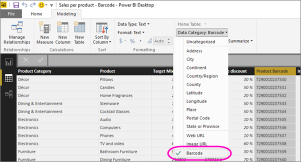

<properties 
   pageTitle="Etiqueta de un campo de código de barras en Power BI Desktop para las aplicaciones móviles de Power BI"
   description="Cuando se etiqueta un campo de código de barras en el modelo en Power BI Desktop, puede filtrar los datos de códigos de barras automáticamente en la aplicación Power BI en su iPhone."
   services="powerbi" 
   documentationCenter="" 
   authors="maggiesMSFT" 
   manager="mblythe" 
   editor=""
   tags=""
   qualityFocus="no"
   qualityDate=""/>
 
<tags
   ms.service="powerbi"
   ms.devlang="NA"
   ms.topic="article"
   ms.tgt_pltfrm="NA"
   ms.workload="powerbi"
   ms.date="09/29/2016"
   ms.author="maggies"/>

# Códigos de barras de etiqueta en Power BI Desktop para las aplicaciones móviles de Power BI

En Power BI Desktop, puede [clasificar los datos](powerbi-desktop-data-categorization.md) en una columna, por lo que Power BI Desktop sabe cómo tratar los valores en objetos visuales en un informe. También puede clasificar una columna como **código de barras**. Cuando usted o sus colegas [analizar un código de barras en un producto con la aplicación Power BI](powerbi-mobile-scan-barcode-for-report.md) en el iPhone, verá que cualquier informe que incluya ese código de barras. Cuando abra el informe en la aplicación móvil, Power BI filtra automáticamente el informe a los datos relacionados con ese código de barras.

1. En Power BI Desktop, cambie a la vista de datos.

2. Seleccione una columna con datos de código de barras. Ver la lista de [admite formatos de código de barras](#supported-barcode-formats) a continuación.

3. En el **modelado** ficha, seleccione **categoría datos** > **código de barras**.

    

4. En la vista de informe, agregue este campo a los elementos visuales que desee filtrar por el código de barras.

5. Guarde el informe y publicarlo en el servicio Power BI.

Ahora, cuando abra el escáner en el [aplicación Power BI para iPhone](powerbi-mobile-ipad-iphone-apps.md) y analizar un código de barras, vea este informe en la lista de informes. Al abrir el informe, sus elementos visuales se filtran por el código de barras de producto que ha examinado.

## Formatos de código de barras
Estos son los códigos de barras que Power BI reconoce si puede etiquetar en un informe de Power BI: 

- UPCECode 
- Code39Code  
- A39Mod43Code 
- EAN13Code 
- EAN8Code  
- 93Code  
- 128Code 
- PDF417Code 
- Interleaved2of5Code 
- ITF14Code 

### Consulte también  
- [Análisis de código de barras de la aplicación de Power BI en su iPhone](powerbi-mobile-scan-barcode-for-report.md)
- [Emitir con el análisis de códigos de barras en un iPhone](powerbi-mobile-scan-barcode-for-report.md#issues-with-scanning-a-barcode)
- [Categorización de datos en Power BI Desktop](powerbi-desktop-data-categorization.md)  
- [Introducción a la aplicación de iPhone para Power BI](powerbi-mobile-iphone-app-get-started.md)  
- [Introducción a Power BI](powerbi-service-get-started.md)  
- ¿Tiene preguntas? [Pruebe a formular a la Comunidad de Power BI](http://community.powerbi.com/)
