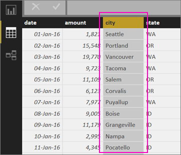
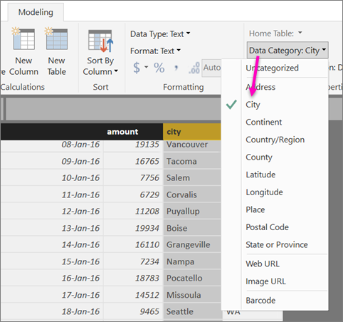
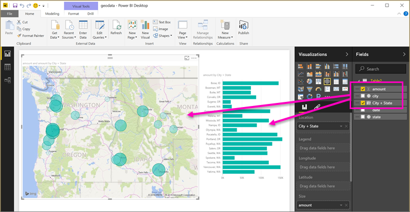
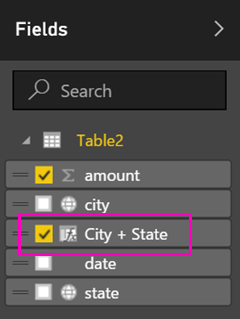

<properties 
   pageTitle="Establecer geográfica filtrado en Power BI Desktop para las aplicaciones móviles de Power BI"
   description="Al establecer geográfica de filtrado en el modelo en Power BI Desktop, puede filtrar los datos para su ubicación automáticamente en las aplicaciones móviles de Power BI para iOS."
   services="powerbi" 
   documentationCenter="" 
   authors="maggiesMSFT" 
   manager="mblythe" 
   editor=""
   tags=""
   qualityFocus="no"
   qualityDate=""/>
 
<tags
   ms.service="powerbi"
   ms.devlang="NA"
   ms.topic="article"
   ms.tgt_pltfrm="NA"
   ms.workload="powerbi"
   ms.date="10/12/2016"
   ms.author="maggies"/>

# Establecer geográfica filtrado en Power BI Desktop para las aplicaciones móviles de Power BI

En Power BI Desktop, puede [clasificar datos geográficos](powerbi-desktop-data-categorization.md) para una columna, por lo que Power BI Desktop sabe cómo tratar los valores en objetos visuales en un informe. Como beneficio adicional, cuando usted o sus colegas ver ese informe en la aplicación móvil de Power BI para iOS, Power BI proporciona automáticamente geográficos filtros que coinciden con el que se encuentre. 

Por ejemplo, que es un administrador de ventas viajan para cumplir con los clientes y que desea filtrar rápidamente el total de ventas y los ingresos para el cliente específico que se va a visitar. Desea dividir los datos para la ubicación actual, ya sea por estado, ciudad o una dirección real. Más adelante, si tiene tiempo restante, que le gustaría visitar a otros clientes que se encuentren más cercanos. Puede [filtrar el informe por su ubicación para encontrar los clientes](powerbi-mobile-geofiltering.md).

> [AZURE.NOTE] Puede filtrar por la ubicación en la aplicación móvil sólo si los nombres geográficos en el informe en inglés & #150; Por ejemplo, "Nueva York" o "Germany".

## Identificar datos geográficos en el informe

1. En Power BI Desktop, cambie a la vista de datos .

2. Seleccione una columna con datos geográficos & #151; Por ejemplo, una columna de la ciudad.

    

3. En el **modelado** pestaña, seleccione **categoría datos**, a continuación, la categoría correcta & #151; en este ejemplo, **Ciudad**.

    

4. Continuar estableciendo categorías de datos geográficos de los demás campos en el modelo. 

    > [AZURE.NOTE] Puede establecer varias columnas para cada categoría de datos en un modelo, pero si lo hace el modelo no se puede filtrar para geography en la aplicación móvil de Power BI. Para utilizar el filtrado geográfica en las aplicaciones móviles, establezca solo una columna para cada categoría de datos & #151; Por ejemplo, sólo uno **City** columna, uno **estado o provincia** columna y otra **País** columna. 

## Crear efectos visuales con los datos geográficos

5. Cambie a la vista de informe , y crear elementos visuales que utilizan los campos geográficos de los datos. 

    

    En este ejemplo, el modelo también contiene una columna calculada que aporta la ciudad y el estado de una columna. Lea acerca de [crear columnas calculadas en Power BI Desktop](powerbi-desktop-calculated-columns.md).

    

6. Publicar el informe en el servicio Power BI.

## Ver el informe en la aplicación de Power BI para iOS

1. Abra el informe en el [aplicación Power BI para iOS](powerbi-mobile-ipad-iphone-apps.md).

2. Si está en una ubicación geográfica con datos en el informe, se puede filtrar automáticamente a su ubicación.

    

Obtenga más información sobre [filtrar un informe por la ubicación en las aplicaciones móviles de Power BI para iOS](powerbi-mobile-geofiltering.md).

### Consulte también  

- [Categorización de datos en Power BI Desktop](powerbi-desktop-data-categorization.md)  
- ¿Tiene preguntas? [Pruebe a formular a la Comunidad de Power BI](http://community.powerbi.com/)