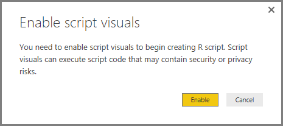
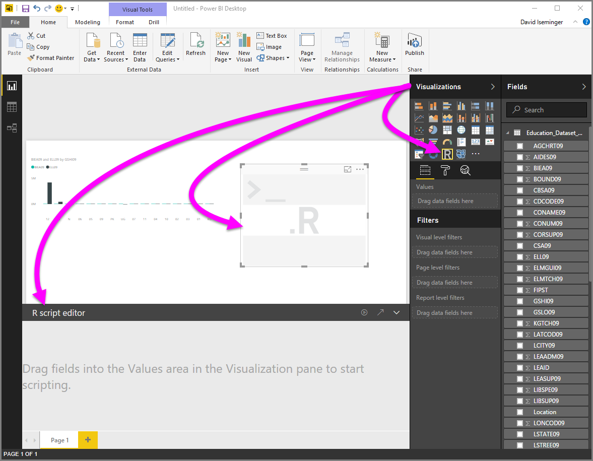
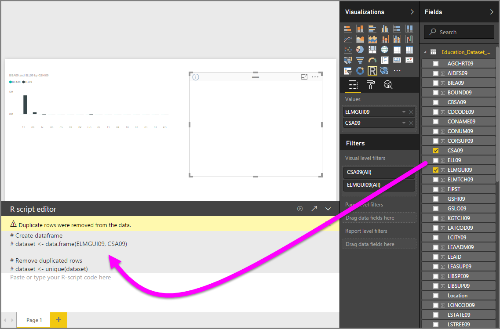
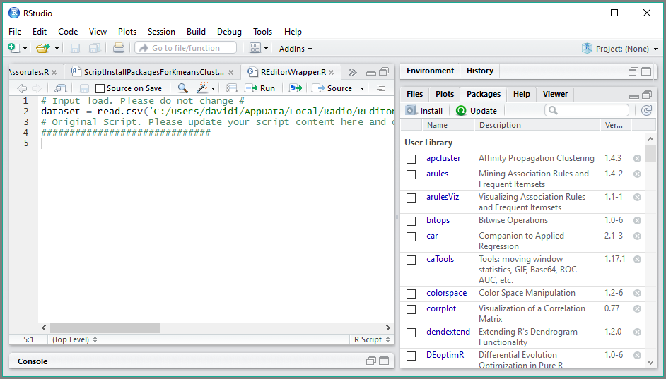

<properties
   pageTitle="Usar un IDE R externo con Power BI"
   description="Puede iniciar y usar un IDE externo con Power BI"
   services="powerbi"
   documentationCenter=""
   authors="davidiseminger"
   manager="mblythe"
   backup=""
   editor=""
   tags=""
   qualityFocus="no"
   qualityDate=""/>

<tags
   ms.service="powerbi"
   ms.devlang="NA"
   ms.topic="article"
   ms.tgt_pltfrm="NA"
   ms.workload="powerbi"
   ms.date="09/15/2016"
   ms.author="davidi"/>

# Usar un IDE R externo con Power BI

Con **Power BI Desktop**, puede usar el IDE R externo (Integrated Development Environment) para crear y refinar los scripts de R y luego usar esos scripts en Power BI.

### Habilitar un IDE R externo

Anteriormente, había que usar el editor de secuencias de comandos de R en **Power BI Desktop** para crear y ejecutar scripts de R. Con esta versión, puede iniciar el IDE R externo desde **Power BI Desktop** y tiene los datos automáticamente importado y aparece en el IDE de R. Desde allí, puede modificar el script en ese IDE R externo y luego péguelo en **Power BI Desktop** para crear elementos visuales de Power BI e informes.

A partir de la versión de septiembre de 2016 de **Power BI Desktop** (versión 2.39.4526.362), puede especificar qué IDE R que le gustaría utilizar e iniciar automáticamente desde **Power BI Desktop**.

### Requisitos

Para utilizar esta característica, debe instalar un **IDE R** en el equipo local. 
            **Power BI Desktop** incluir, implementar o instalar el motor de R, por lo que debe instalar por separado **R** en el equipo local. Puede elegir qué IDE R para usar con las siguientes opciones:

-   Puede instalar su IDE favorito de R, muchos de los cuales están disponibles de forma gratuita, como el [revolución abrir la página de descarga](https://mran.revolutionanalytics.com/download/), y el [repositorio CRAN](https://cran.r-project.org/bin/windows/base/).

-   
            **Power BI Desktop** también admite [R Studio](https://www.rstudio.com/) y **Visual Studio 2015** con [*R Tools para Visual Studio*](https://beta.visualstudio.com/vs/rtvs/) editores.

-   También puede instalar un IDE R diferente y tienen **Power BI Desktop** Iniciar que **IDE R** siguiendo uno de los siguientes:
    -   Puede asociar **. R** archivos con el IDE externo que desee **Power BI Desktop** para iniciar.
    -   Puede especificar el .exe que **Power BI Desktop** debería iniciar seleccionando *otros* desde el **Opciones de Script de R** sección de la **opciones** cuadro de diálogo. Puede poner en funcionamiento el **opciones** diálogo yendo a **archivo > Opciones y configuración > opciones**.

        

Si tiene varios IDE R instalado, puede especificar que se inicia, selecciónelo en la *detectado R IDE* desplegable en el **opciones** cuadro de diálogo.

De forma predeterminada, **Power BI Desktop** iniciará **R Studio** como el IDE R externo si está instalado en el equipo local; si **R Studio** no está instalado y tiene **Visual Studio 2015** con **R Tools para Visual Studio**, que se inicia en su lugar. Si ninguno de estos IDE R está instalado, la aplicación asociada a **. R** archivos se inicia.

Y si no hay ningún **. R** existe en la asociación de archivo, es posible especificar una ruta de acceso a un IDE personalizado en el *vaya a su IDE preferido de R* sección de la **opciones** cuadro de diálogo. También puede iniciar un IDE R diferentes seleccionando la **configuración** icono de engranaje situado junto a la **inicie el IDE de R** icono de flecha, en **Power BI Desktop**.

### Iniciar un IDE R desde Power BI Desktop

Para iniciar un IDE R desde **Power BI Desktop**, siga estos pasos.

1.   Cargar datos en **Power BI Desktop**.

2.   Seleccione algunos campos de la **campos** panel que desea trabajar. Si no ha habilitado los elementos visuales de la secuencia de comandos, se le pedirá que lo haga.

   

3.   Cuando se habilitan los elementos visuales de la secuencia de comandos, puede seleccionar un objeto visual R desde la **visualizaciones** panel, que crea un visual de R en blanco que está listo para mostrar los resultados de la secuencia de comandos. El **editor de script de R** también aparece el panel.

   

4.   Ahora puede seleccionar los campos que desea usar en el script de R. Cuando se selecciona un campo, la **editor de script de R** campo crea automáticamente el código de script basado en el campo o campos seleccionados. Puede crear (o pegue) la secuencia de comandos de R directamente en el **editor de script de R** panel, al que puede dejar vacío.

   

   > 
            **Nota:** es el tipo de agregación predeterminado para elementos visuales de R *no resumir*.

5.   Ahora puede iniciar directamente desde el IDE de R **Power BI Desktop**. Seleccione el **iniciar el IDE de R** botón, que se encuentra en el lado derecho de la **editor de script de R** barra de título, como se muestra a continuación.

   

6.   Se inicia el IDE R especificado por Power BI Desktop, tal como se muestra en la siguiente imagen (en esta imagen, **RStudio** es el valor predeterminado de R IDE).

   

   > 
            **Nota:** **Power BI Desktop** agrega las tres primeras líneas de la secuencia de comandos para que pueda importar los datos desde **Power BI Desktop** una vez que ejecute la secuencia de comandos.

7.   Un script que creó en el **panel del editor de secuencias de comandos de R** de **Power BI Desktop** aparece inicial en la línea 4 en el IDE de R. En este momento puede crear el script de R en el IDE de R. Cuando el script de R se complete en el IDE de R, deberá copiar y péguelo en el **editor de script de R** panel **Power BI Desktop**, *excepto* las tres primeras líneas del script que **Power BI Desktop** generado automáticamente. No copiar las tres primeras líneas del script de nuevo en **Power BI Desktop**, esas líneas sólo se utilizan para importar los datos en el IDE de R de **Power BI Desktop**.

### Limitaciones conocidas

Iniciar un IDE R directamente desde Power BI Desktop tiene algunas limitaciones:

-  Exportación automática de la secuencia de comandos desde el IDE de R en **Power BI Desktop** no se admite.

-  
            **Cliente de R** editor (RGui.exe) no se admite, porque el propio editor no admite abrir archivos.

### Más información

Eche un vistazo a la siguiente información adicional acerca de R en Power BI.

-   [Ejecutar Scripts de R en Power BI Desktop](powerbi-desktop-r-scripts.md)

-   [Crear efectos visuales de Power BI con R](powerbi-desktop-r-visuals.md)
