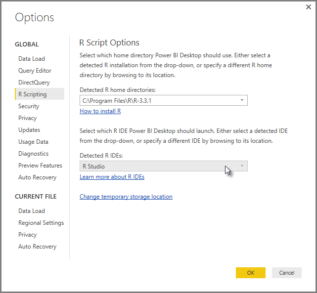
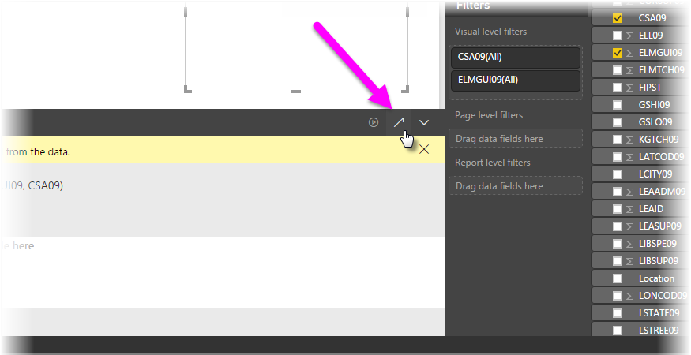

<properties
   pageTitle="Use an external R IDE with Power BI"
   description="You can launch and use an external IDE with Power BI"
   services="powerbi"
   documentationCenter=""
   authors="davidiseminger"
   manager="mblythe"
   backup=""
   editor=""
   tags=""
   qualityFocus="no"
   qualityDate=""/>

<tags
   ms.service="powerbi"
   ms.devlang="NA"
   ms.topic="article"
   ms.tgt_pltfrm="NA"
   ms.workload="powerbi"
   ms.date="09/15/2016"
   ms.author="davidi"/>

# Use an external R IDE with Power BI

With <bpt id="p1">**</bpt>Power BI Desktop<ept id="p1">**</ept>, you can use your external R IDE (Integrated Development Environment) to create and refine R scripts, then use those scripts in Power BI.

### Enabling an external R IDE

Previously, you had to use the R script editor in <bpt id="p1">**</bpt>Power BI Desktop<ept id="p1">**</ept> to create and run R scripts. With this release, you can launch your external R IDE from <bpt id="p1">**</bpt>Power BI Desktop<ept id="p1">**</ept> and have your data automatically imported and displayed in the R IDE. From there, you can modify the script in that external R IDE, then paste it back into <bpt id="p1">**</bpt>Power BI Desktop<ept id="p1">**</ept> to create Power BI visuals and reports.

Beginning with the September 2016 release of <bpt id="p1">**</bpt>Power BI Desktop<ept id="p1">**</ept> (version 2.39.4526.362), you can specify which R IDE you would like to use, and have it launch automatically from within <bpt id="p2">**</bpt>Power BI Desktop<ept id="p2">**</ept>.

### Requisitos

To use this feature, you need to install an <bpt id="p1">**</bpt>R IDE<ept id="p1">**</ept> on your local computer. <bpt id="p1">**</bpt>Power BI Desktop<ept id="p1">**</ept> does not include, deploy or install the R engine, so you must separately install <bpt id="p2">**</bpt>R<ept id="p2">**</ept> on your local computer. You can choose which R IDE to use, with the following options:

-   You can install your favorite R IDE, many of which are available for free, such as the <bpt id="p1">[</bpt>Revolution Open download page<ept id="p1">](https://mran.revolutionanalytics.com/download/)</ept>, and the <bpt id="p2">[</bpt>CRAN Repository<ept id="p2">](https://cran.r-project.org/bin/windows/base/)</ept>.

-   <bpt id="p1">**</bpt>Power BI Desktop<ept id="p1">**</ept> also supports <bpt id="p2">[</bpt>R Studio<ept id="p2">](https://www.rstudio.com/)</ept> and <bpt id="p3">**</bpt>Visual Studio 2015<ept id="p3">**</ept> with <bpt id="p4">[</bpt><bpt id="p5">*</bpt>R Tools for Visual Studio<ept id="p5">*</ept><ept id="p4">](https://beta.visualstudio.com/vs/rtvs/)</ept> editors.

-   You can also install a different R IDE and have <bpt id="p1">**</bpt>Power BI Desktop<ept id="p1">**</ept> launch that <bpt id="p2">**</bpt>R IDE<ept id="p2">**</ept> by doing one of the following:
    -   You can associate <bpt id="p1">**</bpt>.R<ept id="p1">**</ept> files with the external IDE you want <bpt id="p2">**</bpt>Power BI Desktop<ept id="p2">**</ept> to launch.
    -   You can specify the .exe that <bpt id="p1">**</bpt>Power BI Desktop<ept id="p1">**</ept> should launch by selecting <bpt id="p2">*</bpt>Other<ept id="p2">*</ept> from the <bpt id="p3">**</bpt>R Script Options<ept id="p3">**</ept> section of the <bpt id="p4">**</bpt>Options<ept id="p4">**</ept> dialog. You can bring up the <bpt id="p1">**</bpt>Options<ept id="p1">**</ept> dialog by going to <bpt id="p2">**</bpt>File &gt; Options and settings &gt; Options<ept id="p2">**</ept>.

        

If you have multiple R IDEs installed, you can specify which will be launched by selecting it from the <bpt id="p1">*</bpt>Detected R IDEs<ept id="p1">*</ept> drop-down in the <bpt id="p2">**</bpt>Options<ept id="p2">**</ept> dialog.

By default, <bpt id="p1">**</bpt>Power BI Desktop<ept id="p1">**</ept> will launch <bpt id="p2">**</bpt>R Studio<ept id="p2">**</ept> as the external R IDE if it's installed on your local computer; if <bpt id="p3">**</bpt>R Studio<ept id="p3">**</ept> is not installed and you have <bpt id="p4">**</bpt>Visual Studio 2015<ept id="p4">**</ept> with <bpt id="p5">**</bpt>R Tools for Visual Studio<ept id="p5">**</ept>, that will be launched instead. If neither of those R IDEs is installed, the application associated with <bpt id="p1">**</bpt>.R<ept id="p1">**</ept> files is launched.

And if no <bpt id="p1">**</bpt>.R<ept id="p1">**</ept> file association exists, it's possible to specify a path to a custom IDE in the <bpt id="p2">*</bpt>Browse to your preferred R IDE<ept id="p2">*</ept> section of the <bpt id="p3">**</bpt>Options<ept id="p3">**</ept> dialog. You can also launch a different R IDE by selecting the <bpt id="p1">**</bpt>Settings<ept id="p1">**</ept> gear icon beside the <bpt id="p2">**</bpt>Launch R IDE<ept id="p2">**</ept> arrow icon, in <bpt id="p3">**</bpt>Power BI Desktop<ept id="p3">**</ept>.

### Launching an R IDE from Power BI Desktop

To launch an R IDE from <bpt id="p1">**</bpt>Power BI Desktop<ept id="p1">**</ept>, take the following steps.

1.   Load data into <bpt id="p1">**</bpt>Power BI Desktop<ept id="p1">**</ept>.

2.   Select some fields from the <bpt id="p1">**</bpt>Fields<ept id="p1">**</ept> pane that you want to work with. If you haven't enabled script visuals yet, you'll be prompted to do so.

   

3.   When script visuals are enabled, you can select an R visual from the <bpt id="p1">**</bpt>Visualizations<ept id="p1">**</ept> pane, which creates a blank R visual that's ready to display the results of your script. The <bpt id="p1">**</bpt>R script editor<ept id="p1">**</ept> pane also appears.

   

4.   Now you can select the fields you want to use in your R script. When you select a field, the <bpt id="p1">**</bpt>R script editor<ept id="p1">**</ept> field automatically creates script code based on the field or fields you select. You can either create (or paste) your R script directly in the <bpt id="p1">**</bpt>R script editor<ept id="p1">**</ept> pane, your you can leave it empty.

   

   > <bpt id="p1">**</bpt>Note:<ept id="p1">**</ept> The default aggregation type for R visuals is <bpt id="p2">*</bpt>do not summarize<ept id="p2">*</ept>.

5.   You can now launch your R IDE directly from <bpt id="p1">**</bpt>Power BI Desktop<ept id="p1">**</ept>. Select the <bpt id="p1">**</bpt>Launch R IDE<ept id="p1">**</ept> button, found on the right side of the <bpt id="p2">**</bpt>R script editor<ept id="p2">**</ept> title bar, as shown below.

   

6.   Your specified R IDE is launched by Power BI Desktop, as shown in the following image (in this image, <bpt id="p1">**</bpt>RStudio<ept id="p1">**</ept> is the default R IDE).

   

   > <bpt id="p1">**</bpt>Note:<ept id="p1">**</ept> <bpt id="p2">**</bpt>Power BI Desktop<ept id="p2">**</ept> adds the first three lines of the script so it can import your data from <bpt id="p3">**</bpt>Power BI Desktop<ept id="p3">**</ept> once you run the script.

7.   Any script you created in the <bpt id="p1">**</bpt>R script editor pane<ept id="p1">**</ept> of <bpt id="p2">**</bpt>Power BI Desktop<ept id="p2">**</ept> appears starting in line 4 in your R IDE. At this point you can create your R script in the R IDE. Once your R script is complete in your R IDE, you need to copy and paste it back into the <bpt id="p1">**</bpt>R script editor<ept id="p1">**</ept> pane in <bpt id="p2">**</bpt>Power BI Desktop<ept id="p2">**</ept>, <bpt id="p3">*</bpt>excluding<ept id="p3">*</ept> the first three lines of the script that <bpt id="p4">**</bpt>Power BI Desktop<ept id="p4">**</ept> automatically generated. Do not copy the first three lines of script back into <bpt id="p1">**</bpt>Power BI Desktop<ept id="p1">**</ept>, those lines were only used to import your data to your R IDE from <bpt id="p2">**</bpt>Power BI Desktop<ept id="p2">**</ept>.

### Known Limitations

Launching an R IDE directly from Power BI Desktop has a few limitations:

-  Automatically exporting your script from your R IDE into <bpt id="p1">**</bpt>Power BI Desktop<ept id="p1">**</ept> is not supported.

-  <bpt id="p1">**</bpt>R Client<ept id="p1">**</ept> editor (RGui.exe) is not supported, because the editor itself does not support opening files.

### Más información

Take a look at the following additional information about R in Power BI.

-   [Running R Scripts in Power BI Desktop](powerbi-desktop-r-scripts.md)

-   [Create Power BI visuals using R](powerbi-desktop-r-visuals.md)
