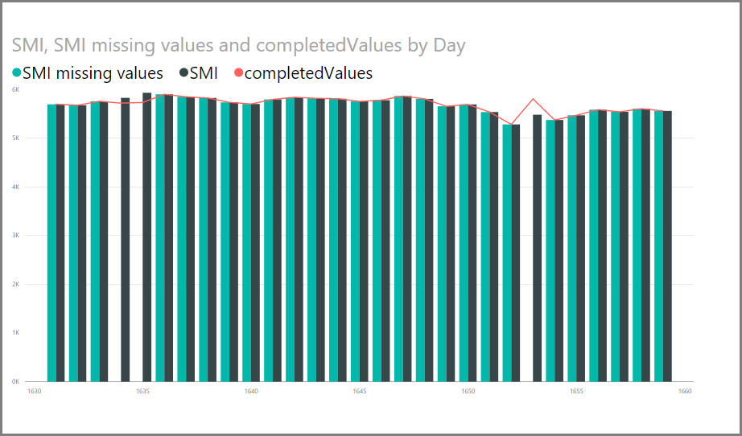
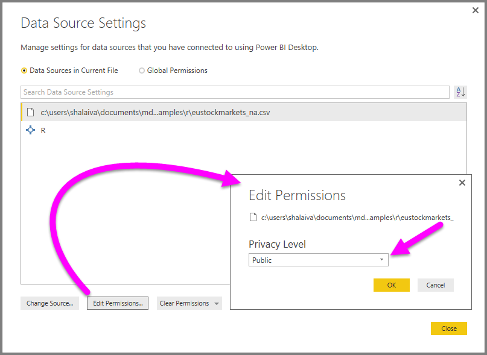

<properties
   pageTitle="Uso de R en el Editor de consultas"
   description="Uso de R en el Editor de consultas en escritorio Power BI para análisis avanzado"
   services="powerbi"
   documentationCenter=""
   authors="davidiseminger"
   manager="mblythe"
   backup=""
   editor=""
   tags=""
   qualityFocus="no"
   qualityDate=""/>

<tags
   ms.service="powerbi"
   ms.devlang="NA"
   ms.topic="article"
   ms.tgt_pltfrm="NA"
   ms.workload="powerbi"
   ms.date="10/12/2016"
   ms.author="davidi"/>

# Uso de R en el Editor de consultas

Puede usar **R**, un lenguaje de programación utilizado ampliamente por estadísticos, científicos de datos y los analistas de datos en Power BI Desktop **Editor de consultas**. Esta integración de R en **Editor de consultas** permite realizar la limpieza de datos con R y realizar el análisis y la forma de datos avanzados en conjuntos de datos, incluida la finalización de la falta de datos, las predicciones y agrupación en clústeres, por nombrar algunos. 
            **R** es un lenguaje eficaz y puede utilizarse en **Editor de consultas** para preparar el modelo de datos y crear informes.

## Instalar R

Usar **R** en Power BI Desktop **Editor de consultas**, necesita instalar **R** en el equipo local. Puede descargar e instalar **R** gratuitamente desde varias ubicaciones, incluyendo la [revolución abrir la página de descarga](https://mran.revolutionanalytics.com/download/), y el [repositorio CRAN](https://cran.r-project.org/bin/windows/base/).

## Uso de R en el Editor de consultas

Para mostrar cómo usar **R** en **Editor de consultas**, vamos a usar un ejemplo de un conjunto de datos de la bolsa, basándose en una. Archivo CSV que puede [Descargar aquí](http://download.microsoft.com/download/F/8/A/F8AA9DC9-8545-4AAE-9305-27AD1D01DC03/EuStockMarkets_NA.csv) y continúe. Los pasos de este ejemplo son los siguientes:

1.  En primer lugar, cargue los datos en **Power BI Desktop**. En este ejemplo, vamos a cargar la *EuStockMarkets_NA.csv* archivo. Seleccione **obtener datos > CSV** desde el **Inicio** la cinta de opciones en **Power BI Desktop**.

    

2.  Seleccione el archivo y seleccione **abiertos**, y el archivo CSV se muestra en el **archivo CSV** cuadro de diálogo.

    

3.  Una vez cargados los datos, la verá en la **campos** panel en Power BI Desktop.

    

4.  Abra **Editor de consultas** seleccionando **Editar consultas** desde el **Inicio** ficha **Power BI Desktop**.

    

5.  En el **transformar** ficha, seleccione **Ejecutar Script de R** y **Ejecutar Script de R** editor aparece (se muestra en el paso siguiente). Tenga en cuenta que filas 15 y 20 sufren los datos que faltan, igual que otras filas que no puede ver en la siguiente imagen. Los pasos siguientes muestran cómo R puede (y le) complete las filas.

    

6.  En este ejemplo, escribiremos el código de secuencia de comandos siguiente:

        library(mice)
        tempData <- mice(dataset,m=1,maxit=50,meth='pmm',seed=100)
        completedData <- complete(tempData,1)
        output <- dataset
        output$completedValues <- completedData$"SMI missing values"

    >
            **Nota:** debe tener el *ratones* biblioteca instalado en su entorno de R para el código de secuencia de comandos anterior funcione correctamente. Para instalar el mouse, ejecute lo siguiente en la instalación de R: |      > install.packages('mice')

    Cuando se colocan en el **Ejecutar Script de R** cuadro de diálogo, el código similar al siguiente:

    

7.  Cuando se selecciona **Aceptar**, **Editor de consultas** muestra una advertencia sobre la privacidad de los datos.

    

8.  Para que los scripts de R funcione correctamente en el servicio Power BI, deben configurarse todos los orígenes de datos *public*. Para obtener más información acerca de la configuración de privacidad y sus implicaciones, consulte [niveles de privacidad](powerbi-desktop-privacy-levels.md).

    

    Una vez que lo hacemos, veremos una columna nueva en la **campos** también denominada *completedValues*. Observe que hay algunas que faltan elementos de datos, como en la fila 15 y 18. Veremos cómo R controla en la sección siguiente.

    Tenga en cuenta

Con sólo cinco líneas de script de R **Editor de consultas** rellena los valores que faltan con un modelo de predicción.

## Crear elementos visuales de los datos de la secuencia de comandos de R

Ahora podemos crear un elemento visual para ver cómo la R script de código mediante la *ratones* biblioteca completa de los valores que faltan, como se muestra en la siguiente imagen.

Una vez que visual es completando y los otros elementos visuales que queremos crear mediante **Power BI Desktop**, podemos guardar la **Power BI Desktop** archivo (que se guarda como un archivo .pbix) y, a continuación, utilizar el modelo de datos, incluidas las secuencias de comandos de R que forman parte del mismo, en el servicio Power BI.

>
            **Nota:** para ver un archivo .pbix completado con estos pasos completados? Está de suerte: puede descargar el completado **Power BI Desktop** usado en estos ejemplos de archivo [justo aquí](http://download.microsoft.com/download/F/8/A/F8AA9DC9-8545-4AAE-9305-27AD1D01DC03/Complete Values with R in PQ.pbix).

Una vez que haya cargado el archivo .pbix en el servicio Power BI, unos cuantos pasos son necesarios para habilitar la actualización de datos (en el servicio) y habilitar elementos visuales que se actualizará en el servicio (los datos necesita acceso r para elementos visuales actualizarse). Los pasos adicionales son los siguientes:

-   
            **Habilitar actualización programada para el conjunto de datos** : para habilitar la actualización programada para el libro que contiene el conjunto de datos con scripts de R, consulte [actualización programada de configuración](powerbi-refresh-scheduled-refresh.md), que también incluye información acerca de **Personal Gateway**.

-   
            **Instale la puerta de enlace Personal** -necesita una **Personal Gateway** instalada en el equipo donde se encuentra el archivo, y donde está instalado R; el servicio Power BI debe tener acceso a ese libro y volver a representar los elementos visuales actualizadas. Puede obtener más información acerca de cómo [instalar y configurar la puerta de enlace Personal](powerbi-personal-gateway.md).

## Limitaciones

Existen algunas limitaciones para las consultas que incluyen scripts de R creados en **Editor de consultas**:

-   Todas las configuraciones de origen de datos de R deben establecerse en *público*, y todos los demás pasos en una consulta creada en **Editor de consultas** también deben ser públicos. Para obtener los valores de origen de datos en **Power BI Desktop** seleccione **archivo > Opciones y configuración > configuración del origen de datos**.

    

    Desde el **Configuración del origen de datos** cuadro de diálogo, seleccione el los orígenes de datos y, a continuación, seleccione **Editar permisos** y asegúrese de que el **nivel de privacidad** está establecido en *público*.

        

-   Para habilitar la actualización programada de los elementos visuales de R o el conjunto de datos, debe habilitar **actualización programada** y tener un **Personal Gateway** instalado en el equipo que aloja el libro y la instalación de R. Para obtener más información sobre ambos, consulte la sección anterior de este artículo, que proporciona vínculos para obtener más información acerca de cada uno.

Hay todo tipo de cosas que puede hacer con R y consultas personalizadas, por lo que explorar y los datos de forma igual que desee que aparezca.
